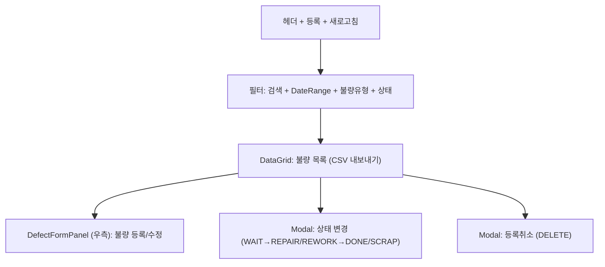

---
sources:
  - apps/frontend/src/app/(authenticated)/quality/defect/components/DefectFormPanel.tsx
  - apps/frontend/src/components/ui/Modal.tsx
verifiedCommit: 8a7e96ea
---

# 불량관리 — 비즈니스 로직 & 데이터 흐름 분석

> **Menu Code:** `QC_DEFECT`
> **Path:** `/quality/defect`
> **Label:** `menu.quality.defect`
> **분석 기준 커밋:** `8a7e96ea`
> **분석 일자:** `2026-07-04`

## 1. 화면 개요

공정/제품 불량을 등록하고 상태(WAIT→REPAIR/REWORK→DONE/SCRAP)를 관리한다. 불량 목록 조회 + 우측 DefectFormPanel 등록 + Modal 상태 변경.

## 2. 화면 구성

## 3. API 호출 흐름

| 시점 | API | 용도 |
| --- | --- | --- |
| 진입 | `GET /quality/defect-logs` | 불량 목록 (search/defectCode/status/fromDate/toDate) |
| 진입 | `GET /quality/defect-codes/options?defectScope=PROCESS` | 불량코드 옵션 |
| 등록 | `POST /quality/defect-logs` | 불량 등록 |
| 삭제 | `DELETE /quality/defect-logs/{id}` | 불량 등록취소 |
| 상태변경 | `PATCH /quality/defect-logs/{id}/status` | 상태 전이 |

## 4. 처리 규칙

- 불량 등록 시 작업지시/제품바코드 + 불량코드(등급/범위) + 수량 + 원인 필수
- 상태변경: WAIT(대기) → REPAIR(수리) / REWORK(재작업) → DONE(완료) / SCRAP(폐기)

## 5. DB 테이블 영향

| 테이블 | 작업 | 설명 |
| --- | --- | --- |
| `DEFECT_LOGS` | CRUD + status UPDATE | 불량 이력 |
| `DEFECT_CODES` | SELECT | 불량코드 참조 |

## 6. 공통코드

| 그룹코드 | 용도 |
| --- | --- |
| `DEFECT_LOG_STATUS` | 불량 상태 (WAIT/REPAIR/REWORK/DONE/SCRAP) |
| `DEFECT_GRADE` | 불량등급 |
| `DEFECT_TYPE` | 불량유형 |

## 7. 비고

- `alert()/confirm()/prompt()` 사용 없음
- Modal과 ConfirmModal로 모든 사용자 액션 처리
