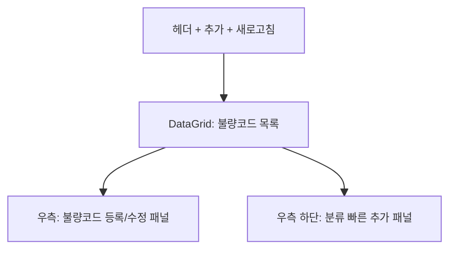

# 불량코드관리 — 비즈니스 로직 & 데이터 흐름 분석

> **Menu Code:** `QC_DEFECT_CODE`
> **Path:** `/quality/defect-code`
> **Label:** `menu.quality.defectCode`
> **분석 기준 커밋:** `8a7e96ea`
> **분석 일자:** `2026-07-04`

## 1. 화면 개요

불량코드 체계를 3레벨 분류(카테고리) + 불량코드로 관리하는 기준정보 화면. 불량등급(CRITICAL/MAJOR/MINOR), 적용범위(COMMON/RAW_MATERIAL/PRODUCT/PROCESS) 설정.

## 2. 화면 구성

| 영역 | 컴포넌트 | 역할 |
| --- | --- | --- |
| 좌측 | `DataGrid` | 불량코드 목록 (codelLevels/grade/scope 표시) |
| 우측 상단 | `CodeFormPanel` | 불량코드 등록/수정 (1/2/3레벨 선택) |
| 우측 하단 | `CategoryQuickAdd` | 분류(카테고리) 빠른 추가 |

## 3. API 호출 흐름

| 시점 | API | 용도 |
| --- | --- | --- |
| 진입 | `GET /quality/defect-codes` | 불량코드 목록 |
| 진입 | `GET /quality/defect-codes/categories` | 분류 트리 조회 |
| 등록/수정 | `POST/PUT /quality/defect-codes` | 불량코드 CRUD |
| 분류 등록 | `POST /quality/defect-codes/categories` | 카테고리 등록 |

## 4. DB 테이블 영향

| 테이블 | 작업 | 설명 |
| --- | --- | --- |
| `DEFECT_CODES` | CRUD | 불량코드 마스터 |
| `DEFECT_CATEGORIES` | CRUD | 불량분류 트리 (3레벨) |

## 5. 공통코드

| 그룹코드 | 용도 |
| --- | --- |
| `DEFECT_GRADE` | 불량등급 (CRITICAL/MAJOR/MINOR) |
| `USE_YN` | 사용여부 |

## 6. 비고

- 분류는 Level1(검사단계) → Level2(모델구분) → Level3(불량유형) 계층
- 3레벨 분류에 불량코드가 속함
- `alert()/confirm()/prompt()` 사용 없음
