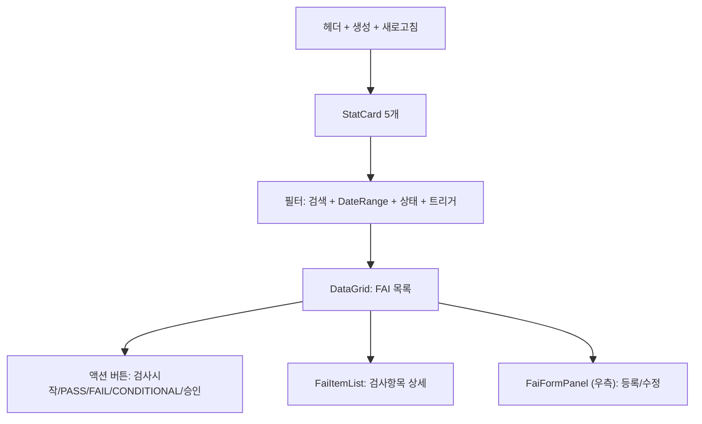
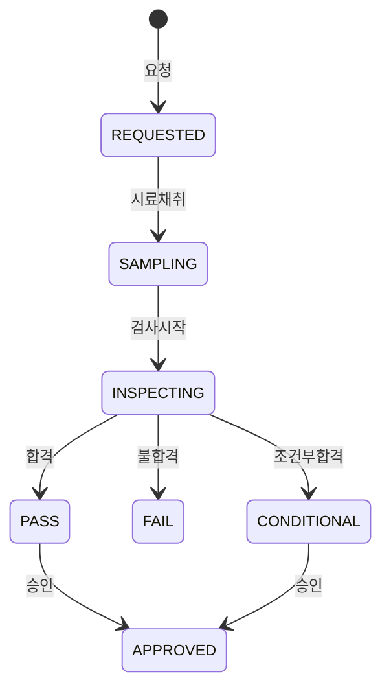

---
sources:
  - apps/frontend/src/app/(authenticated)/quality/fai/components/FaiFormPanel.tsx
verifiedCommit: 8a7e96ea
---

# 초물검사(FAI) — 비즈니스 로직 & 데이터 흐름 분석

> **Menu Code:** `QC_FAI`
> **Path:** `/quality/fai`
> **Label:** `menu.quality.fai`
> **분석 기준 커밋:** `8a7e96ea`
> **분석 일자:** `2026-07-04`

## 1. 화면 개요

IATF 16949 8.3.4.4 신규/변경 품목 첫 생산품 검증(FAI). StatCard(전체/요청/검사중/합격/불합격) + DataGrid + FaiFormPanel + FaiItemList. 상태: REQUESTED → SAMPLING/INSPECTING → PASS/FAIL/CONDITIONAL → 승인.

## 2. 화면 구성

## 3. API 호출 흐름

| 시점 | API | 용도 |
| --- | --- | --- |
| 진입 | `GET /quality/fai` | FAI 목록 |
| 등록 | `POST /quality/fai` | FAI 등록 |
| 검사시작 | `PATCH /quality/fai/{id}/start` | REQUESTED → SAMPLING |
| 검사완료 | `PATCH /quality/fai/{id}/complete` | → PASS/FAIL/CONDITIONAL |
| 승인 | `PATCH /quality/fai/{id}/approve` | 승인 처리 |
| 항목목록 | `GET /quality/fai/{id}/items` | 검사항목 결과 |

## 4. 상태 전이

## 5. DB 테이블 영향

| 테이블 | 작업 | 설명 |
| --- | --- | --- |
| `QA_FAIS` | CRUD + status UPDATE | FAI 마스터 |
| `QA_FAI_ITEMS` | CRUD | 검사항목 결과 |

## 6. 공통코드

| 그룹코드 | 용도 |
| --- | --- |
| `FAI_STATUS` | FAI 상태 |
| `FAI_TRIGGER_TYPE` | 트리거 유형 |

## 7. 비고

- `alert()/confirm()/prompt()` 사용 없음
