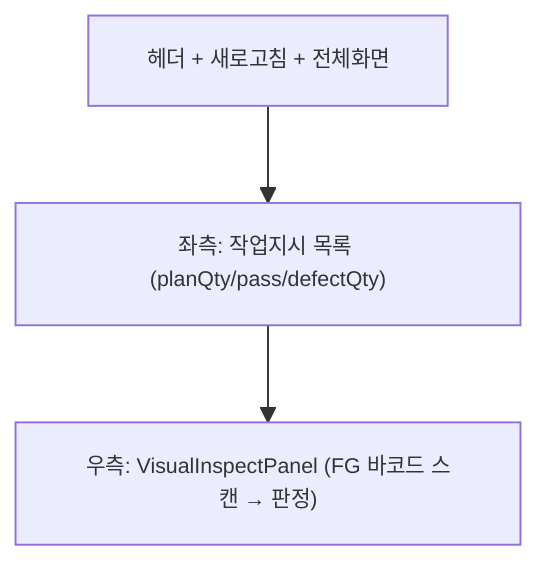

# 외관검사 — 비즈니스 로직 & 데이터 흐름 분석

> **Menu Code:** `QC_INSPECT`
> **Path:** `/quality/inspect`
> **Label:** `menu.quality.inspect`
> **분석 기준 커밋:** `8a7e96ea`
> **분석 일자:** `2026-07-04`

## 1. 화면 개요

완제품(FG) 외관검사 페이지. 작업지시 선택 + FG 바코드 스캔 → 합격/불합격 판정. 통전검사와 달리 검사기/소모품/회로라벨 스캔 절차 없음.

## 2. 화면 구성

| 영역 | 컴포넌트 | 역할 |
| --- | --- | --- |
| 좌측 | JobOrderList | 작업지시 목록 (완료 생산실적만, 자동 단일선택) |
| 우측 | `VisualInspectPanel` | FG 바코드 스캔 + 합격/불합격 판정 |

## 3. API 호출 흐름

| 시점 | API | 용도 |
| --- | --- | --- |
| 진입 | `GET /quality/continuity-inspect/job-orders?finishedOnly=true` | 작업지시 목록 |
| 판정 | `POST /quality/inspect` | 외관검사 판정 등록 |

## 4. DB 테이블 영향

| 테이블 | 작업 | 설명 |
| --- | --- | --- |
| `INSPECT_RESULTS` | INSERT | 외관검사 결과 |
| `PROD_RESULTS` | UPDATE status | FG_LABEL_STATUS 변경 |

## 5. 공통코드

| 그룹코드 | 용도 |
| --- | --- |
| `JOB_ORDER_STATUS` | 작업지시 상태 |
| `INSPECT_RESULT` | 검사결과 (PASS/FAIL) |
| `FG_LABEL_STATUS` | FG 상태 (ISSUED/VISUAL_PASS/VISUAL_FAIL) |

## 6. 비고

- 작업지시 목록에 통계(planQty/goodQty/defectQty) 함께 표시
- 전체화면 모드 지원 (requestFullscreen API)
- `alert()/confirm()/prompt()` 사용 없음
