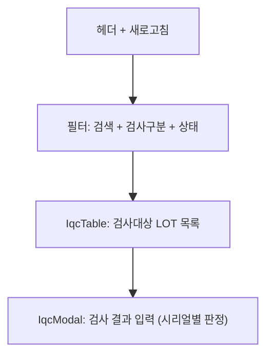
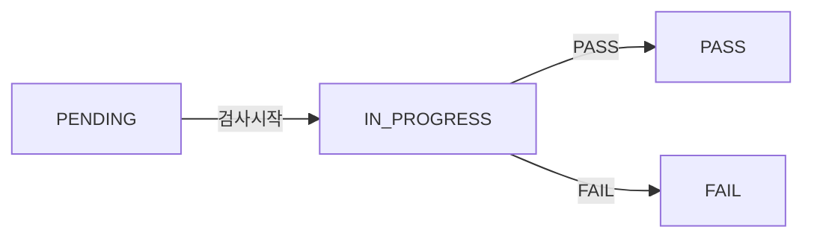

# 수입검사(IQC) — 비즈니스 로직 & 데이터 흐름 분석

> **Menu Code:** `QC_IQC`
> **Path:** `/material/iqc`
> **Label:** `menu.material.iqc`
> **분석 기준 커밋:** `8a7e96ea`
> **분석 일자:** `2026-07-04`

## 1. 화면 개요

입하된 자재의 수입검사(IQC)를 수행. PENDING/IN_PROGRESS 상태의 LOT를 조회하고 검사 결과(PASS/FAIL)를 등록한다. 검사구분(전수/샘플링/파괴)별로 다르게 처리.

## 2. 화면 구성

| 영역 | 컴포넌트 | 역할 |
| --- | --- | --- |
| 헤더 | `page.tsx` | 제목, 새로고침 |
| 본문 | `IqcTable` | 입하 LOT 목록 (품목코드/입하번호/시리얼별) |
| 모달 | `IqcModal` | 검사 판정 (PASS/FAIL, 불량코드, 수량, AQL 결과) |

## 3. API 호출 흐름

| 시점 | API | 용도 |
| --- | --- | --- |
| 진입 | `GET /material/lots` | IQC 대상 LOT 목록 (status=PENDING/IN_PROGRESS) |
| 검사 등록 | `POST /material/iqc-history` | 검사 결과 저장 (시리얼별 판정 + AQL 결과) |

## 4. 상태 전이

## 5. DB 테이블 영향

| 테이블 | 작업 | 설명 |
| --- | --- | --- |
| `MAT_LOTS` | UPDATE | iqcStatus 변경 (PENDING → IN_PROGRESS → PASS/FAIL) |
| `IQC_HISTORIES` | INSERT | 검사 이력 저장 |
| `MAT_ARRIVALS` | UPDATE (간접) | iqcStatus 동기화 |

## 6. 공통코드

| 그룹코드 | 용도 |
| --- | --- |
| `IQC_STATUS` | IQC 상태 (PENDING/IN_PROGRESS/PASS/FAIL) |
| `IQC_INSPECT_METHOD` | 검사구분 (전수/샘플링/파괴) |
| `INSPECT_RESULT` | 검사결과 (PASS/FAIL) |

## 7. 비고

- AQL 정책 기반 합부 판정 (QC_IQC_PART_SPEC에서 설정)
- 시리얼별 판정과 AQL 전체 판정 동시 저장
- `alert()/confirm()/prompt()` 사용 없음
