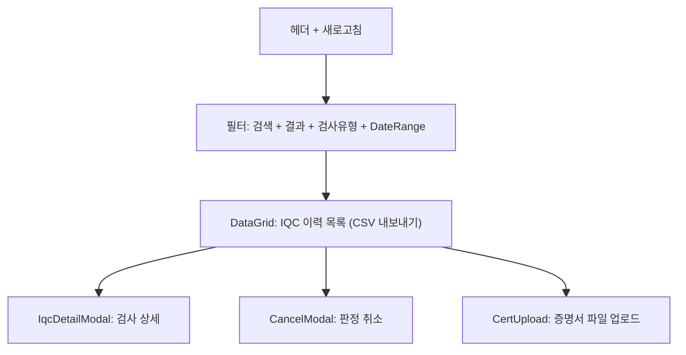

# IQC 이력조회 — 비즈니스 로직 & 데이터 흐름 분석

> **Menu Code:** `QC_IQC_HISTORY`
> **Path:** `/material/iqc-history`
> **Label:** `menu.material.iqcHistory`
> **분석 기준 커밋:** `8a7e96ea`
> **분석 일자:** `2026-07-04`

## 1. 화면 개요

완료된 IQC 검사 이력을 조회하는 읽기/취소 화면. 검사결과(PASS/FAIL), 검사유형(INITIAL/RETEST), 기간별 필터링. DONE 상태 건은 판정 취소 가능. 증명서 파일 업로드 지원.

## 2. 화면 구성

## 3. API 호출 흐름

| 시점 | API | 용도 |
| --- | --- | --- |
| 진입/조회 | `GET /material/iqc-history` | 이력 목록 (search/result/inspectType/fromDate/toDate) |
| 판정 취소 | `POST /material/iqc-history/cancel` | DONE → PENDING 복원 |
| 증명서 업로드 | `POST /material/iqc-history/{inspectDate}/{seq}/upload-cert` | 파일 첨부 |

## 4. DB 테이블 영향

| 테이블 | 작업 | 설명 |
| --- | --- | --- |
| `IQC_HISTORIES` | SELECT / UPDATE result | 이력 조회 및 판정 취소 |
| `MAT_LOTS` | UPDATE iqcStatus | 취소 시 PENDING으로 복원 |

## 5. 공통코드

| 그룹코드 | 용도 |
| --- | --- |
| `INSPECT_RESULT` | 검사결과 (PASS/FAIL) |
| `IQC_INSPECT_TYPE` | 검사유형 (INITIAL/RETEST) |

## 6. 비고

- Default 검사유형=INITIAL (유수명 재검사는 shelf-life-history에서 조회)
- 판정 취소 시 사유 필수 입력
- `alert()/confirm()/prompt()` 사용 없음
