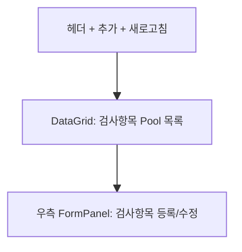

---
sources:
  - apps/frontend/src/app/(authenticated)/master/iqc-item/components/IqcItemFormPanel.tsx
verifiedCommit: 8a7e96ea
---

# IQC 검사항목마스터 — 비즈니스 로직 & 데이터 흐름 분석

> **Menu Code:** `QC_IQC_ITEM`
> **Path:** `/master/iqc-item`
> **Label:** `menu.master.iqcItem`
> **분석 기준 커밋:** `8a7e96ea`
> **분석 일자:** `2026-07-04`

## 1. 화면 개요

IQC에서 사용할 검사항목 Pool(IqcItemPool)을 관리하는 기준정보 화면. 검사항목 코드/명, 판정방식(합부/측정), 단위, 사용여부를 CRUD 한다.

## 2. 화면 구성

| 영역 | 컴포넌트 | 역할 |
| --- | --- | --- |
| 헤더 | `page.tsx` → `IqcItemTab` | 제목, 추가 버튼 |
| 본문 | `DataGrid` | 검사항목 목록 |
| 우측 | `IqcItemFormPanel` | 검사항목 등록/수정 |

## 3. API 호출 흐름

| 시점 | API | 용도 |
| --- | --- | --- |
| 진입 | `GET /master/iqc-items` | 검사항목 Pool 목록 (limit/search/useYn) |
| 등록 | `POST /master/iqc-items` | 신규 검사항목 등록 |
| 수정 | `PUT /master/iqc-items/{inspItemCode}` | 검사항목 수정 |

## 4. DB 테이블 영향

| 테이블 | 작업 | 설명 |
| --- | --- | --- |
| `IQC_ITEM_POOL` | CRUD | 검사항목 Pool 마스터 |
| `IQC_ITEM_MASTER` | SELECT (참조) | 품목별 연결된 검사항목 수 |

## 5. 공통코드

| 그룹코드 | 용도 |
| --- | --- |
| `INSPECT_JUDGE_METHOD` | 판정방식 (합부/측정) |
| `USE_YN` | 사용여부 |

## 6. 비고

- 검사항목 Pool은 모든 품목이 공유하는 마스터 데이터
- 실제 품목별 검사항목 연결은 QC_IQC_PART_SPEC에서 관리
- `alert()/confirm()/prompt()` 사용 없음
