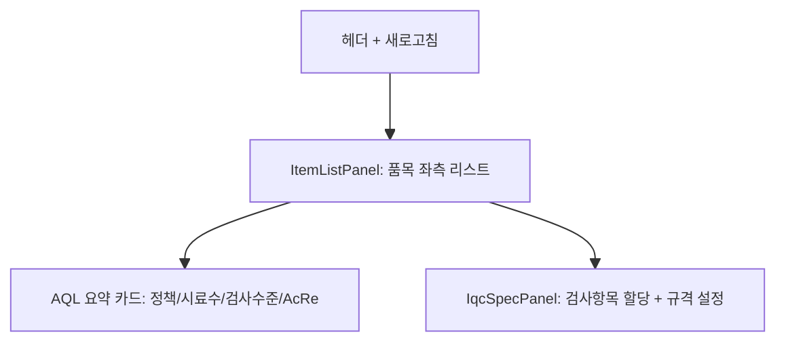

# 품목별 IQC 항목관리 — 비즈니스 로직 & 데이터 흐름 분석

> **Menu Code:** `QC_IQC_PART_SPEC`
> **Path:** `/master/iqc-part-spec`
> **Label:** `menu.master.iqcPartSpec`
> **분석 기준 커밋:** `8a7e96ea`
> **분석 일자:** `2026-07-04`

## 1. 화면 개요

품목(원자재)별 IQC 검사항목, 시료수, AQL 기준을 연결/관리하는 기준정보 화면. 품목 선택 → AQL 정책 미리보기 → Pool 검사항목 할당 + 규격값(LSL/USL/기준) 입력.

## 2. 화면 구성

| 영역 | 컴포넌트 | 역할 |
| --- | --- | --- |
| 좌측 | `ItemListPanel` | 품목 목록 (검색, 연결된 항목 수 표시) |
| 중앙 상단 | `AQL 요약 카드` | AQL 정책/시료수/검사수준/AcRe 미리보기 |
| 중앙 하단 | `IqcSpecPanel` | 검사항목 Pool 할당, 규격(LSL/USL/기준) 입력 |

## 3. API 호출 흐름

| 시점 | API | 용도 |
| --- | --- | --- |
| 진입 | `GET /master/parts?itemType=RAW_MATERIAL` | 품목 목록 |
| 진입 | `GET /master/iqc-part-specs` | 품목별 할당된 검사항목 |
| 진입 | `GET /master/iqc-item-pool?useYn=Y` | Pool 검사항목 |
| 품목 선택 | `GET /quality/aql/resolve-iqc-items?itemCode=&lotQty=` | AQL 정책 미리보기 |
| 저장 | `POST /master/iqc-part-specs` | 검사항목 할당 저장 |

## 4. DB 테이블 영향

| 테이블 | 작업 | 설명 |
| --- | --- | --- |
| `IQC_PART_SPECS` | CRUD | 품목별 검사항목 매핑 |
| `IQC_PART_SPEC_ITEMS` | CRUD | 검사항목별 규격(LSL/USL/기준) |
| `IQC_ITEM_POOL` | SELECT | Pool 검사항목 참조 |
| `IQC_AQL_POLICIES` | SELECT | AQL 정책 참조 |

## 5. 공통코드

| 그룹코드 | 용도 |
| --- | --- |
| `INSPECT_JUDGE_METHOD` | 판정방식 |
| `AQL_INSP_LEVEL` | 검사수준 |
| `IQC_INSPECT_TYPE` | 검사구분 (일반/파괴/전수) |
| `DEFECT_GRADE` | 불량등급 (CRITICAL/MAJOR/MINOR) |

## 6. 비고

- AQL 미리보기는 `resolve-iqc-items` API로 실시간 계산
- LOT 수량 입력에 따라 Ac/Re 동적 변경
- `alert()/confirm()/prompt()` 사용 없음
