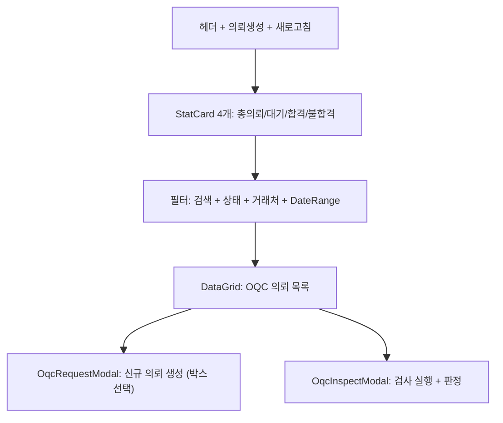

---
sources:
  - apps/frontend/src/app/(authenticated)/quality/oqc/components/OqcInspectModal.tsx
  - apps/frontend/src/app/(authenticated)/quality/oqc/components/OqcRequestModal.tsx
verifiedCommit: 8a7e96ea
---

# 출하검사(OQC) — 비즈니스 로직 & 데이터 흐름 분석

> **Menu Code:** `QC_OQC`
> **Path:** `/quality/oqc`
> **Label:** `menu.quality.oqc`
> **분석 기준 커밋:** `8a7e96ea`
> **분석 일자:** `2026-07-04`

## 1. 화면 개요

출하검사(OQC) 의뢰 생성, 검사 실행, 결과 조회를 관리. StatCard(총의뢰/대기/합격/불합격) + DataGrid + OqcRequestModal + OqcInspectModal.

## 2. 화면 구성

## 3. API 호출 흐름

| 시점 | API | 용도 |
| --- | --- | --- |
| 진입 | `GET /quality/oqc` | OQC 의뢰 목록 |
| 진입 | `GET /quality/oqc/stats` | 통계 정보 |
| 의뢰 생성 | `POST /quality/oqc` | 새 OQC 의뢰 등록 |
| 검사 실행 | `POST /quality/oqc/inspect` | 검사 판정 저장 |
| 행 클릭 | → `OqcInspectModal` | 검사 실행 |

## 4. DB 테이블 영향

| 테이블 | 작업 | 설명 |
| --- | --- | --- |
| `OQC_RESULTS` | CRUD | OQC 의뢰 및 결과 |

## 5. 공통코드

| 그룹코드 | 용도 |
| --- | --- |
| `OQC_STATUS` | OQC 상태 (PENDING/IN_PROGRESS/PASS/FAIL) |
| `INSPECT_RESULT` | 검사결과 |

## 6. 비고

- 행 클릭 시 바로 OqcInspectModal 열림 (의뢰→검사 원스텝)
- `alert()/confirm()/prompt()` 사용 없음
