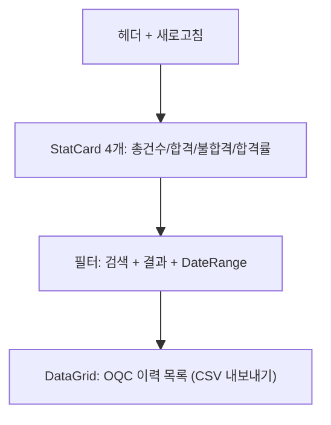

# 출하검사 이력 — 비즈니스 로직 & 데이터 흐름 분석

> **Menu Code:** `QC_OQC_HISTORY`
> **Path:** `/quality/oqc-history`
> **Label:** `menu.quality.oqcHistory`
> **분석 기준 커밋:** `8a7e96ea`
> **분석 일자:** `2026-07-04`

## 1. 화면 개요

완료된 OQC 검사(PASS/FAIL) 이력을 조회하는 읽기 전용 화면. 통계(총건수/합격/불합격/합격률) + DataGrid.

## 2. 화면 구성

## 3. API 호출 흐름

| 시점 | API | 용도 |
| --- | --- | --- |
| 진입/조회 | `GET /quality/oqc` | 이력 목록 (status=PASS/FAIL 필터) |

QC_OQC와 동일한 엔드포인트 사용 (상태 필터로 완료건만 조회).

## 4. DB 테이블 영향

| 테이블 | 작업 | 설명 |
| --- | --- | --- |
| `OQC_RESULTS` | SELECT | 완료된 OQC 이력 |

## 5. 공통코드

| 그룹코드 | 용도 |
| --- | --- |
| `INSPECT_RESULT` | 검사결과 |

## 6. 비고

- 읽기 전용 화면 (CRUD 없음)
- QC_OQC와 동일 API 사용 (status 필터링)
- 합격률 = PASS / (PASS+FAIL) * 100
- `alert()/confirm()/prompt()` 사용 없음
