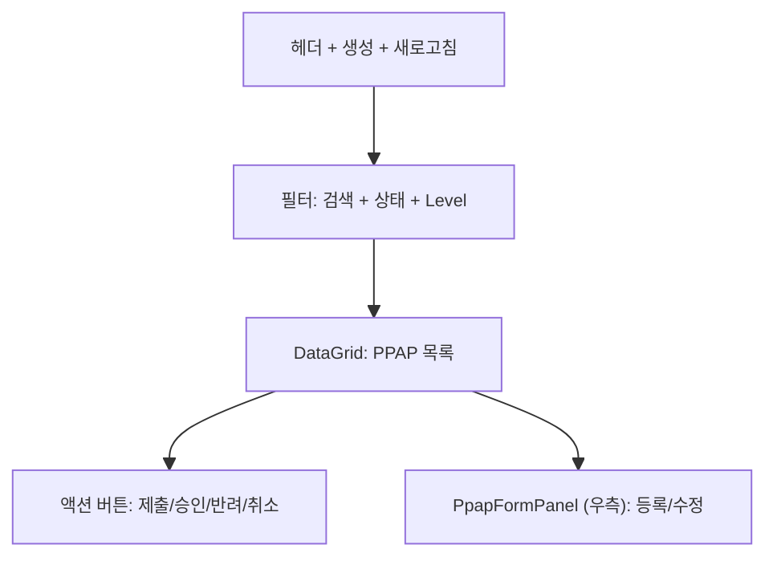
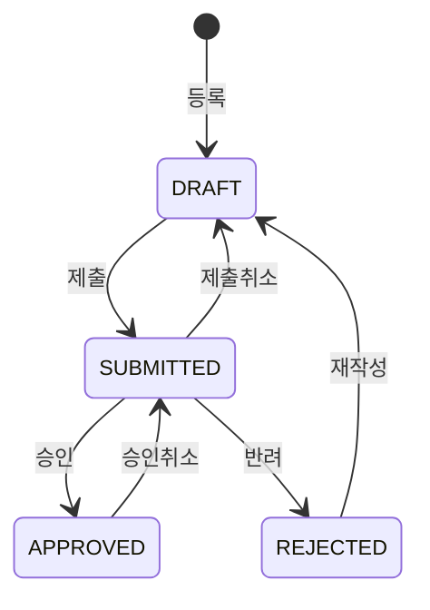

# PPAP 관리 — 비즈니스 로직 & 데이터 흐름 분석

> **Menu Code:** `QC_PPAP`
> **Path:** `/quality/ppap`
> **Label:** `menu.quality.ppap`
> **분석 기준 커밋:** `8a7e96ea`
> **분석 일자:** `2026-07-04`

## 1. 화면 개요

IATF 16949 PPAP(Production Part Approval Process) 제출 관리. StatCard(전체/제출대기/승인대기/승인완료) + DataGrid + PpapFormPanel. 상태: DRAFT → SUBMITTED → APPROVED/REJECTED.

## 2. 화면 구성

## 3. API 호출 흐름

| 시점 | API | 용도 |
| --- | --- | --- |
| 진입 | `GET /quality/ppap` | PPAP 목록 |
| 등록 | `POST /quality/ppap` | PPAP 등록 |
| 제출 | `PATCH /quality/ppap/submit/{id}` | DRAFT → SUBMITTED |
| 승인 | `PATCH /quality/ppap/approve/{id}` | SUBMITTED → APPROVED |
| 반려 | `PATCH /quality/ppap/reject/{id}` | SUBMITTED → REJECTED (사유 입력) |
| 제출취소 | `PATCH /quality/ppap/cancel-submit/{id}` | SUBMITTED → DRAFT |
| 승인취소 | `PATCH /quality/ppap/cancel-approve/{id}` | APPROVED → SUBMITTED |
| 삭제 | `DELETE /quality/ppap/{id}` | DRAFT/REJECTED만 삭제 가능 |

## 4. 상태 전이

## 5. DB 테이블 영향

| 테이블 | 작업 | 설명 |
| --- | --- | --- |
| `QA_PPAPS` | CRUD + status UPDATE | PPAP 제출 마스터 |

## 6. 공통코드

| 그룹코드 | 용도 |
| --- | --- |
| `PPAP_STATUS` | PPAP 상태 |
| `PPAP_LEVEL` | PPAP Level (1~5) |

## 7. 비고

- 반려 시 rejectReason 필수 입력
- Level 1~5 선택 가능
- `alert()/confirm()/prompt()` 사용 없음
