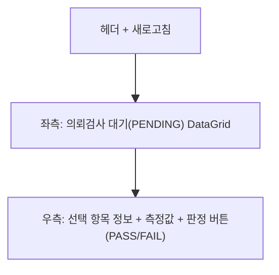

# 의뢰검사 입력 — 비즈니스 로직 & 데이터 흐름 분석

> **Menu Code:** `QC_REQUEST_INSPECT`
> **Path:** `/quality/request-inspect`
> **Label:** `menu.quality.requestInspect`
> **분석 기준 커밋:** `8a7e96ea`
> **분석 일자:** `2026-07-04`

## 1. 화면 개요

DELEGATE 방식 자주검사(공정샘플검사)의 의뢰 대기 항목 결과를 품질팀이 입력하는 화면. 좌측 대기 목록 + 우측 측정값/판정 입력.

## 2. 화면 구성

## 3. API 호출 흐름

| 시점 | API | 용도 |
| --- | --- | --- |
| 진입 | `GET /production/self-inspect/delegates` | DELEGATE 의뢰 대기 목록 |
| 판정 | `PATCH /production/self-inspect/results/{id}/status` | PASS/FAIL 판정 저장 |

## 4. DB 테이블 영향

| 테이블 | 작업 | 설명 |
| --- | --- | --- |
| `SELF_INSPECT_RESULTS` | UPDATE status/measureValue | 판정 저장 |

## 5. 공통코드

| 그룹코드 | 용도 |
| --- | --- |
| `INSPECT_RESULT` | 검사결과 (PASS/FAIL) |
| `INSPECT_TIMING` | 시점 (FIRST/MID/LAST) |

## 6. 비고

- 측정형(MEASURE): LSL/USL 범위 내 검증, 판정형(VISUAL): 규격 없음
- 측정값 입력 후 PASS/FAIL 버튼으로 판정
- `alert()/confirm()/prompt()` 사용 없음
