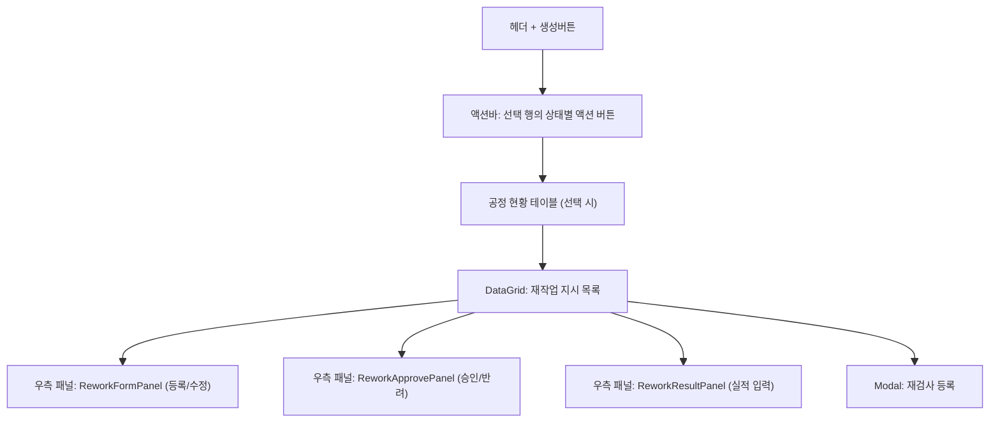
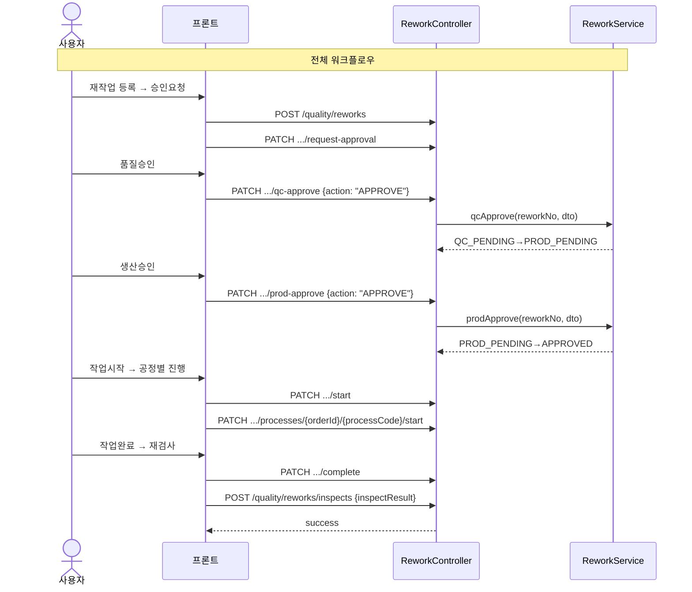
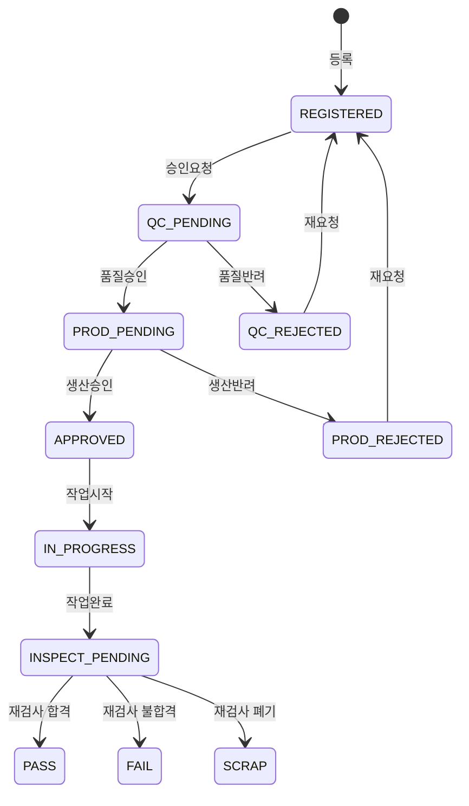

# 재작업 지시 — 비즈니스 로직 & 데이터 흐름 분석

> **Menu Code:** `QC_REWORK`
> **Path:** `/quality/rework`
> **Label:** `menu.quality.rework`
> **분석 기준 커밋:** `8a7e96ea`
> **분석 일자:** `2026-07-04`

## 1. 화면 개요

IATF 16949 8.7.1 부적합 출력물 재작업 관리. 재작업 지시 등록 → 2단계 승인(품질→생산) → 작업진행 → 재검사로 이어지는 전체 워크플로우를 처리한다.

## 2. 화면 구성

| 액션 | 대상 상태 | 전이 |
| --- | --- | --- |
| 승인요청 | REGISTERED | → QC_PENDING |
| 품질승인 | QC_PENDING | → PROD_PENDING 또는 QC_REJECTED |
| 생산승인 | PROD_PENDING | → APPROVED 또는 PROD_REJECTED |
| 작업시작 | APPROVED | → IN_PROGRESS |
| 작업완료 | IN_PROGRESS | → INSPECT_PENDING |
| 재검사 | INSPECT_PENDING | → PASS/FAIL/SCRAP |

## 3. API 호출 흐름

| 시점 | API | 용도 |
| --- | --- | --- |
| 진입/조회 | `GET /quality/reworks` | 재작업 목록 (search/status/lineCode/fromDate/toDate) |
| 행 선택 | `GET /quality/reworks/{reworkNo}/processes` | 공정 목록 |
| 등록 | `POST /quality/reworks` | 재작업 지시 생성 |
| 수정 | `PUT /quality/reworks/{reworkNo}` | 재작업 수정 |
| 삭제 | `DELETE /quality/reworks/{reworkNo}` | 재작업 삭제 |
| 승인요청 | `PATCH /quality/reworks/{reworkNo}/request-approval` | REGISTERED→QC_PENDING |
| 품질승인 | `PATCH /quality/reworks/{reworkNo}/qc-approve` | QC_PENDING→PROD_PENDING/QC_REJECTED |
| 생산승인 | `PATCH /quality/reworks/{reworkNo}/prod-approve` | PROD_PENDING→APPROVED/PROD_REJECTED |
| 작업시작 | `PATCH /quality/reworks/{reworkNo}/start` | APPROVED→IN_PROGRESS |
| 작업완료 | `PATCH /quality/reworks/{reworkNo}/complete` | IN_PROGRESS→INSPECT_PENDING |
| 공정시작 | `PATCH /quality/reworks/processes/{orderId}/{processCode}/start` | WAITING→IN_PROGRESS |
| 공정완료 | `PATCH /quality/reworks/processes/{orderId}/{processCode}/complete` | IN_PROGRESS→COMPLETED |
| 공정스킵 | `PATCH /quality/reworks/processes/{orderId}/{processCode}/skip` | WAITING→SKIPPED |
| 실적등록 | `POST /quality/reworks/results` | 공정별 실적 |
| 재검사등록 | `POST /quality/reworks/inspects` | 재검사 결과 |

## 4. 백엔드 처리

**Controller:** `ReworkController` (`apps/backend/src/modules/quality/rework/controllers/rework.controller.ts`)
**Service:** `ReworkService` + `ReworkProcessService`

## 5. DB 테이블 영향

| 테이블 | 작업 | 설명 |
| --- | --- | --- |
| `REWORKS` | CRUD + status UPDATE | 재작업 지시 마스터 |
| `REWORK_PROCESSES` | CRUD | 재작업 공정별 관리 |
| `REWORK_RESULTS` | INSERT | 공정 실적 |
| `REWORK_INSPECTS` | INSERT | 재검사 결과 |

## 6. 상태 전이

## 7. 공통코드

| 그룹코드 | 용도 |
| --- | --- |
| `REWORK_STATUS` | 재작업 상태 |
| `REWORK_PROCESS_STATUS` | 공정 상태 (WAITING/IN_PROGRESS/COMPLETED/SKIPPED) |
| `DEFECT_TYPE` | 불량유형 |

## 8. 비고

- `alert()/confirm()/prompt()` 사용 없음
- 2단계 승인 워크플로우 (QC → 생산)
- 공정별 시작/완료/스킵/실적 입력 지원
- `INSPECT_PENDING` 상태에서 재검사 등록 시 PASS/FAIL/SCRAP 판정
- PASS 시 양품 수량이 공정창고(WIP) 제품재고로 복원
