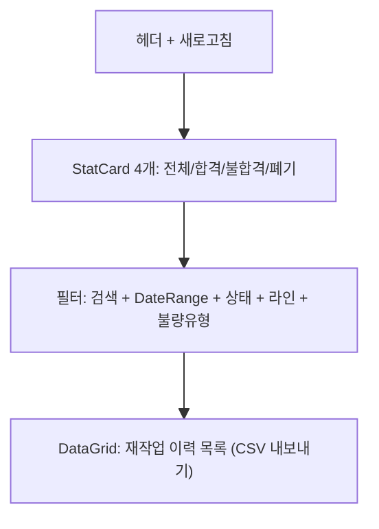

# 재작업 현황 — 비즈니스 로직 & 데이터 흐름 분석

> **Menu Code:** `QC_REWORK_HISTORY`
> **Path:** `/quality/rework-history`
> **Label:** `menu.quality.reworkHistory`
> **분석 기준 커밋:** `8a7e96ea`
> **분석 일자:** `2026-07-04`

## 1. 화면 개요

전체 재작업 이력을 조회하고 통계를 확인하는 읽기 전용 화면. 상태/라인/불량유형/기간별 필터링 제공.

## 2. 화면 구성

## 3. API 호출

| 시점 | API | 용도 |
| --- | --- | --- |
| 진입/조회 | `GET /quality/reworks` | 재작업 목록 (search/status/lineCode/defectType/fromDate/toDate) |

QC_REWORK와 동일한 엔드포인트 사용.

## 4. 통계

| StatCard | 설명 |
| --- | --- |
| 전체 | 전체 건수 |
| 합격(PASS) | status=PASS 건수 |
| 불합격(FAIL) | status=FAIL 건수 |
| 폐기(SCRAP) | status=SCRAP 건수 |

## 5. DB 테이블 영향

| 테이블 | 작업 | 설명 |
| --- | --- | --- |
| `REWORKS` | SELECT | 재작업 이력 조회 |

## 6. 공통코드

| 그룹코드 | 용도 |
| --- | --- |
| `REWORK_STATUS` | 재작업 상태 |
| `DEFECT_TYPE` | 불량유형 |

## 7. 비고

- 읽기 전용 화면 (CRUD 없음)
- QC_REWORK와 동일한 `GET /quality/reworks` API 사용 (필터만 다름)
- DataGrid의 `enableExport`로 CSV 내보내기
- `alert()/confirm()/prompt()` 사용 없음
