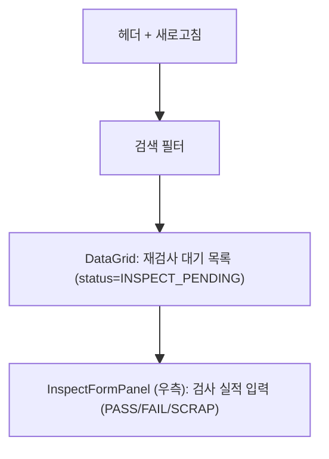
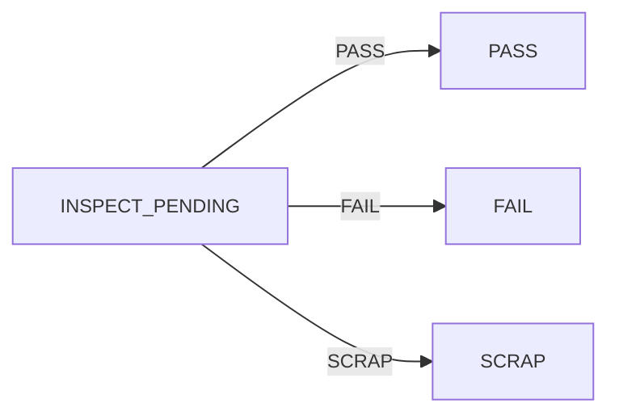

---
sources:
  - apps/frontend/src/app/(authenticated)/quality/rework-inspect/components/InspectFormPanel.tsx
verifiedCommit: 8a7e96ea
---

# 재작업 후 검사 — 비즈니스 로직 & 데이터 흐름 분석

> **Menu Code:** `QC_REWORK_INSPECT`
> **Path:** `/quality/rework-inspect`
> **Label:** `menu.quality.reworkInspect`
> **분석 기준 커밋:** `8a7e96ea`
> **분석 일자:** `2026-07-04`

## 1. 화면 개요

IATF 16949 재작업 완료 건(INSPECT_PENDING)의 재검증 검사 실적 입력 화면. DataGrid + 우측 InspectFormPanel.

## 2. 화면 구성

## 3. API 호출 흐름

| 시점 | API | 용도 |
| --- | --- | --- |
| 진입 | `GET /quality/reworks?status=INSPECT_PENDING` | 재검사 대기 목록 |
| 검사 등록 | `POST /quality/reworks/inspects` | 재검사 결과 저장 |

## 4. DB 테이블 영향

| 테이블 | 작업 | 설명 |
| --- | --- | --- |
| `REWORK_INSPECTS` | INSERT | 재검사 결과 |
| `REWORKS` | UPDATE status | INSPECT_PENDING → PASS/FAIL/SCRAP |

## 5. 상태 전이

## 6. 공통코드

| 그룹코드 | 용도 |
| --- | --- |
| `REWORK_STATUS` | 재작업 상태 |
| `INSPECT_RESULT` | 검사결과 |

## 7. 비고

- QC_REWORK에서 INSPECT_PENDING 상태로 전이된 건만 대상
- PASS 시 양품 수량이 WIP 재고로 복원
- `alert()/confirm()/prompt()` 사용 없음
