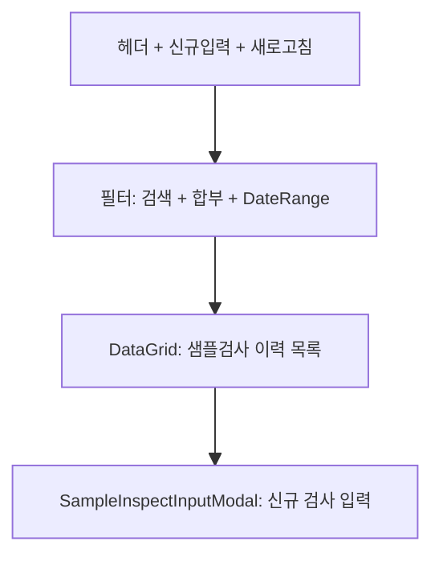

# 반제품 샘플검사 — 비즈니스 로직 & 데이터 흐름 분석

> **Menu Code:** `QC_SAMPLE_INSPECT`
> **Path:** `/production/sample-inspect`
> **Label:** `menu.production.sampleInspect`
> **분석 기준 커밋:** `8a7e96ea`
> **분석 일자:** `2026-07-04`

## 1. 화면 개요

반제품(SFG) 샘플검사 이력 조회 + 신규 입력 화면. 필터/검색 + DataGrid + SampleInspectInputModal.

## 2. 화면 구성

## 3. API 호출 흐름

| 시점 | API | 용도 |
| --- | --- | --- |
| 진입 | `GET /production/sample-inspect-input` | 샘플검사 이력 목록 |
| 신규 입력 | `POST /production/sample-inspect-input` | 샘플검사 등록 |

## 4. DB 테이블 영향

| 테이블 | 작업 | 설명 |
| --- | --- | --- |
| `SAMPLE_INSPECTS` | SELECT / INSERT | 샘플검사 이력 |

## 5. 공통코드

| 그룹코드 | 용도 |
| --- | --- |
| `JUDGE_YN` | 합부 판정 |
| `INSPECT_TIMING` | 시점 |

## 6. 비고

- `alert()/confirm()/prompt()` 사용 없음
- 합격률 통계는 클라이언트에서 계산
