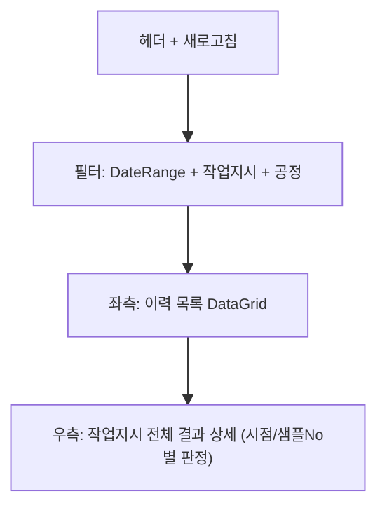

# 공정샘플검사 이력 — 비즈니스 로직 & 데이터 흐름 분석

> **Menu Code:** `QC_SELF_INSPECT_HISTORY`
> **Path:** `/quality/self-inspect-history`
> **Label:** `menu.quality.selfInspectHistory`
> **분석 기준 커밋:** `8a7e96ea`
> **분석 일자:** `2026-07-04`

## 1. 화면 개요

자주검사(공정샘플검사) 결과 이력을 조회하는 읽기 전용 화면. 좌측 이력 목록 선택 → 우측 상세 결과(시점/샘플별) 표시.

## 2. 화면 구성

## 3. API 호출 흐름

| 시점 | API | 용도 |
| --- | --- | --- |
| 진입/조회 | `GET /production/self-inspect/history` | 이력 목록 (fromDate/toDate/orderNo/processCode) |
| 행 선택 | `GET /production/self-inspect/results/{orderNo}` | 작업지시 전체 상세 결과 |
| 공정 목록 | `GET /master/processes` | 공정 필터 옵션 |

## 4. DB 테이블 영향

| 테이블 | 작업 | 설명 |
| --- | --- | --- |
| `SELF_INSPECT_RESULTS` | SELECT | 자주검사 결과 조회 |

## 5. 공통코드

| 그룹코드 | 용도 |
| --- | --- |
| `INSPECT_TIMING` | 시점 (FIRST/MID/LAST) |
| `INSPECT_RESULT` | 검사결과 |

## 6. 비고

- 읽기 전용 화면 (CRUD 없음)
- `alert()/confirm()/prompt()` 사용 없음
