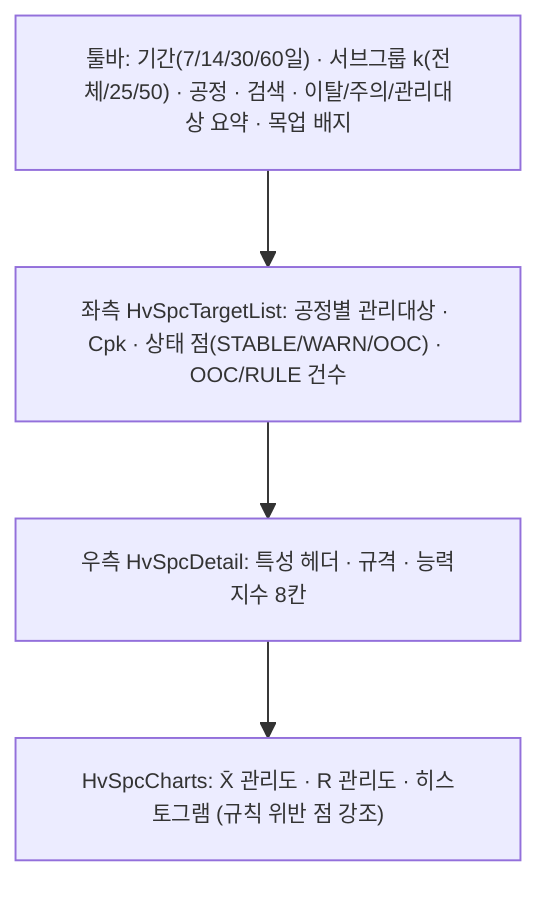

---
sources:
  - apps/frontend/src/app/(authenticated)/quality/spc/page.tsx
  - apps/frontend/src/app/(authenticated)/quality/spc/components/HvSpcBoard.tsx
  - apps/backend/src/modules/quality/spc/hv/hv-spc.service.ts
  - apps/backend/src/modules/quality/spc/hv/hv-spc-source.ts
verifiedCommit: HEAD
---

# SPC 관리 — 비즈니스 로직 & 데이터 흐름 분석

> **Menu Code:** `QC_SPC`
> **Path:** `/quality/spc`
> **Label:** `menu.quality.spc`
> **분석 일자:** `2026-09-04` (WebDisplay `/hanes/spc` 보드로 화면 교체)

## 1. 화면 개요

고전압 하네스 공정의 SPC 관리도 보드. 좌측에 공정별 관리대상(특성) 목록과 Cpk·상태 점, 우측에 선택 대상의
X̄-R 관리도·히스토그램·능력지수(Cp/Cpk/Pp/Ppk)·관리한계 이탈·패턴 규칙 위반을 보여준다.
관리도 등록/수정 CRUD 화면은 폐기했고(2026-09-04), 관리대상은 데이터 소스가 제공한다.

## 2. 화면 구성

디자인 규칙은 `docs/design/hv-spc.md`. 상태 색은 값에만 입히고 배경을 칠하지 않는다.

## 3. API 호출 흐름

| 시점 | API | 용도 |
| --- | --- | --- |
| 진입·필터 변경 | `GET /quality/spc/hv/targets?days&k` | 관리대상 목록 + 요약(Cpk/health/이탈 수). 60초 자동 갱신 |
| 대상 선택 | `GET /quality/spc/hv/targets/{targetId}?days&k` | 서브그룹·관리한계·능력지수·규칙 위반 |

응답 `data` 형태는 WebDisplay `/api/hanes/spc` 와 동일(`SpcTargetSummary`, `SpcTargetData`). `days`는 7/14/30/60만 허용.

## 4. 데이터 소스와 계산

- 소스는 `SpcDataSource` 인터페이스 뒤에 있고 시스템설정 `SPC_HV_SOURCE`(QUALITY 그룹, `MOCK`|`DB`, 기본 `MOCK`)로 명시 전환한다. 그 외 값은 500. 데이터가 없어도 목업으로 바꾸지 않는다(조용한 폴백 금지).
- `MOCK`: 카탈로그 12건(절단·탈피·편조·압착·육각압착·열수축·조립·종합검사) + 시드 고정 정규 노이즈에 평균이동/추세/이상점을 심은 목업. 응답 `sourceKind='MOCK'`, 화면 헤더에 "목업 데이터 — 검사이력 연동 전" 배지.
- `DB`: `SPC_CHARTS`(CHART_TYPE='XBAR_R', STATUS='ACTIVE', 회사/공장 스코프)를 관리대상으로, `SPC_DATA`(VALUES = JSON 배열 또는 쉼표 구분 샘플값)를 서브그룹으로 읽는다. 공정명/품목명은 PROCESS_MASTERS/ITEM_MASTERS In() 일괄 조인. 응답 `sourceKind='ORACLE'`.
- 계산(백엔드 `hv-spc-source.ts buildTargetData`): X̄-R 관리한계(서브그룹 크기 2~10 상수표), Cp/Cpk(σ군내 = R̄/d2)·Pp/Ppk(σ전체), Western Electric R1~R4 + R차트 RR1. health는 최근 25개 서브그룹만 본다(전체 기간을 보면 우연 이탈로 상태가 의미를 잃음). 이탈/규칙 건수는 조회 기간 전체.

## 5. DB 테이블 영향

| 테이블 | 작업 | 설명 |
| --- | --- | --- |
| `SPC_CHARTS` | R | DB 소스의 관리대상(규격 USL/LSL/TARGET, 서브그룹 크기) |
| `SPC_DATA` | R | DB 소스의 서브그룹 측정값 |
| `SYS_CONFIGS` | R | `SPC_HV_SOURCE` 소스 선택 |

기존 관리도 CRUD API(`/quality/spc/charts`, `calculate-limits`, `cpk`, `data`)는 백엔드에 남아 있으나 이 화면은 호출하지 않는다.

## 6. 비고

- 검사이력(측정값) 테이블이 확정되면 `DbSpcSource`의 조회 대상을 그 테이블로 바꾸고 `SPC_HV_SOURCE=DB`로 전환한다. 목업 규격은 카탈로그 예시값이라 도면 규격으로 치환 필요.
- `alert()/confirm()/prompt()` 사용 없음.
