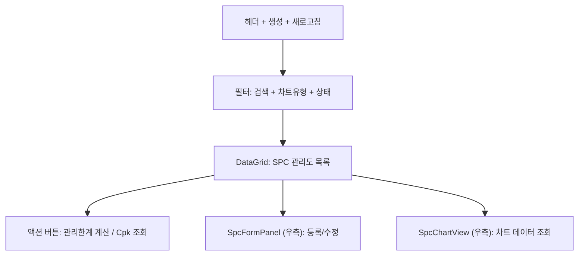

---
sources:
  - apps/frontend/src/app/(authenticated)/quality/spc/components/SpcFormPanel.tsx
verifiedCommit: 8a7e96ea
---

# SPC 관리 — 비즈니스 로직 & 데이터 흐름 분석

> **Menu Code:** `QC_SPC`
> **Path:** `/quality/spc`
> **Label:** `menu.quality.spc`
> **분석 기준 커밋:** `8a7e96ea`
> **분석 일자:** `2026-07-04`

## 1. 화면 개요

통계적 공정 관리(SPC) 관리도 목록 및 데이터 조회. DataGrid + SpcFormPanel + SpcChartView. 관리한계 계산, Cpk 조회 기능.

## 2. 화면 구성

## 3. API 호출 흐름

| 시점 | API | 용도 |
| --- | --- | --- |
| 진입 | `GET /quality/spc/charts` | SPC 관리도 목록 |
| 등록/수정 | `POST/PUT /quality/spc/charts` | 관리도 CRUD |
| 한계 계산 | `POST /quality/spc/charts/calculate-limits/{chartNo}` | 관리한계(UCL/LCL) 재계산 |
| 차트 조회 | `GET /quality/spc/charts/{chartNo}/data` | 측정 데이터 조회 |

## 4. DB 테이블 영향

| 테이블 | 작업 | 설명 |
| --- | --- | --- |
| `QA_SPC_DATA` | CRUD | SPC 관리도 마스터 및 데이터 |

## 5. 공통코드

| 그룹코드 | 용도 |
| --- | --- |
| `SPC_CHART_TYPE` | 관리도 유형 (Xbar-R, Xbar-S, p, np, c, u) |
| `SPC_STATUS` | SPC 상태 |

## 6. 비고

- 관리한계 계산은 수집된 데이터 기반 Cpk/UCL/LCL 자동 계산
- `alert()/confirm()/prompt()` 사용 없음
