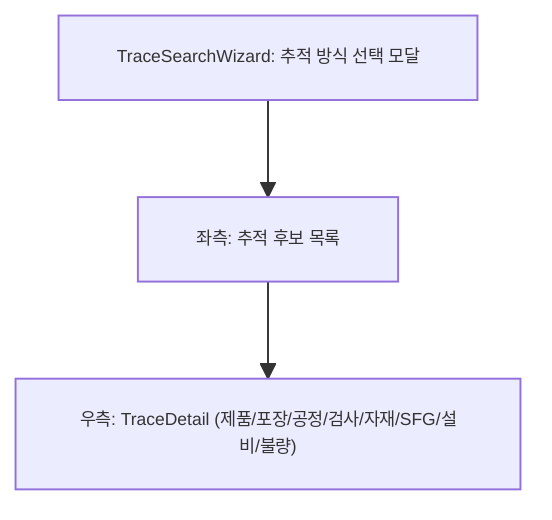

# 추적성조회 — 비즈니스 로직 & 데이터 흐름 분석

> **Menu Code:** `QC_TRACE`
> **Path:** `/quality/trace`
> **Label:** `menu.quality.trace`
> **분석 기준 커밋:** `8a7e96ea`
> **분석 일자:** `2026-07-04`

## 1. 화면 개요

제품 전수이력 추적 화면. 9가지 추적 방식(제품바코드/자재UID/업체LOT/박스/팔레트/출하지시/설비+기간/작업자+기간/작업지시/SFG) 선택 → 후보 목록 → 제품 이력 상세(공정/검사/자재/반제품/설비/불량).

## 2. 화면 구성

| 영역 | 컴포넌트 | 역할 |
| --- | --- | --- |
| 모달 | `TraceSearchWizard` | 추적 방식/값 입력 |
| 좌측 | CandidateList | 추적 후보 목록 (traceType별 표시) |
| 우측 | `TraceDetail` | 제품 이력 상세 (8개 섹션) |
| 세부 | `MaterialSection` | 자재 정보 |
| 세부 | `SemiProductSection` | 반제품 정보 |
| 세부 | `EquipInspectionSection` | 설비점검 정보 |
| 세부 | `EquipConsumableSection` | 설비 소모품 정보 |
| 세부 | `DefectRepairSection` | 불량/수리 이력 |

## 3. API 호출 흐름

| 시점 | API | 용도 |
| --- | --- | --- |
| 후보 조회 | `GET /quality/trace/candidates?mode=&value=` | 추적 후보 목록 |
| 상세 조회 | `GET /quality/trace?serial=` | 제품 전수이력 상세 |

## 4. DB 테이블 영향

| 테이블 | 작업 | 설명 |
| --- | --- | --- |
| (다수) | SELECT | PROD_RESULTS/MAT_LOTS/INSPECT_RESULTS 등 전수 조회 |

## 5. 공통코드

| 그룹코드 | 용도 |
| --- | --- |
| `FG_LABEL_STATUS` | FG 상태 |
| `TRACE_MODE` | 추적 방식 (product/material/supplierLot/box/pallet 등) |

## 6. 비고

- 대량 후보(>500건) 시 사용자 확인 후 조회
- FG/SG/traceType에 따라 후보 표시 방식 상이
- `alert()/confirm()/prompt()` 사용 없음 (커스텀 모달 사용)
