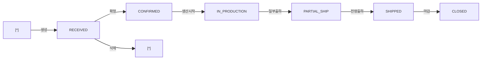

# 고객발주관리 — 비즈니스 로직 & 데이터 흐름 분석

> **분석 기준 커밋:** `8a7e96ea`
> **분석 일자:** `2026-07-04`

---

## 1. 화면 개요

| 항목 | 내용 |
|------|------|
| **메뉴 코드** | `SALES_CUST_PO` |
| **URL** | `/shipping/customer-po` |
| **메뉴 경로** | 영업관리 > 고객발주관리 |
| **화면 목적** | 고객 수주(발주) CRUD, 상태 관리, 우측 패널 방식 |
| **주요 사용자** | 영업/수주 관리자 |

## 2. 화면 구성

| 영역 | 역할 |
| --- | --- |
| 헤더 | 타이틀 + 새로고침/신규 버튼 |
| 스탯카드 5개 | Total/Received/Confirmed/InProduction/Shipped |
| DataGrid | 고객발주 목록 (검색/상태 필터) |
| 우측 패널 | `CustomerPoFormPanel` — 생성/수정 폼 |

## 3. API 호출 흐름

| 시점 | API | 용도 |
| --- | --- | --- |
| 페이지 로드 | `GET /shipping/customer-orders?limit=5000&search=&status=` | 목록 조회 |
| 저장 | `POST /shipping/customer-orders` (신규) / `PUT /shipping/customer-orders/:id` (수정) | CRUD |
| 삭제 | `DELETE /shipping/customer-orders/:id` | RECEIVED 상태만 삭제 |

## 4. 백엔드 처리 — `customer-order.service.ts`

- `findAll()` — `CustomerOrder` + `CustomerOrderItem` IN 조인, `ItemMaster` 품목명 매핑
- `create()` — `tx.run`: `CUSTOMER_ORDERS` INSERT + `CUSTOMER_ORDER_ITEMS` INSERT (seq 자동)
- `update()` — `tx.run`: items 전체 DELETE 후 재INSERT, 마감(CLOSED) 상태 차단
- `delete()` — RECEIVED 상태만 삭제 허용
- `findStatus()` — 출하율/잔량/기한초과 파생 상태 계산 (IN_PROGRESS/PARTIAL_SHIP/COMPLETED/OVERDUE)

## 5. 상태 전이

### CustomerOrder.status

## 6. DB 테이블 영향

| 테이블 | 변경 |
|--------|------|
| `CUSTOMER_ORDERS` | INSERT/UPDATE |
| `CUSTOMER_ORDER_ITEMS` | INSERT/DELETE (전체교체) |

## 7. 엔티티

| 엔티티 | 테이블명 |
|--------|----------|
| `CustomerOrder` | `CUSTOMER_ORDERS` |
| `CustomerOrderItem` | `CUSTOMER_ORDER_ITEMS` |

## 8. 비고

- 물리적 경로: `apps/frontend/src/app/(authenticated)/shipping/customer-po/`
- 메뉴 분류: 영업관리(SALES)지만 파일은 shipping 하위
- `CustomerPoFormPanel` 별도 컴포넌트 분리
- `ComCodeSelect`로 `SHIPMENT_STATUS` 공통코드 사용
