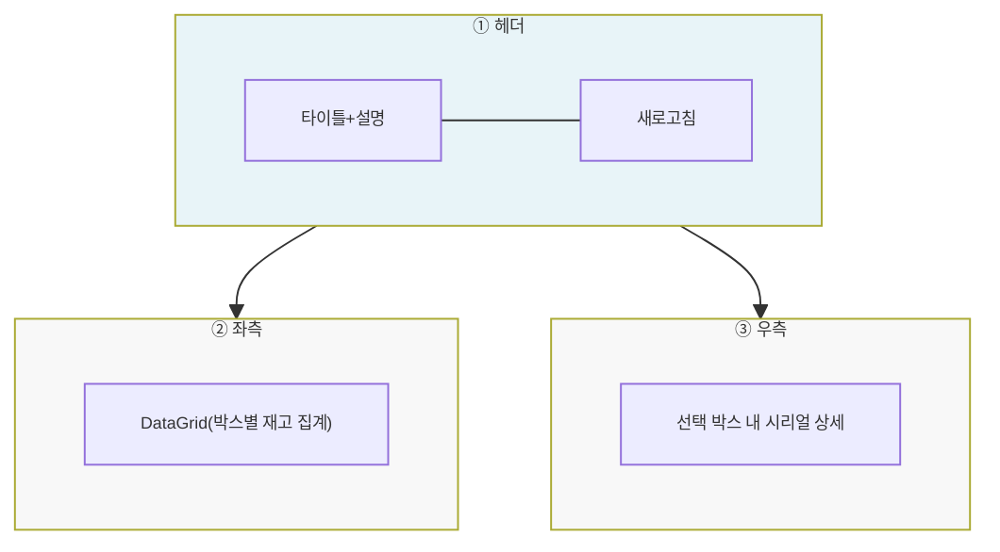
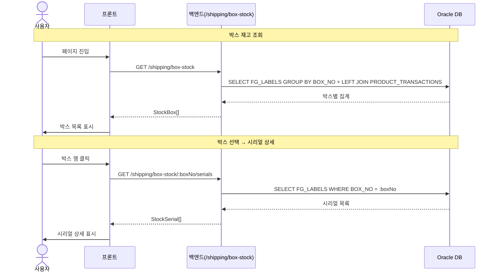
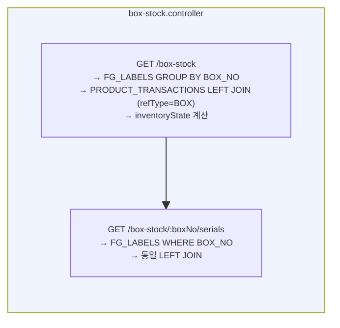

# 박스재고조회 — 비즈니스 로직 & 데이터 흐름 분석

> **분석 기준 커밋:** `8a7e96ea`
> **분석 일자:** `2026-07-04`

---

## 1. 화면 개요

| 항목 | 내용 |
|------|------|
| **메뉴 코드** | `SHIP_BOX_STOCK` |
| **URL** | `/shipping/box-stock` |
| **메뉴 경로** | 출하관리 > 박스재고조회 |
| **화면 목적** | 박스별 재고 현황 조회 (포장완료 → 입고/미입고 구분) |
| **주요 사용자** | 출하/재고 관리자 |
| **Workflow 노드** | 해당 없음 |

## 2. 화면 구성

### 2.1 레이아웃

| 영역 | 컴포넌트 | 역할 |
| --- | --- | --- |
| ① 헤더 | `page.tsx` | 타이틀, 설명, 새로고침 |
| ② 좌측 | `page.tsx` + `boxStockColumns.tsx` | 박스 재고 집계 DataGrid |
| ③ 우측 | `page.tsx` + `boxStockColumns.tsx` | 선택 박스의 FG 시리얼 목록 |

### 2.2 입력 폼 필드

| 필드 | 타입 | 필수 | 비고 |
|------|------|------|------|
| searchText | text | N | 박스번호 검색 |

## 3. 상태 관리

로컬 useState만 사용. 조회 전용(read-only).

## 4. API 호출 흐름

### 4-1. 조회

| 시점 | API | 용도 |
| --- | --- | --- |
| 페이지 로드 | `GET /shipping/box-stock?boxNo=` | 박스 재고 집계 목록 |
| 박스 선택 | `GET /shipping/box-stock/:boxNo/serials` | 선택 박스 내 FG 시리얼 목록 |

### 4-2. 조회 시퀀스

## 5. 백엔드 처리 — `box-stock.controller.ts`

트랜잭션 여부: 없음. 순수 SELECT 조회 전용.

1. **박스 목록** — `FG_LABELS` GROUP BY `BOX_NO`, `PRODUCT_TRANSACTIONS` LEFT JOIN(refType='BOX', transType IN ('WIP_OUT','FG_IN'))
   - `inventoryState`: `PRODUCT_TRANSACTIONS` 존재 시 `WAREHOUSE_RECEIVED`, 없으면 `PACKED_WAITING`
2. **시리얼 상세** — `FG_LABELS` WHERE `BOX_NO`, 동일 LEFT JOIN 방식

## 6. 처리 규칙 및 검증

### 6.1 조회 규칙
- `FG_LABELS.STATUS <> 'SHIPPED'` — 미출하 재고만 조회
- `FG_LABELS.BOX_NO IS NOT NULL` — 박스에 할당된 시리얼만 집계
- `inventoryState`는 `PRODUCT_TRANSACTIONS` 입고 트랜잭션 존재 여부로 판단

## 7. 상태 전이

해당 없음. 조회 전용(read-only).

## 8. 상태 코드 및 공통코드

| 상태명 | 코드값 | 설명 |
|--------|--------|-------------|
| 포장대기 | PACKED_WAITING | 박스 포장 완료, 창고 미입고 |
| 창고입고 | WAREHOUSE_RECEIVED | 창고 입고 완료 |

## 9. DB 테이블 영향 및 엔티티

### 9.1 테이블 영향

조회 전용 — INSERT/UPDATE/DELETE 없음.

### 9.2 연관 엔티티

| 엔티티 | 테이블명 | 역할 | 관계 |
|--------|----------|------|------|
| `FgLabel` | `FG_LABELS` | FG 시리얼 | BOX_NO로 BoxMaster 참조 |
| `ProductTransaction` | `PRODUCT_TRANSACTIONS` | 수불 트랜잭션 | refType='BOX', refId=boxNo |

## 10. 에러 코드 및 메시지

| 상황 | HTTP | 에러메시지 |
|------|------|-----------|
| 박스 없음 | 200 | 빈 배열 반환 |

## 11. 비고 / 위반 사항 / 우회 발견

- **공통코드 우회**: 없음. inventoryState는 프론트 enum `InventoryState`
- **`alert()/confirm()/prompt()`**: 사용하지 않음
- **tenant scope**: company/plant 적용
- **채번 방식**: 해당 없음 (SELECT only)
- **기타**: `PRODUCT_TRANSACTIONS`의 `refType='BOX'`가 입고 판단 기준. `packedWaiting`/`warehouseReceived` 레이블은 프론트에서 랜더링
