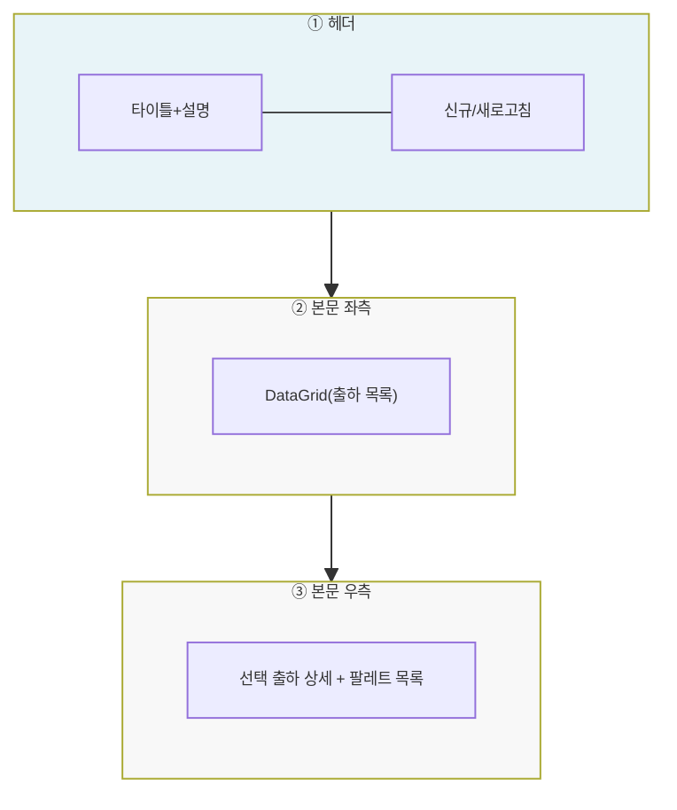
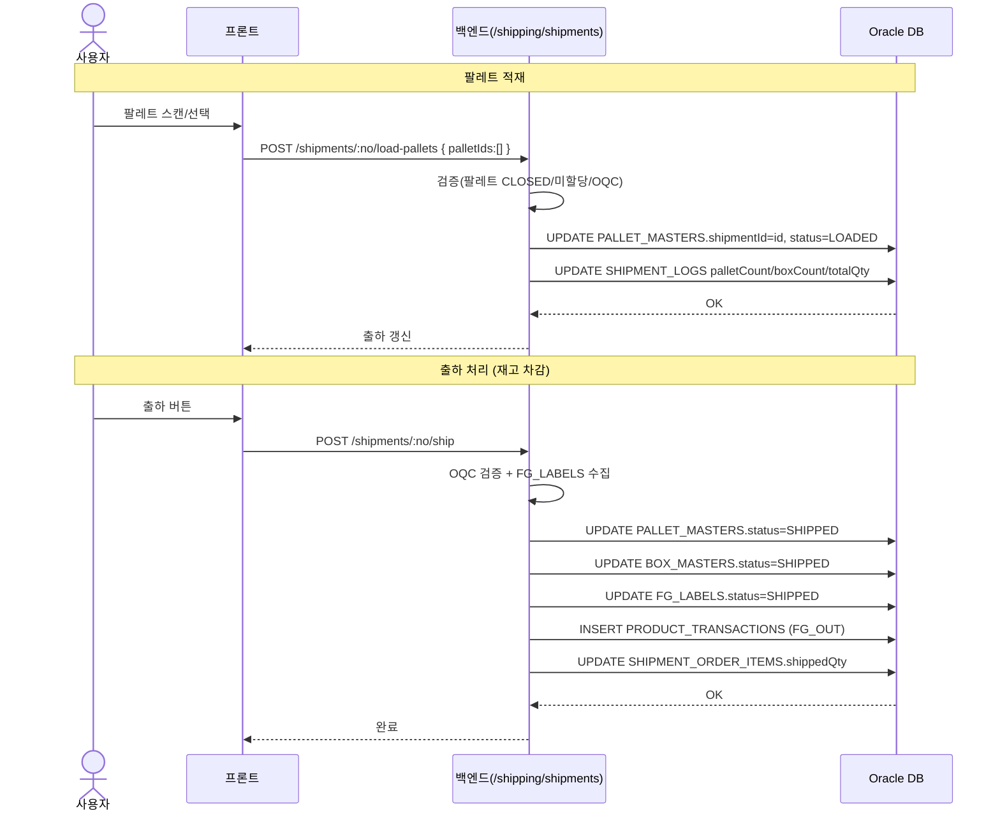
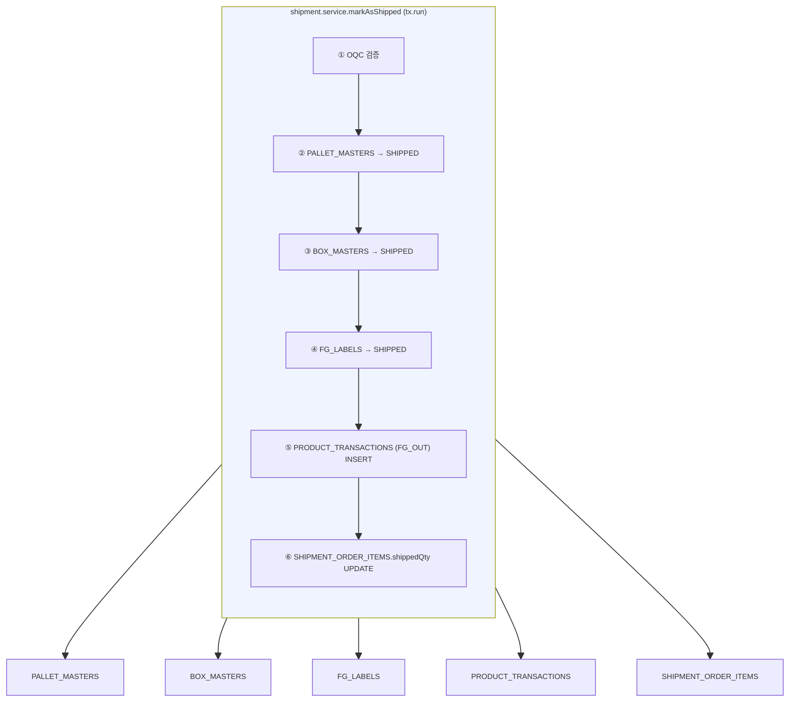
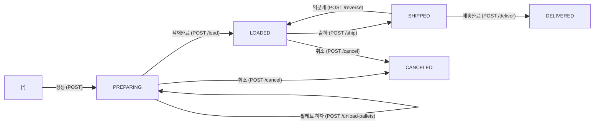

# 출하관리 — 비즈니스 로직 & 데이터 흐름 분석

> **분석 기준 커밋:** `8a7e96ea`
> **분석 일자:** `2026-07-04`

---

## 1. 화면 개요

| 항목 | 내용 |
|------|------|
| **메뉴 코드** | `SHIP_CONFIRM` |
| **URL** | `/shipping/confirm` |
| **메뉴 경로** | 출하관리 > 출하관리 |
| **화면 목적** | 출하(Shipment) 생성→적재→출하→배송완료 프로세스 관리 |
| **주요 사용자** | 출하 관리자 |
| **Workflow 노드** | 해당 없음 |

## 2. 화면 구성

(분석 중 — 컨트롤러 `shipment.controller.ts` → `shipment.service.ts` 전체 확인 완료)

### 2.1 레이아웃

| API 엔드포인트 | HTTP | 용도 |
|---------------|------|------|
| `/shipping/shipments` | GET | 출하 목록 조회 |
| `/shipping/shipments` | POST | 출하 생성 |
| `/shipping/shipments/:no` | PUT | 출하 수정 |
| `/shipping/shipments/:no` | DELETE | 출하 삭제 |
| `/shipping/shipments/:no/load-pallets` | POST | 팔레트 적재 |
| `/shipping/shipments/:no/unload-pallets` | POST | 팔레트 하차 |
| `/shipping/shipments/:no/ship` | POST | 출하 처리 (LOADED→SHIPPED) |
| `/shipping/shipments/:no/deliver` | POST | 배송완료 (SHIPPED→DELIVERED) |
| `/shipping/shipments/:no/cancel` | POST | 출하 취소 (PREPARING/LOADED→CANCELED) |
| `/shipping/shipments/:no/reverse` | POST | 역분개 (SHIPPED→LOADED) |

## 3. 상태 관리

로컬 useState만 사용.

## 4. API 호출 흐름

### 4-1. 상태 전이 시퀀스

## 5. 백엔드 처리 — `shipment.service.ts`

트랜잭션 여부: `markAsShipped()`는 전체 tx.run 내 6단계 처리.

1. **OQC 검증** — `OQC_ENABLED` 설정 시 PASS 아닌 박스 출하 차단
2. **팔레트 → SHIPPED** — `PALLET_MASTERS.status = 'SHIPPED'`
3. **박스 → SHIPPED** — `BOX_MASTERS.status = 'SHIPPED'`, `shippedAt` 세팅
4. **FG_LABELS → SHIPPED** — serialList의 모든 FG 바코드 batch UPDATE
5. **재고 차감** — `productInventoryService.issueStockByItemFifoInTx()` FG_OUT 트랜잭션
6. **출하지시 반영** — `SHIPMENT_ORDER_ITEMS.shippedQty` 누적, 전량 시 SHIPMENT_ORDERS → CLOSED

## 6. 처리 규칙 및 검증

### 6.1 입력 검증
- 팔레트는 CLOSED 상태여야 적재 가능
- OQC PASS 아닌 박스 포함 팔레트는 적재/출하 불가 (OQC_ENABLED 시)
- SHIPPED/DELIVERED 상태 수정/삭제 불가
- ERP 동기화 완료 시 역분개 불가

### 6.2 비즈니스 규칙
- 출하 취소는 PREPARING/LOADED만 가능 → 팔레트 CLOSED 복원
- 역분개는 SHIPPED만 가능 → LOADED로 복원 + 재고 역분개(FG_OUT_CANCEL)
- 출하 통계: 일자별/고객사별 집계 제공

## 7. 상태 전이

### 7.1 ShipmentLog.status

## 8. 상태 코드 및 공통코드

| 상태명 | 코드값 | 설명 |
|--------|--------|------|
| 준비중 | PREPARING | 출하 생성, 팔레트 적재 전 |
| 적재완료 | LOADED | 팔레트 적재 완료 |
| 출하완료 | SHIPPED | 게이트 통과, 재고 차감 완료 |
| 배송완료 | DELIVERED | 고객사 도착 |
| 취소 | CANCELED | 출하 취소 |

## 9. DB 테이블 영향 및 엔티티

### 9.1 테이블 영향

| 테이블 | 트리거 | 변경 | 주요 칼럼 |
| --- | --- | --- | --- |
| `SHIPMENT_LOGS` | 생성/수정 | INSERT/UPDATE | `status`, `palletCount`, `boxCount`, `totalQty` |
| `PALLET_MASTERS` | 적재/하차/출하 | UPDATE | `shipmentId`, `status` |
| `BOX_MASTERS` | 출하/역분개 | UPDATE | `status`, `shippedAt`, `shipOrderNo` |
| `FG_LABELS` | 출하/역분개 | UPDATE | `status` (SHIPPED↔PACKED) |
| `PRODUCT_TRANSACTIONS` | 출하/역분개 | INSERT | `transType=FG_OUT/FG_OUT_CANCEL` |
| `SHIPMENT_ORDER_ITEMS` | 출하/역분개 | UPDATE | `shippedQty` |

## 10. 에러 코드 및 메시지

| 상황 | HTTP | 에러메시지 |
|------|------|-----------|
| 팔레트 CLOSED 아님 | 400 | "CLOSED 상태가 아닌 팔레트가 있습니다" |
| OQC 미완료 | 400 | "OQC 미완료/불합격 박스가 포함되어 있습니다" |
| SHIPPED 상태 수정 | 400 | "출하 완료된 건은 수정할 수 없습니다" |
| ERP 동기화 완료 역분개 | 400 | "ERP 연동이 완료되어 역분개할 수 없습니다" |
| 취소 불가 상태 | 400 | "현재 상태에서는 취소할 수 없습니다" |

## 11. 비고 / 위반 사항 / 우회 발견

- **공통코드 우회**: 없음
- **`alert()/confirm()/prompt()`**: `toast` 사용
- **tenant scope**: company/plant 적용
- **채번 방식**: shipNo 자연키 (사용자 입력)
- **기타**: 출하가 가장 복잡한 트랜잭션(6개 테이블 동시 변경)을 가진 도메인. `cancelInTx`와 `reverseShipmentInTx` 헬퍼는 다른 서비스에서 재사용 가능하도록 분리됨
