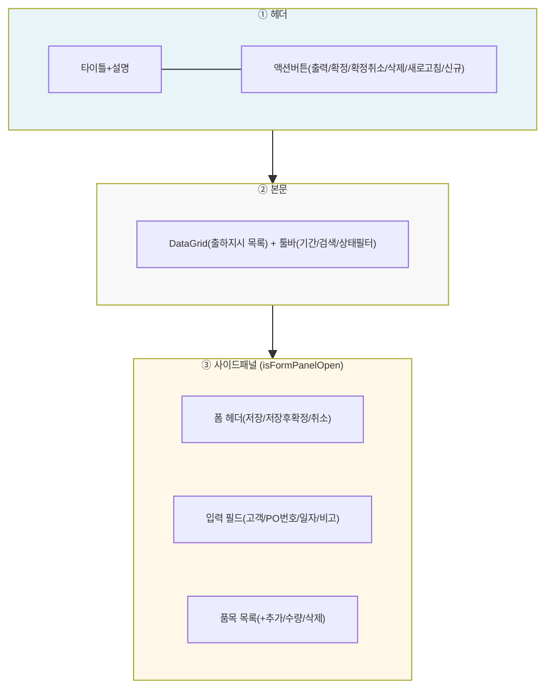
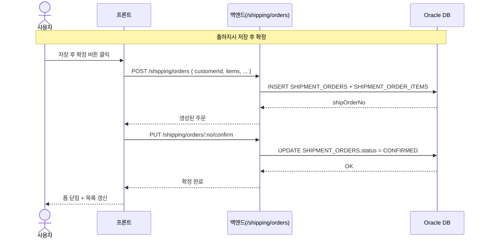
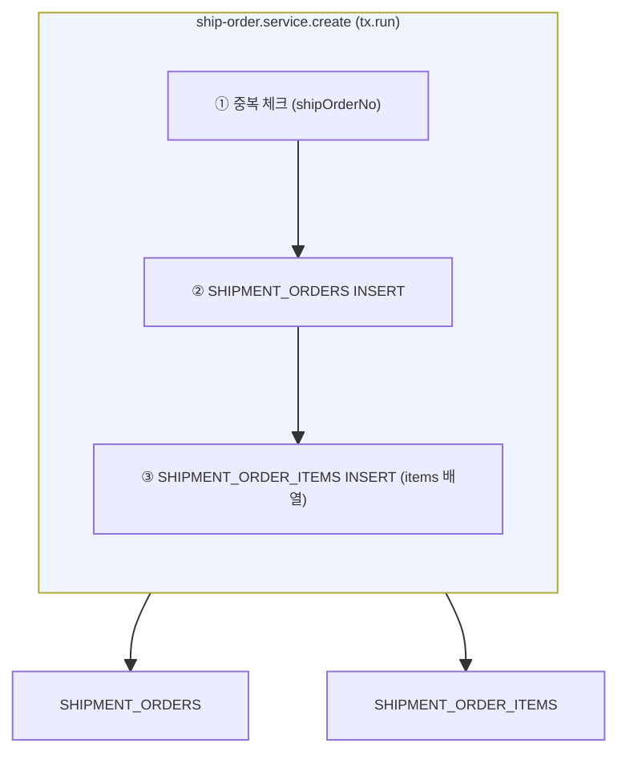
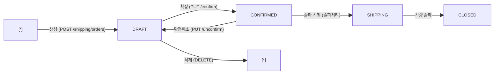

---
sources:
  - apps/frontend/src/components/shared/PartSearchModal.tsx
  - apps/frontend/src/components/ui/Modal.tsx
verifiedCommit: 8a7e96ea
---

# 출하지시등록 — 비즈니스 로직 & 데이터 흐름 분석

> **분석 기준 커밋:** `8a7e96ea`
> **분석 일자:** `2026-07-04`

---

## 1. 화면 개요

| 항목 | 내용 |
|------|------|
| **메뉴 코드** | `SHIP_ORDER` |
| **URL** | `/shipping/order` |
| **메뉴 경로** | 출하관리 > 출하지시등록 |
| **화면 목적** | 출하지시 CRUD, 품목 관리, 확정/확정취소, 출력 |
| **주요 사용자** | 출하 관리자 |
| **Workflow 노드** | 해당 없음 |

## 2. 화면 구성

### 2.1 레이아웃

| 영역 | 컴포넌트 | 역할 |
| --- | --- | --- |
| ① 헤더 | `page.tsx` | 타이틀, 선택행 기준 액션버튼 |
| ② 본문 | `page.tsx` + `shippingOrderColumns.tsx` | 출하지시 목록 DataGrid |
| ③ 사이드패널 | `page.tsx` 내장 | 생성/수정 폼 (480px) |
| 모달 | `PartSearchModal` | 품목 검색/선택 |
| 출력 | `page.tsx` 내장 | 출하지시서 QR코드+테이블 인쇄 |

### 2.2 입력 폼 필드

| 필드 | 타입 | 필수 | 기본값 | 검증 | 비고 |
|------|------|------|--------|------|------|
| shipOrderNo | text(disabled) | - | 자동생성 | - | 편집 시 표시 |
| customerId | Select(partner) | N | - | CUSTOMER 타입 | 거래처 선택 |
| customerPoNo | text | N | - | max 100 | 고객 PO번호 |
| dueDate | date | N | - | - | 납기일 |
| shipDate | date | Y | - | - | 출하예정일 |
| remark | text | N | - | max 500 | 비고 |
| items | 동적목록 | Y | - | orderQty>0, 정수 | 품목 라인 |

### 2.3 버튼/액션

| 버튼 | 조건 | 동작 | API |
|------|------|------|-----|
| 신규 | 항상 | 사이드패널 오픈(초기화) | - |
| 저장 | DRAFT(수정) or 신규 | 생성/수정 저장 | `POST /shipping/orders` or `PUT /shipping/orders/:no` |
| 저장 후 확정 | DRAFT or 신규 | 저장 + 확정 | `POST/PUT` → `PUT /shipping/orders/:no/confirm` |
| 확정 | 선택+DRAFT+품목있음 | 상태 CONFIRMED 변경 | `PUT /shipping/orders/:no/confirm` |
| 확정취소 | 선택+CONFIRMED | 상태 DRAFT 복원 | `PUT /shipping/orders/:no/unconfirm` |
| 삭제 | 선택+DRAFT | 출하지시 삭제 | `DELETE /shipping/orders/:no` |
| 출력 | 선택 | 출하지시서 인쇄(QR) | 브라우저 print() |

## 3. 상태 관리

로컬 useState만 사용.

| 상태 필드 | 용도 | 초기값 |
| --- | --- | --- |
| `data` | 출하지시 목록 | `[]` |
| `selectedOrder` | 선택된 행 | `null` |
| `isFormPanelOpen` | 사이드패널 표시 | `false` |
| `editingItem` | 수정 대상 | `null` |
| `form` | 폼 입력값 | `{ customerId, ... }` |
| `orderItems` | 품목 라인 | `[]` |

## 4. API 호출 흐름

### 4-1. 목록/상태

| 시점 | API | 용도 |
| --- | --- | --- |
| 페이지 로드 | `GET /shipping/orders?limit=5000&shipDateFrom=&shipDateTo=&status=&includeOpen=` | 출하지시 목록 |

### 4-2. CRUD/액션

| 시점 | API | 용도 |
| --- | --- | --- |
| 생성 | `POST /shipping/orders { customerId, items, ... }` | 출하지시 생성+품목 |
| 수정 | `PUT /shipping/orders/:no { ... }` | 출하지시 수정+품목교체 |
| 확정 | `PUT /shipping/orders/:no/confirm` | DRAFT→CONFIRMED |
| 확정취소 | `PUT /shipping/orders/:no/unconfirm` | CONFIRMED→DRAFT |
| 삭제 | `DELETE /shipping/orders/:no` | DRAFT만 삭제 |

### 4-3. 저장→확정 시퀀스

## 5. 백엔드 처리 — `ship-order.service.ts`

트랜잭션 여부: 생성/수정은 `tx.run` 트랜잭션 사용. 확정/확정취소는 단일 UPDATE.

1. **중복 체크** — 동일 shipOrderNo 존재 시 ConflictException
2. **SHIPMENT_ORDERS INSERT** — `status: 'DRAFT'`, tenant scope(company/plant)
3. **SHIPMENT_ORDER_ITEMS INSERT** — items 배열 순회, `seq` 자동 부여(1부터)
4. **확정** — `ship-order.service.confirm()`: `status: 'DRAFT' → 'CONFIRMED'`, 박스/팔레트 할당 가능 상태
5. **확정취소** — `ship-order.service.unconfirm()`: `status: 'CONFIRMED' → 'DRAFT'`, 단 출하수량/배정 내역 있으면 거부
6. **수정** — items 전체 DELETE 후 재INSERT (트랜잭션)
7. **삭제** — DRAFT 상태만 허용

## 6. 처리 규칙 및 검증

### 6.1 입력 검증
- shipDate 필수
- items 최소 1개 이상, 각 orderQty > 0 정수
- CLOSED 상태 수정 불가

### 6.2 비즈니스 규칙
- DRAFT만 수정/삭제 가능
- CONFIRMED 이후는 저장 불가 (전용 확정취소 API 필요)
- 확정취소 시 shippedQty > 0이면 불가 (이미 출하 진행)

### 6.3 트랜잭션 처리
1. `SHIPMENT_ORDERS` INSERT/UPDATE
2. `SHIPMENT_ORDER_ITEMS` INSERT/UPDATE/DELETE (전체 교체)
- 롤백 조건: any exception

## 7. 상태 전이

### 7.1 ShipmentOrder.status

## 8. 상태 코드 및 공통코드

| 상태명 | 코드값 | 공통코드그룹 | 설명 |
|--------|--------|-------------|------|
| 작성중 | DRAFT | SHIP_ORDER_STATUS | 생성 후 미확정 |
| 확정 | CONFIRMED | SHIP_ORDER_STATUS | 출하 진행 가능 |
| 출하중 | SHIPPING | SHIP_ORDER_STATUS | 일부 출하됨 |
| 마감 | CLOSED | SHIP_ORDER_STATUS | 전량 출하 완료 |

## 9. DB 테이블 영향 및 엔티티

### 9.1 테이블 영향

| 테이블 | 트리거 | 변경 | 주요 칼럼 |
| --- | --- | --- | --- |
| `SHIPMENT_ORDERS` | 생성/수정/확정 | INSERT/UPDATE | `status`, `customerId`, `shipDate` |
| `SHIPMENT_ORDER_ITEMS` | 생성/수정 | INSERT/DELETE | `itemCode`, `orderQty`, `shippedQty` |
| `SHIPMENT_ORDERS` | 확정취소 | UPDATE | `status=DRAFT` |

### 9.2 연관 엔티티

| 엔티티 | 테이블명 | 역할 | 관계 |
|--------|----------|------|------|
| `ShipmentOrder` | `SHIPMENT_ORDERS` | 출하지시 | PK: shipOrderNo |
| `ShipmentOrderItem` | `SHIPMENT_ORDER_ITEMS` | 출하지시 품목 | N:1 → ShipmentOrder |
| `ItemMaster` | `ITEM_MASTERS` | 품목 참조 | 1:N → ShipmentOrderItem |
| `PartnerMaster` | `PARTNER_MASTERS` | 고객사 참조 | 1:N → ShipmentOrder |

### 9.3 채번 방식

| 대상 | Oracle Object | 비고 |
|------|-------------|------|
| shipOrderNo | `PKG_SEQ_GENERATOR.GET_NO('SHIP_ORDER_NO')` | AGENTS §5 준수 |

## 10. 에러 코드 및 메시지

| 상황 | HTTP | 에러메시지 | 처리 |
|------|------|-----------|------|
| 중복 번호 | 409 | "이미 존재하는 출하지시번호입니다" | 생성 차단 |
| DRAFT 아닌 상태 삭제 | 400 | "DRAFT 상태에서만 삭제 가능합니다" | 버튼 비활성화 |
| 확정취소 불가 | 400 | "출하수량이 있어 확정취소할 수 없습니다" | ConfirmModal 표시 |
| 마감 상태 수정 | 400 | "마감된 발주는 수정할 수 없습니다" | 거부 |

## 11. 비고 / 위반 사항 / 우회 발견

- **공통코드 우회**: 없음. `SHIP_ORDER_STATUS` 공통코드 사용
- **`alert()/confirm()/prompt()`**: `ConfirmModal`, `toast` 사용
- **tenant scope**: company/plant 적용
- **채번 방식**: `PKG_SEQ_GENERATOR.GET_NO('SHIP_ORDER_NO')` — 준수
- **기타**: 사이드패널 폼은 `shipping/order/page.tsx` 내 인라인으로 구현, 별도 컴포넌트 분리 없음
