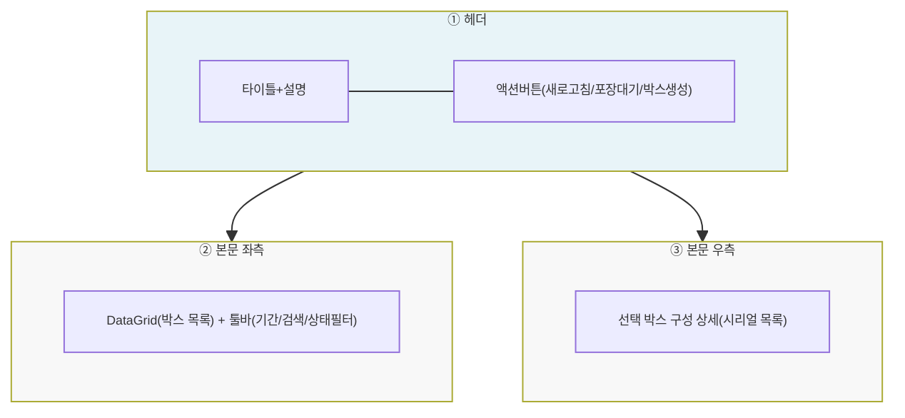
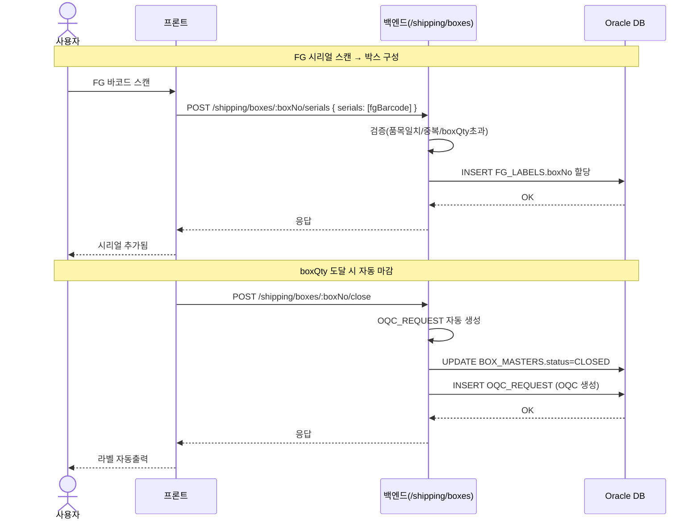
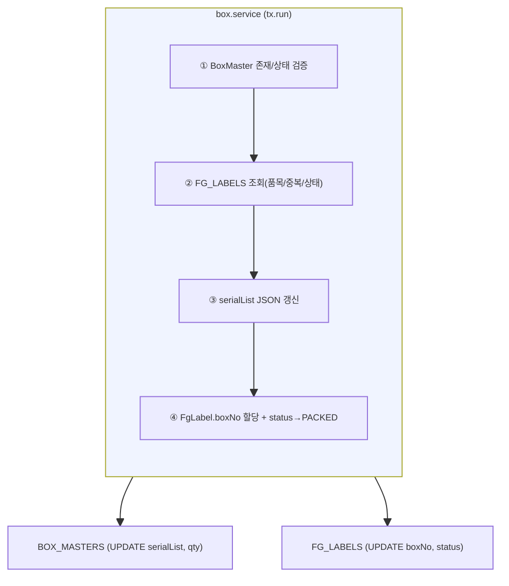
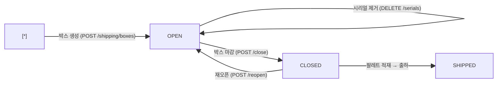
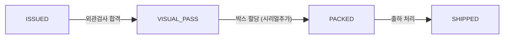

# 제품포장관리 — 비즈니스 로직 & 데이터 흐름 분석

> **분석 기준 커밋:** `8a7e96ea`
> **분석 일자:** `2026-07-04`

---

## 1. 화면 개요

| 항목 | 내용 |
|------|------|
| **메뉴 코드** | `SHIP_PACK` |
| **URL** | `/shipping/pack` |
| **메뉴 경로** | 출하관리 > 제품포장관리 |
| **화면 목적** | FG라벨(검사합격) 시리얼을 박스 단위로 포장(구성)하고 박스 마감/라벨 출력 |
| **주요 사용자** | 생산 포장 작업자 |
| **Workflow 노드** | 해당 없음 |

## 2. 화면 구성

### 2.1 레이아웃



| 영역 | 컴포넌트 | 역할 |
| --- | --- | --- |
| ① 헤더 | `page.tsx` | 타이틀, 포장대기 팝업/박스생성 버튼 |
| ② 좌측 본문 | `page.tsx` + `packColumns.tsx` | 박스 목록 DataGrid, 기간/상태 필터, 선택행 액션툴바 |
| ③ 우측 패널 | `page.tsx` | 선택 박스의 시리얼 구성 내역(품목정보/용량/시리얼목록) |
| 모달 | `BoxLabelModal.tsx` | 박스 라벨 출력/재발행 |
| 모달 | `page.tsx` 내장 | 박스생성 모달, 시리얼추가 모달, 포장대기 모달 |

### 2.2 입력 폼 필드

| 필드 | 타입 | 필수 | 기본값 | 검증 | 비고 |
|------|------|------|--------|------|------|
| statusFilter | select | N | 전체 | - | BOX_STATUS 공통코드 |
| createdFrom/To | date | N | 당일 | - | 생성일 기준 |
| searchText | text | N | - | - | 박스번호/품목코드 검색 |
| createItemCode | PartSelect | Y | - | FINISHED 타입 | 박스 생성 시 품목 선택 |
| serialInput | BarcodeScanInput | Y | - | FG_BARCODE | 바코드 스캔/수동입력 |

### 2.3 버튼/액션

| 버튼 | 조건 | 동작 | API |
|------|------|------|-----|
| 포장 대기 | 항상 | 포장가능 FG 시리얼 목록 모달 오픈 | `GET /shipping/boxes/packable-serials` |
| 박스 생성 | 항상 | 품목선택 모달 → 박스 생성 | `POST /shipping/boxes` |
| 제품 담기 | 선택+OPEN | 시리얼 추가 모달 오픈 | - |
| 박스 마감 | 선택+OPEN | 박스 CLOSED + OQC 자동생성 | `POST /shipping/boxes/:boxNo/close` |
| 재오픈 | 선택+CLOSED+미할당 | 박스 OPEN으로 복원 | `POST /shipping/boxes/:boxNo/reopen` |
| 라벨 재발행 | 선택+qty>0 | 라벨출력 모달 | 내장 |
| 빈 박스 삭제 | 선택+OPEN+미할당+비어있음 | 박스 삭제 | `DELETE /shipping/boxes/:boxNo` |
| 시리얼 추가 | 모달 내 OPEN | FG 시리얼 박스에 추가 | `POST /shipping/boxes/:boxNo/serials` |
| 시리얼 제거 | 모달 내 OPEN | FG 시리얼 박스에서 제거 | `DELETE /shipping/boxes/:boxNo/serials` |

## 3. 상태 관리

Zustand store 없음. 로컬 useState만 사용.

| 상태 필드 | 용도 | 초기값 |
| --- | --- | --- |
| `data` | 박스 목록 | `[]` |
| `selectedBox` | 선택된 박스 | `null` |
| `isSerialModalOpen` | 시리얼 추가 모달 | `false` |

## 4. API 호출 흐름

### 4-1. 목록 조회

| 시점 | API | 용도 |
| --- | --- | --- |
| 페이지 로드 | `GET /shipping/boxes?limit=5000&search=&status=&createdFrom=&createdTo=&includeOpen=` | 박스 목록 조회 |
| 페이지 로드 | `GET /shipping/boxes/packable-serials` | 포장 대기 FG 시리얼 목록 |
| 박스 선택 | `GET /shipping/boxes/:boxNo/items` | 선택 박스 내 시리얼 상세 |

### 4-2. CRUD/액션

| 시점 | API | 용도 |
| --- | --- | --- |
| 박스 생성 | `POST /shipping/boxes { itemCode }` | 빈 박스 생성 |
| 시리얼 추가 | `POST /shipping/boxes/:boxNo/serials { serials:[] }` | FG 바코드를 박스에 할당 |
| 시리얼 제거 | `DELETE /shipping/boxes/:boxNo/serials { serials:[] }` | FG 바코드를 박스에서 제거 |
| 박스 마감 | `POST /shipping/boxes/:boxNo/close` | 박스 CLOSED + OQC 생성 |
| 재오픈 | `POST /shipping/boxes/:boxNo/reopen` | 박스 OPEN 복원 |
| 빈 박스 삭제 | `DELETE /shipping/boxes/:boxNo` | OPEN+빈 박스만 삭제 |

### 4-3. 시리얼 추가 → 박스 자동마감 시퀀스



```http
POST /shipping/boxes/:boxNo/serials
body: { "serials": ["FG2407010001"] }
```

## 5. 백엔드 처리 — `box.service.ts` 중심

트랜잭션 여부: 시리얼 추가/제거/마감은 `tx.run` 트랜잭션 내에서 처리.



1. **검증** — 박스 OPEN 상태 확인, FG 바코드 품목일치/중복/boxQty 초과 확인
2. **serialList 갱신** — `BOX_MASTERS.serialList` JSON 배열에 FG바코드 추가/제거
3. **FgLabel 연결** — `FG_LABELS.boxNo` 할당, `status` → `PACKED`
4. **박스 마감** — `BOX_MASTERS.status` → `CLOSED`, `OQC_REQUEST` 자동 생성
5. **OQC 생성** — `box.service.closeBox()` 내에서 OQC 요청 레코드 INSERT

## 6. 처리 규칙 및 검증

### 6.1 입력 검증
- FG 바코드가 `FG_LABELS`에 존재하고 `status`가 `ISSUED`/`VISUAL_PASS`여야 함
- 동일 박스 내 중복 FG 바코드 불가
- `boxQty`(품목마스터 설정) 초과 불가 (미만은 허용)
- 박스 마감은 OPEN 상태에서만 가능

### 6.2 비즈니스 규칙
- 박스 생성 시 `qty=0`, `serialList=null`
- 시리얼 추가 시 자동으로 `qty` 증가
- `boxQty` 도달 시 자동 마감 + 라벨 자동 출력
- OQC 사용 설정(`OQC_ENABLED`) 시 마감과 동시에 OQC 요청 생성

### 6.3 트랜잭션 처리
1. `BOX_MASTERS` (UPDATE serialList, qty, status)
2. `FG_LABELS` (UPDATE boxNo, status)
3. `OQC_REQUEST` (INSERT — 마감 시)
- 롤백 조건: any exception

## 7. 상태 전이

### 7.1 BoxMaster.status



### 7.2 FgLabel.status



## 8. 상태 코드 및 공통코드

| 상태명 | 코드값 | 공통코드그룹 | 설명 |
|--------|--------|-------------|------|
| 박스 OPEN | OPEN | BOX_STATUS | 포장 진행중 |
| 박스 CLOSED | CLOSED | BOX_STATUS | 포장 완료(마감) |
| 박스 SHIPPED | SHIPPED | BOX_STATUS | 출하 완료 |
| FG 라벨 ISSUED | ISSUED | FG_LABEL_STATUS | 최초 발행 |
| FG 라벨 VISUAL_PASS | VISUAL_PASS | FG_LABEL_STATUS | 외관검사 합격 |
| FG 라벨 PACKED | PACKED | FG_LABEL_STATUS | 포장 완료 |
| FG 라벨 SHIPPED | SHIPPED | FG_LABEL_STATUS | 출하 완료 |

## 9. DB 테이블 영향 및 엔티티

### 9.1 테이블 영향

| 테이블 | 트리거 | 변경 | 주요 칼럼 |
| --- | --- | --- | --- |
| `BOX_MASTERS` | 시리얼 추가/제거 | UPDATE | `serialList`, `qty`, `status` |
| `BOX_MASTERS` | 박스 생성 | INSERT | `boxNo`, `itemCode`, `status=OPEN` |
| `BOX_MASTERS` | 박스 마감 | UPDATE | `status=CLOSED`, `closeAt` |
| `FG_LABELS` | 시리얼 추가 | UPDATE | `boxNo`, `status=PACKED` |
| `FG_LABELS` | 시리얼 제거 | UPDATE | `boxNo=NULL`, `status=VISUAL_PASS` |
| `OQC_REQUEST` | 박스 마감 | INSERT | OQC 요청 레코드 생성 |

### 9.2 연관 엔티티

| 엔티티 | 테이블명 | 역할 | 관계 |
|--------|----------|------|------|
| `BoxMaster` | `BOX_MASTERS` | 박스 정보 | PK: boxNo |
| `FgLabel` | `FG_LABELS` | FG 시리얼 | N:1 → BoxMaster.boxNo |
| `ItemMaster` | `ITEM_MASTERS` | 품목 | 1:N → BoxMaster.itemCode |
| `OqcRequest` | `OQC_REQUEST` | OQC 요청 | 1:1 → BoxMaster.boxNo |

### 9.3 채번 방식

| 대상 | Oracle Object | 비고 |
|------|-------------|------|
| boxNo | `PKG_SEQ_GENERATOR.GET_NO('BOX_NO')` | AGENTS §5 준수 |

## 10. 에러 코드 및 메시지

| 상황 | HTTP | 에러메시지 | 처리 |
|------|------|-----------|------|
| 품목 미선택 | - | "품목을 선택하세요" | 생성 버튼 비활성화 |
| 시리얼 중복 | 400 | "이미 박스에 포함된 시리얼입니다" | 토스트 메시지 |
| boxQty 초과 | 400 | "박스 입수량을 초과할 수 없습니다" | 모달 경고 |
| OPEN이 아닌 상태 | 400 | "OPEN 상태에서만 처리할 수 있습니다" | 버튼 비활성화 |

## 11. 비고 / 위반 사항 / 우회 발견

- **공통코드 우회**: 없음. `BOX_STATUS` 공통코드 사용
- **`alert()/confirm()/prompt()`**: `ConfirmModal` 컴포넌트 사용
- **tenant scope**: company/plant 적용 (복합 PK)
- **채번 방식**: `PKG_SEQ_GENERATOR.GET_NO('BOX_NO')` — SEQUENCE NEXTVAL 패턴 준수
- **기타**: 박스 생성 시 `shipOrderNo`가 NULL인 독립 박스. 출하지시 연결은 팔레트 단계에서 수행
