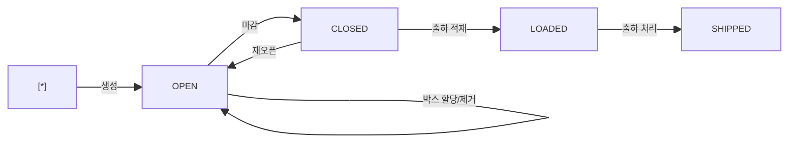

# 팔레트적재 — 비즈니스 로직 & 데이터 흐름 분석

> **분석 기준 커밋:** `8a7e96ea`
> **분석 일자:** `2026-07-04`

---

## 1. 화면 개요

| 항목 | 내용 |
|------|------|
| **메뉴 코드** | `SHIP_PALLET` |
| **URL** | `/shipping/pallet` |
| **메뉴 경로** | 출하관리 > 팔레트적재 |
| **화면 목적** | 출하지시별 팔레트 생성/박스할당/마감/재오픈 |
| **주요 사용자** | 출하 작업자 |
| **Workflow 노드** | 해당 없음 |

## 2. 화면 구성

| 영역 | 역할 |
| --- | --- |
| DataGrid(팔레트 목록) | 팔레트 목록 + 기간/상태 필터 |
| 우측 패널 | 선택 팔레트 내 박스 목록 |
| 팔레트생성 모달 | 대기 출하지시 선택 + 바코드 스캔 |
| 박스할당 모달 | 적재가능 박스 목록 + 바코드 스캔 |

## 3. API 호출 흐름

| 시점 | API | 용도 |
| --- | --- | --- |
| 페이지 로드 | `GET /shipping/pallets?limit=5000` | 팔레트 목록 |
| 페이지 로드 | `GET /shipping/orders?status=CONFIRMED&limit=5000` | 대기 출하지시 |
| 생성 | `POST /shipping/orders/:no/pallets {}` | 팔레트 생성 (자동채번) |
| 박스할당 | `POST /shipping/orders/:orderNo/pallets/:palletNo/boxes { boxIds }` | 박스→팔레트 할당 |
| 박스제거 | `DELETE /shipping/orders/:orderNo/pallets/:palletNo/boxes { boxIds }` | 박스→팔레트 제거 |
| 마감 | `POST /shipping/orders/:orderNo/pallets/:palletNo/close` | 팔레트 CLOSED |
| 재오픈 | `POST /shipping/pallets/:palletNo/reopen` | 팔레트 재오픈 |
| 조회 | `GET /shipping/pallets/barcode/:palletNo/boxes` | 팔레트 포함 박스 |
| 조회 | `GET /shipping/pallets/pallet-no/:palletNo` | 팔레트 단건 |

## 4. 처리 규칙

- 마감(CLOSED) + 미할당 + OQC PASS 박스만 팔레트에 적재 가능
- `shipOrderNo`가 연결된 팔레트만 박스 할당 가능
- 출하지시와 다른 품목의 박스는 동일 팔레트에 적재 불가

## 5. 상태 전이

### PalletMaster.status

## 6. DB 테이블 영향

| 테이블 | 변경 | 비고 |
|--------|------|------|
| `PALLET_MASTERS` | INSERT/UPDATE | 생성/마감/재오픈/박스할당 |
| `BOX_MASTERS` | UPDATE palletNo | 박스할당 시 |

## 7. 비고

- 팔레트번호는 자동 채번
- `shipOrderNo`로 출하지시와 연결되어야 박스 할당 가능
