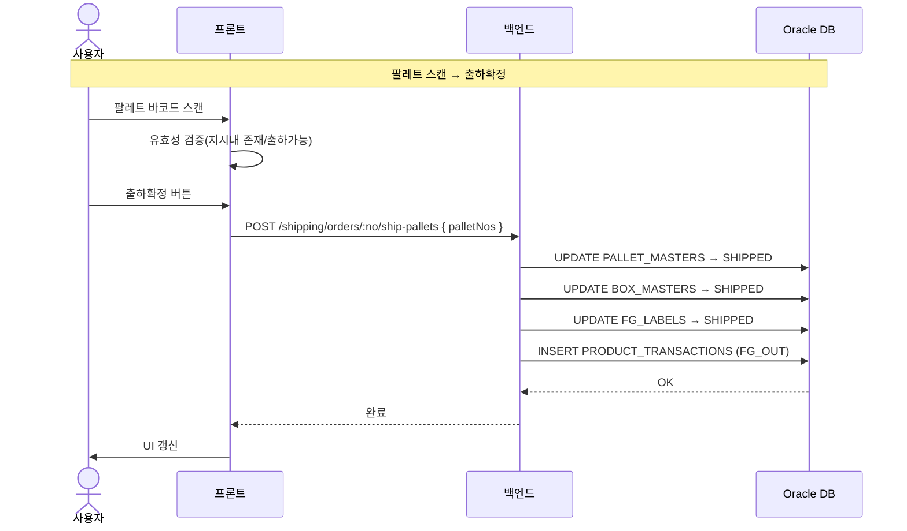

# 팔레트출하 — 비즈니스 로직 & 데이터 흐름 분석

> **분석 기준 커밋:** `8a7e96ea`
> **분석 일자:** `2026-07-04`

---

## 1. 화면 개요

| 항목 | 내용 |
|------|------|
| **메뉴 코드** | `SHIP_PALLET_SHIP` |
| **URL** | `/shipping/pallet-ship` |
| **메뉴 경로** | 출하관리 > 팔레트출하 |
| **화면 목적** | 출하지시별 팔레트를 스캔하여 일괄 출하 처리 |
| **주요 사용자** | 출하 게이트 작업자 |

## 2. 화면 구성

| 영역 | 역할 |
| --- | --- |
| 좌측: 출하지시 목록 | CONFIRMED 상태 지시만 표시 |
| 중앙: 팔레트 DataGrid | 선택 지시의 팔레트 목록 (출하가능/불가 구분) |
| 우측: 박스 구성 | 선택 팔레트 내 박스 목록 |
| 스캔 모달 | 팔레트 바코드 스캔 → 출하확정 |

## 3. API 호출 흐름

| 시점 | API | 용도 |
| --- | --- | --- |
| 페이지 로드 | `GET /shipping/orders?status=CONFIRMED&limit=200` | 출하대기 지시 |
| 지시 선택 | `GET /shipping/orders/:no/fulfillment` | 팔레트+박스+후보박스 조회 |
| 출하확정 | `POST /shipping/orders/:no/ship-pallets { palletNos }` | 팔레트→SHIPPED 일괄 처리 |

### 시퀀스

## 4. 처리 규칙

- 출하 전용 API (`ship-pallets`)는 `pallet.service`의 `shipPallets()` 또는 `ship-order.service`에 위임
- 스캔된 팔레트는 해당 출하지시 소속이어야 함
- `canShip()` 조건: CLOSED 상태 + 할당된 박스 존재

## 5. DB 테이블 영향

| 테이블 | 변경 |
|--------|------|
| `PALLET_MASTERS` | status → SHIPPED |
| `BOX_MASTERS` | status → SHIPPED, shippedAt |
| `FG_LABELS` | status → SHIPPED |
| `PRODUCT_TRANSACTIONS` | INSERT (FG_OUT) |
| `SHIPMENT_ORDER_ITEMS` | shippedQty 증가 |
| `SHIPMENT_ORDERS` | 전량 시 → CLOSED |

## 6. 비고

- `SHIP_PALLET_SHIP`은 SHIP_CONFIRM과 달리 "출하지시 단위"로 팔레트를 출하
- 팔레트 출하만 처리 (박스 단건 출하는 해당 없음)
