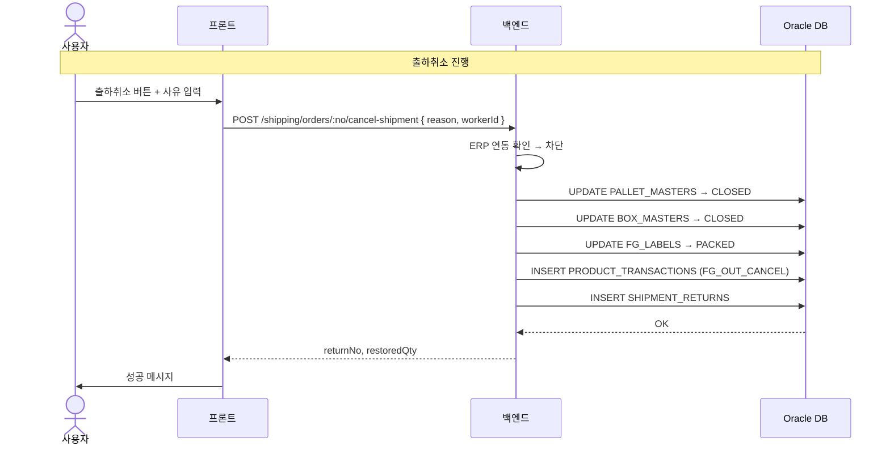

# 출하취소 — 비즈니스 로직 & 데이터 흐름 분석

> **분석 기준 커밋:** `8a7e96ea`
> **분석 일자:** `2026-07-04`

---

## 1. 화면 개요

| 항목 | 내용 |
|------|------|
| **메뉴 코드** | `SHIP_RETURN` |
| **URL** | `/shipping/return` |
| **메뉴 경로** | 출하관리 > 출하취소 |
| **화면 목적** | 출하지시 단위로 출하분(팔레트+박스)을 취소하고 재고 복원 |
| **주요 사용자** | 출하 관리자 |

## 2. 화면 구성

| 영역 | 역할 |
| --- | --- |
| 뷰 토글 | 출하이력 / 취소이력 |
| 좌측: 출하이력 DataGrid | 출하분이 있는 출하지시 목록 |
| 우측: 출하 상세 | 팔레트/박스 구성 + 출하취소 버튼 |
| 취소 모달 | 취소 사유 입력 → 확인 |

## 3. API 호출 흐름

| 시점 | API | 용도 |
| --- | --- | --- |
| 페이지 로드(출하) | `GET /shipping/orders/shipped` | 출하분 있는 지시 |
| 페이지 로드(취소) | `GET /shipping/returns?limit=5000` | 취소 이력 |
| 행 선택 | `GET /shipping/orders/:no/shipped-detail` | 출하 상세 |
| 출하취소 | `POST /shipping/orders/:no/cancel-shipment { reason, workerId }` | 출하 취소 + 재고 복원 |

### 시퀀스

## 4. 백엔드 처리 — `ship-return.service.ts`

- `GET /shipping/orders/shipped` — 출하처리된 지시 목록 조회
- `POST /shipping/orders/:no/cancel-shipment` — 취소 트랜잭션 (tx.run)
  1. ERP 동기화 여부 확인 (erpSyncYn=Y면 차단)
  2. 팔레트 상태 → CLOSED, shipmentId=null
  3. 박스 상태 → CLOSED, shippedAt=null, shipOrderNo=null
  4. FG_LABELS → PACKED
  5. PRODUCT_TRANSACTIONS 역분개 (FG_OUT_CANCEL)
  6. SHIPMENT_RETURNS + SHIPMENT_RETURN_ITEMS INSERT
  7. SHIPMENT_ORDER_ITEMS.shippedQty 차감
  8. SHIPMENT_ORDERS 상태 → CONFIRMED

## 5. DB 테이블 영향

| 테이블 | 변경 |
|--------|------|
| `PALLET_MASTERS` | status→CLOSED, shipmentId→null |
| `BOX_MASTERS` | status→CLOSED, shippedAt→null |
| `FG_LABELS` | status→PACKED |
| `PRODUCT_TRANSACTIONS` | INSERT (FG_OUT_CANCEL) |
| `SHIPMENT_RETURNS` | INSERT (returnNo 자동 채번) |
| `SHIPMENT_RETURN_ITEMS` | INSERT |
| `SHIPMENT_ORDER_ITEMS` | shippedQty 차감 |
| `SHIPMENT_ORDERS` | status→CONFIRMED |

## 6. 처리 규칙

- ERP 연동 완료된 출하는 취소 불가
- 취소 사유 필수 입력
- 출하취소는 SHIPMENT 단위가 아닌 SHIPMENT_ORDER 단위로 처리
- SHIP_CONFIRM의 `reverseShipment`와 달리 SHIP_RETURN은 `cancel-shipment` 별도 엔드포인트

## 7. 비고

- `ship-return.controller.ts`의 @Controller는 `shipping/returns`
- view 토글: 출하이력 / 취소이력 (GET /shipping/returns)
- 취소 성공 시 returnNo와 복원 수량 표시
