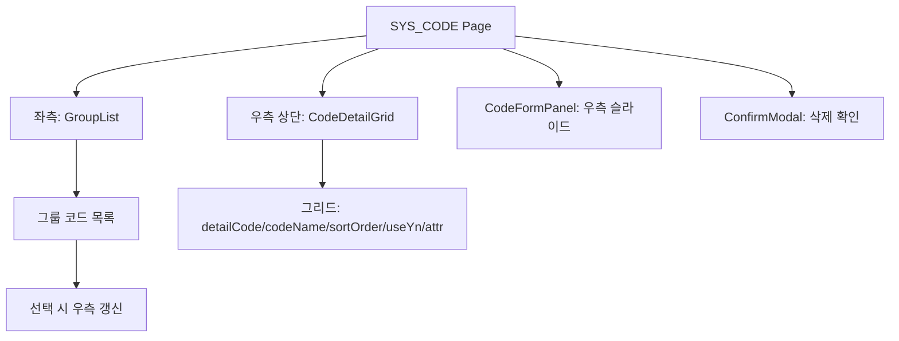
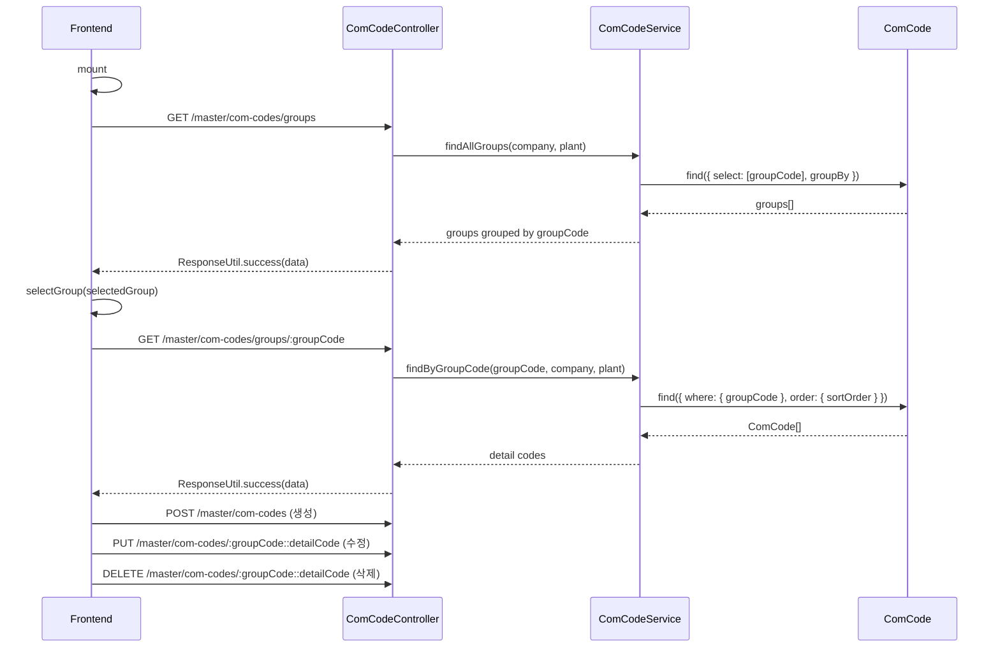

---
sources:
  - apps/frontend/src/app/(authenticated)/master/code/page.tsx
verifiedCommit: 8a7e96ea
---

# 공통코드 관리 — 비즈니스 로직 & 데이터 흐름 분석
> **분석 기준 커밋:** `8a7e96ea`
> **분석 일자:** `2026-07-04`

## 1. 화면 개요

시스템 전역 공통코드(ComCode)를 그룹별로 관리하는 페이지. 좌측 그룹 리스트 + 우측 상세 코드 그리드 + 슬라이드 패널 CRUD.

| 항목 | 내용 |
|------|------|
| **메뉴 코드** | SYS_CODE |
| **경로** | `/master/code` |
| **프론트 파일** | `apps/frontend/src/app/(authenticated)/master/code/page.tsx` |
| **컴포넌트** | `GroupList.tsx`, `CodeDetailGrid.tsx`, `CodeFormPanel.tsx` |
| **타입** | `types.ts` |
| **백엔드** | `ComCodeController` (`/master/com-codes`) |
| **서비스** | `ComCodeService` |
| **DB 엔티티** | `ComCode` |
| **훅** | `useApiQuery`, `useApiMutation`, `useInvalidateQueries` (React Query) |

## 2. 화면 구성



## 3. 상태 관리

```typescript
const [selectedGroup, setSelectedGroup] = useState("");
const [isPanelOpen, setIsPanelOpen] = useState(false);
const [editingCode, setEditingCode] = useState<ComCodeDetail | null>(null);
const [deleteTarget, setDeleteTarget] = useState<ComCodeDetail | null>(null);

// React Query
const { data: groupsData } = useApiQuery(["com-codes", "groups"], "/master/com-codes/groups");
const { data: codesData } = useApiQuery(
  ["com-codes", "detail", selectedGroup],
  `/master/com-codes/groups/${selectedGroup}`,
  { enabled: !!selectedGroup }
);
```

## 4. API 호출 흐름



## 5. 백엔드 처리

- `ComCodeService.findAllGroups`: DISTINCT groupCode 조회
- `ComCodeService.findByGroupCode`: groupCode로 ComCode 목록 조회
- `ComCodeService.create`: groupCode+detailCode 중복 체크
- `ComCodeService.update`: 복합키 `groupCode::detailCode` 파싱 → update
- `ComCodeService.delete`: 복합키 파싱 → delete
- `findAllActive`: 전체 활성 코드를 groupCode별 그룹핑 (앱 초기 로딩용)

## 6. 처리 규칙 및 검증

- 첫 로드 시 첫 번째 그룹 자동 선택
- groupCode + detailCode = 복합키 (프론트에서 `::` 조인)
- detailCode, codeName, sortOrder 필수
- useYn: Y/N
- attr1/attr2/attr3: 추가 속성 (코드별로 다르게 사용)
- React Query `invalidate(["com-codes"])`로 CRUD 후 캐시 무효화

## 7. ComCodeDetail 타입

```typescript
interface ComCodeDetail {
  groupCode: string;
  detailCode: string;
  parentCode: string | null;
  codeName: string;
  codeDesc: string | null;
  sortOrder: number;
  useYn: string;
  attr1/attr2/attr3: string | null;
}
```

## 8. 상태 코드 및 공통코드

공통코드 관리 페이지 자체가 공통코드를 CRUD하는 페이지이므로 별도 코드 테이블 없음.

## 9. DB 테이블 영향 및 엔티티

**ComCode** (`com-code.entity.ts`)
| 컬럼 | 설명 |
|------|------|
| groupCode | 그룹 코드 |
| detailCode | 상세 코드 |
| parentCode | 부모 코드 |
| codeName | 코드명 |
| codeDesc | 설명 |
| sortOrder | 정렬 순서 |
| useYn | 사용여부 |
| attr1/2/3 | 추가 속성 |
| defectGrade | 불량 등급 |
| company | 테넌트 |
| plant | 테넌트 |

## 10. 에러 코드

| HTTP | 상황 |
|------|------|
| 404 | 코드 미존재 |
| 409 | 중복 groupCode+detailCode |

## 11. 비고

- `useUnsavedGuard`로 편집 중인 폼 보호
- 첫 로드 시 useApiQuery의 enabled 옵션으로 선택된 그룹이 있을 때만 상세 조회
- 프론트 전체에서 `@/components/shared/ComCodeBadge`, `ComCodeSelect`, `useComCode` 등으로 공통코드 참조
