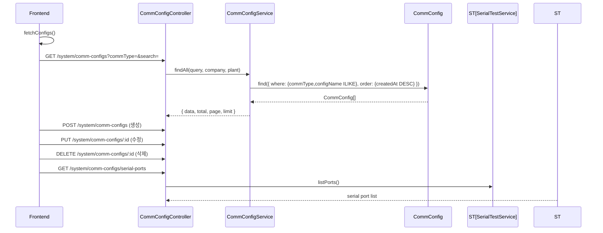

# 통신설정 관리 — 비즈니스 로직 & 데이터 흐름 분석
> **분석 기준 커밋:** `8a7e96ea`
> **분석 일자:** `2026-07-04`

## 1. 화면 개요

설비/장비 통신 설정(SERIAL/TCP/MQTT/OPC-UA/Modbus)을 CRUD 관리하는 페이지. 시리얼 포트 테스트 기능 포함.

| 항목 | 내용 |
|------|------|
| **메뉴 코드** | SYS_COMM |
| **경로** | `/system/comm-config` |
| **프론트 파일** | `apps/frontend/src/app/(authenticated)/system/comm-config/page.tsx` |
| **훅** | `useCommConfigData` (`@/hooks/system/useCommConfigData`) |
| **컴포넌트** | `CommConfigForm` (`@/components/system/CommConfigForm`), `SerialTestModal` |
| **백엔드** | `CommConfigController` (`/system/comm-configs`) |
| **서비스** | `CommConfigService`, `SerialTestService` |
| **DB 엔티티** | `CommConfig` |

## 2. 화면 구성

```mermaid
flowchart TD
    A[SYS_COMM Page] --> B[StatCard × 4: 전체/SERIAL/TCP/기타]
    A --> C[DataGrid: 통신설정 목록]
    C --> D[Actions: 시리얼 테스트 / 수정 / 삭제]
    A --> E[Modal: CommConfigForm (생성/수정)]
    A --> F[SerialTestModal]
    A --> G[ConfirmModal: 삭제 확인]
```

| StatCard | 값 |
|----------|-----|
| 전체 설정 | stats.total |
| SERIAL | stats.serialCount |
| TCP | stats.tcpCount |
| MQTT/기타 | stats.otherCount |

## 3. 상태 관리

```typescript
// useCommConfigData 훅에서 관리
const { configs, loading, stats, typeFilter, setTypeFilter, searchText, setSearchText,
        isModalOpen, editingConfig, deleteTarget, ... } = useCommConfigData();
```

## 4. API 호출 흐름



## 5. 백엔드 처리

- `CommConfigService.findAll`: commType 필터 + configName ILIKE 검색
- `CommConfigService.create`: configName 중복 체크 → create
- `CommConfigService.update`: 존재 확인 + 이름 중복 체크 → partial update
- `CommConfigService.remove`: 진짜 DELETE
- `SerialTestService.listPorts`: 시스템 시리얼 포트 목록 반환

## 6. 처리 규칙 및 검증

- 통신 타입: SERIAL/TCP/MQTT/OPC_UA/MODBUS
- configName은 unique (PK)
- extraConfig는 JSON 문자열로 저장
- SerialTestModal: 선택한 설정으로 시리얼 통신 테스트

## 7. 상태 전이

- useYn(Y/N)으로 활성/비활성

## 8. 상태 코드 및 공통코드

- 없음

## 9. DB 테이블 영향 및 엔티티

**CommConfig** (`comm-config.entity.ts`)
| 컬럼 | 설명 |
|------|------|
| configName | 설정명 (PK) |
| commType | 통신 유형 |
| description | 설명 |
| host | 호스트 (TCP) |
| port | 포트 |
| portName | 시리얼 포트명 |
| baudRate | Baud rate |
| dataBits | 데이터 비트 |
| stopBits | 정지 비트 |
| parity | 패리티 |
| flowControl | 흐름 제어 |
| extraConfig | 추가 설정 (JSON) |
| useYn | 사용여부 |
| company | 테넌트 |
| plant | 테넌트 |

## 10. 에러 코드

| HTTP | 상황 |
|------|------|
| 404 | 설정 미존재 |
| 409 | 중복 설정명 |

## 11. 비고

- `useCommConfigData` 커스텀 훅에서 상태/API 로직 캡슐화
- commConfigColumns.tsx에 그리드 컬럼 정의 분리
