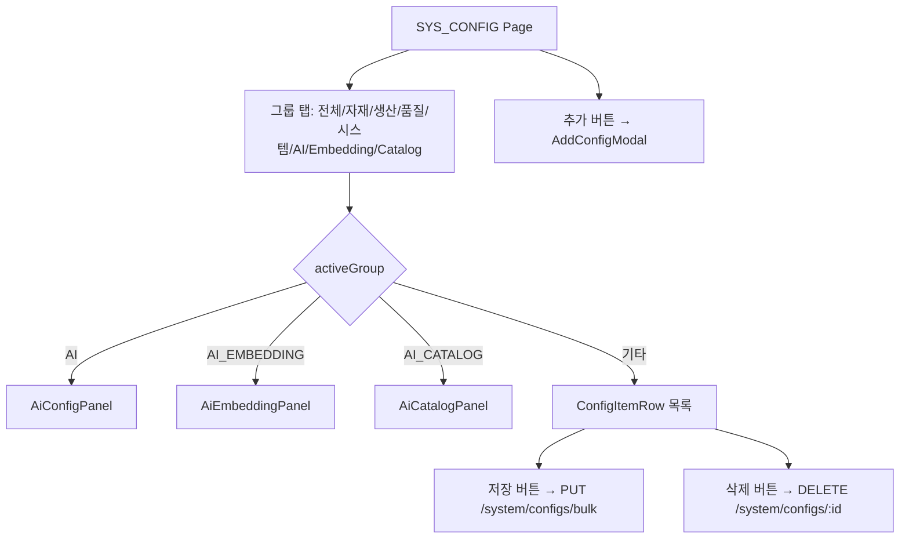
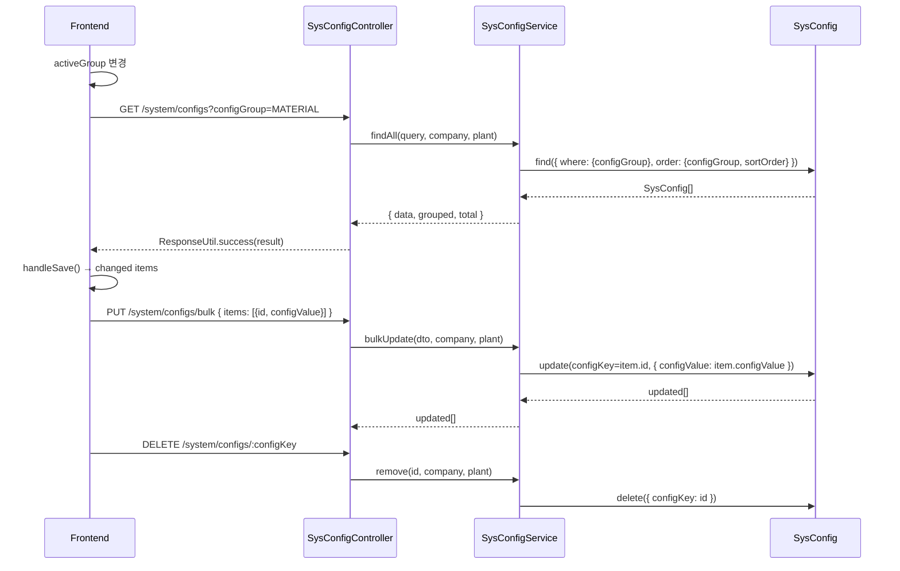

---
sources:
  - apps/frontend/src/app/(authenticated)/system/config/page.tsx
verifiedCommit: 8a7e96ea
---

# 시스템 환경설정 — 비즈니스 로직 & 데이터 흐름 분석
> **분석 기준 커밋:** `8a7e96ea`
> **분석 일자:** `2026-07-04`

## 1. 화면 개요

시스템 전역 설정을 그룹별로 관리하는 페이지. 좌측 탭으로 카테고리 전환, 각 설정을 타입별 UI로 편집, 변경사항 일괄 저장.

| 항목 | 내용 |
|------|------|
| **메뉴 코드** | SYS_CONFIG |
| **경로** | `/system/config` |
| **프론트 파일** | `apps/frontend/src/app/(authenticated)/system/config/page.tsx` |
| **컴포넌트** | `ConfigItemRow`, `AddConfigModal`, `AiConfigPanel`, `AiEmbeddingPanel`, `AiCatalogPanel` |
| **백엔드** | `SysConfigController` (`/system/configs`) |
| **서비스** | `SysConfigService` |
| **DB 엔티티** | `SysConfig` |
| **스토어** | `sysConfigStore` |

## 2. 화면 구성



## 3. 상태 관리

```typescript
const [activeGroup, setActiveGroup] = useState('');
const [changes, setChanges] = useState<Record<string, string>>({});
const [isSaving, setIsSaving] = useState(false);
const [showAddModal, setShowAddModal] = useState(false);
const [deleteTarget, setDeleteTarget] = useState<string | null>(null);

// React Query
const { data, isLoading, refetch } = useApiQuery(['sys-configs', activeGroup], '/system/configs');

// 전역 스토어
const { fetchConfigs } = useSysConfigStore();
```

## 4. API 호출 흐름



## 5. 백엔드 처리

- `SysConfigService.findAll`: 그룹별/전체 조회, 검색 시 label/configKey/description LIKE
- `SysConfigService.bulkUpdate`: items 배열 순회하며 각각 update
- `SysConfigService.create`: 중복 체크 (`configGroup + configKey`)
- `SysConfigService.remove`: 존재 확인 후 delete
- `findAllActive`: 앱 로딩 시 key-value 맵 반환 (cache by sysConfigStore)

## 6. 처리 규칙 및 검증

- 전체 탭에서는 AI 그룹 숨김 (전용 패널에서만 관리)
- 변경사항 감지: `changes` 객체에 변경된 값만 저장, 저장 시 bulk API 호출
- 저장 전 변경 수량 표시 (`changedCount`)
- isActive='Y'인 설정만 findAllActive에서 반환
- 설정 타입: TEXT/NUMBER/BOOLEAN/SELECT 등

## 7. 상태 전이

- isActive: Y/N (설정 활성/비활성)

## 8. 상태 코드 및 공통코드

- 없음 (프론트에서 동적 렌더링)

## 9. DB 테이블 영향 및 엔티티

**SysConfig** (`sys-config.entity.ts`)
| 컬럼 | 설명 |
|------|------|
| configGroup | 설정 그룹 |
| configKey | 설정 키 (PK) |
| configValue | 설정 값 |
| configType | 설정 타입 |
| label | 표시 라벨 |
| description | 설명 |
| options | Select 옵션 (JSON) |
| sortOrder | 정렬 순서 |
| isActive | 활성여부 |
| company | 테넌트 |
| plant | 테넌트 |

## 10. 에러 코드

| HTTP | 상황 |
|------|------|
| 404 | 설정 미존재 |
| 409 | 중복 설정키 |

## 11. 비고

- `sysConfigStore` (zustand)에서 활성 설정을 캐시 → 앱 전역에서 `useSysConfigStore`로 접근
- AI 설정은 ConfigItemRow 대신 전용 패널(AiConfigPanel 등) 사용
