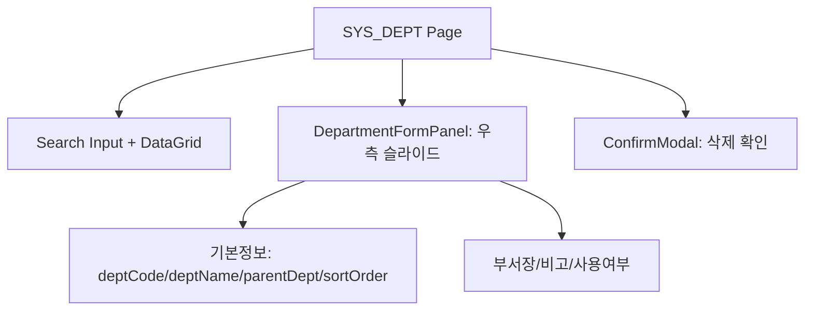
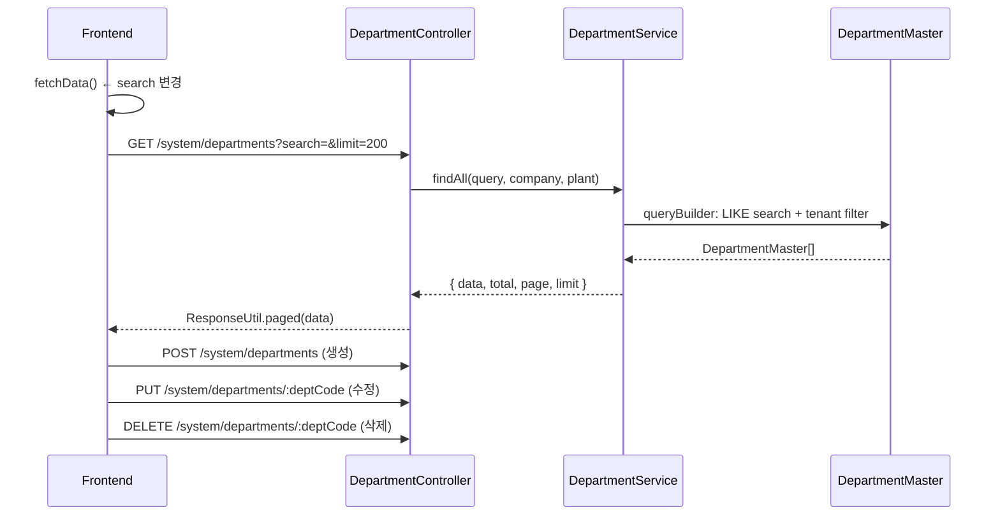

# 부서 관리 — 비즈니스 로직 & 데이터 흐름 분석
> **분석 기준 커밋:** `8a7e96ea`
> **분석 일자:** `2026-07-04`

## 1. 화면 개요

조직 부서 정보를 CRUD 관리하는 페이지. DataGrid + 우측 슬라이드 패널 + 삭제 확인 모달 구성.

| 항목 | 내용 |
|------|------|
| **메뉴 코드** | SYS_DEPT |
| **경로** | `/system/department` |
| **프론트 파일** | `apps/frontend/src/app/(authenticated)/system/department/page.tsx` |
| **컴포넌트** | `DepartmentFormPanel.tsx`, `departmentColumns.tsx`, `types.ts` |
| **백엔드** | `DepartmentController` (`/system/departments`) |
| **서비스** | `DepartmentService` |
| **DB 엔티티** | `DepartmentMaster` |

## 2. 화면 구성



| 컬럼 | 설명 |
|------|------|
| deptCode | 부서 코드 |
| deptName | 부서명 |
| parentDeptCode | 상위 부서 코드 |
| sortOrder | 정렬 순서 |
| managerName | 부서장 |
| useYn | 사용여부 (Y/N badge) |
| remark | 비고 |

## 3. 상태 관리

```typescript
const [departments, setDepartments] = useState<Department[]>([]);
const [loading, setLoading] = useState(false);
const [search, setSearch] = useState("");
const [isPanelOpen, setIsPanelOpen] = useState(false);
const [editingDept, setEditingDept] = useState<Department | null>(null);
const [deleteTarget, setDeleteTarget] = useState<Department | null>(null);
```

## 4. API 호출 흐름



## 5. 백엔드 처리

- `DepartmentService.findAll`: 부서코드/부서명/부서장 LIKE 검색, tenant 필터
- `DepartmentService.create`: 중복 체크 → create → save
- `DepartmentService.update`: findById → partial update
- `DepartmentService.delete`: 진짜 DELETE

## 6. 처리 규칙 및 검증

- deptCode 수정 시 disabled (PK)
- deptCode, deptName 필수
- parentDeptCode는 같은 테이블의 활성 부서 중에서 선택 (자기 자신 제외)
- useYn 옵션은 공유 hook `useUseYnOptions` 사용
- 검색: 부서코드/부서명 검색

## 7. 상태 전이

- 논리적 상태 전이 없음. useYn(Y/N)

## 8. 상태 코드 및 공통코드

- `useUseYnOptions` (공통 useYn Select 옵션)

## 9. DB 테이블 영향 및 엔티티

**DepartmentMaster** (`department-master.entity.ts`)
| 컬럼 | 설명 |
|------|------|
| deptCode | 부서코드 (PK) |
| deptName | 부서명 |
| parentDeptCode | 상위 부서코드 |
| sortOrder | 정렬 순서 |
| managerName | 부서장 |
| useYn | 사용여부 |
| remark | 비고 |
| company | 테넌트 |
| plant | 테넌트 |

## 10. 에러 코드

| HTTP | 상황 |
|------|------|
| 404 | 부서 미존재 |
| 409 | 중복 부서코드 |

## 11. 비고

- Controller 경로가 `system/departments`지만, 실제 파일은 `modules/master/controllers/department.controller.ts`에 위치
- typecheck/서버 에러 시 `catch`에서 silent 처리
