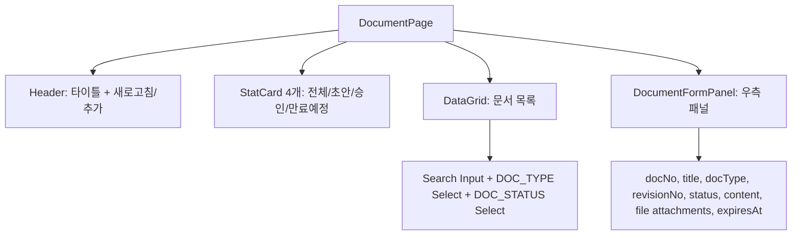
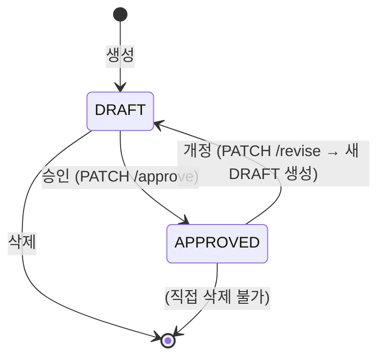

# 문서 관리 (SYS_DOCUMENT) — 비즈니스 로직 & 데이터 흐름 분석

> **분석 기준 커밋:** `8a7e96ea`
> **분석 일자:** `2026-07-04`

## 1. 화면 개요

| 항목 | 내용 |
|---|---|
| 메뉴 코드 | SYS_DOCUMENT |
| 페이지 경로 | `/system/document` |
| 화면 제목 | 문서 관리 (DCC - Document Control Center) |
| 주요 기능 | IATF 16949 문서화된 정보 관리, 문서 CRUD, 승인/개정 워크플로우, 만료 예정 하이라이트, 통계 StatCard |
| 데이터 소스 | Oracle SYS_DOCUMENTS |

## 2. 화면 구성

### 컴포넌트 목록

| 파일 | 역할 |
|---|---|
| `page.tsx` | 메인 페이지 |
| `components/DocumentFormPanel.tsx` | 문서 등록/수정/승인/개정 패널 |
| `documentColumns.tsx` | DataGrid 컬럼 + Document 타입 + isExpiringSoon |

## 3. 상태 전이

## 4. API 호출

| 엔드포인트 | 컨트롤러 | 설명 |
|---|---|---|
| `GET /system/documents` | `DocumentController.findAll` | 문서 목록 (페이징 + DOC_TYPE/STATUS 필터) |
| `GET /system/documents/expiring` | `DocumentController.getExpiring` | 만료 예정 문서 (기본 30일) |
| `GET /system/documents/:id` | `DocumentController.findById` | 단건 조회 |
| `POST /system/documents` | `DocumentController.create` | 등록 (DRAFT 상태) |
| `PUT /system/documents/:id` | `DocumentController.update` | 수정 |
| `DELETE /system/documents/:id` | `DocumentController.delete` | 삭제 (DRAFT만 가능) |
| `PATCH /system/documents/:id/approve` | `DocumentController.approve` | 승인 (DRAFT/REVIEW → APPROVED) |
| `PATCH /system/documents/:id/revise` | `DocumentController.revise` | 개정 (APPROVED → 새 DRAFT, revisionNo 증가) |

## 5. DB 테이블 영향

| 테이블 | 작업 |
|---|---|
| `SYS_DOCUMENTS` | SELECT/INSERT/UPDATE/DELETE |

주요 필드: `DOC_NO(PK)`, `TITLE`, `DOC_TYPE`, `STATUS` (DRAFT/APPROVED), `REVISION_NO`, `CONTENT`, `EXPIRES_AT`, `CREATED_BY`, `APPROVED_BY`, `COMPANY`, `PLANT_CD`

## 6. 공통코드

| 코드 그룹 | 사용처 |
|---|---|
| `DOC_TYPE` | 문서 유형 (품질매뉴얼, 절차서, 작업표준 등) |
| `DOC_STATUS` | 문서 상태 (DRAFT/APPROVED) |

## 7. 처리 규칙

- 신규 문서는 항상 `DRAFT` 상태로 생성
- 승인: `DRAFT` → `APPROVED` (createdBy 기록)
- 개정: 기존 `APPROVED` 문서 기반으로 새 `DRAFT` 문서 생성 (revisionNo +1)
- 30일 이내 만료 문서는 DataGrid에서 노란색 배경 강조
- 통계: total, draft, approved, expiring (30일 이내)

## 8. 비고

- IATF 16949 7.5 요구사항 대응 문서 관리 시스템
- DRAFT 상태에서만 삭제 가능
- 만료일(`expiresAt`) 기반으로 문서 검토 주기 관리
