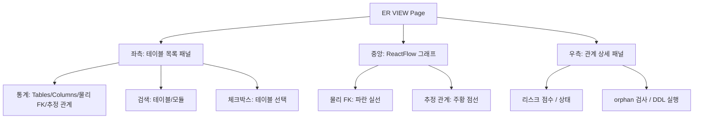
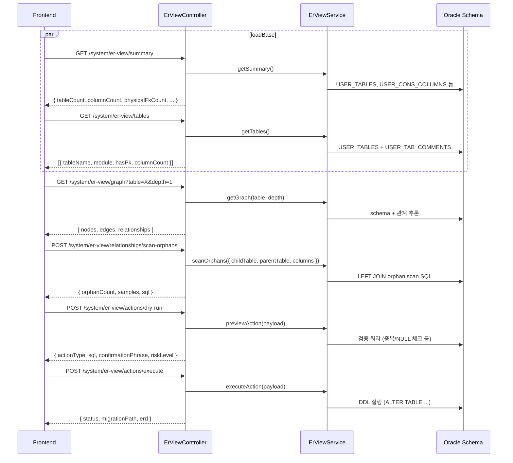
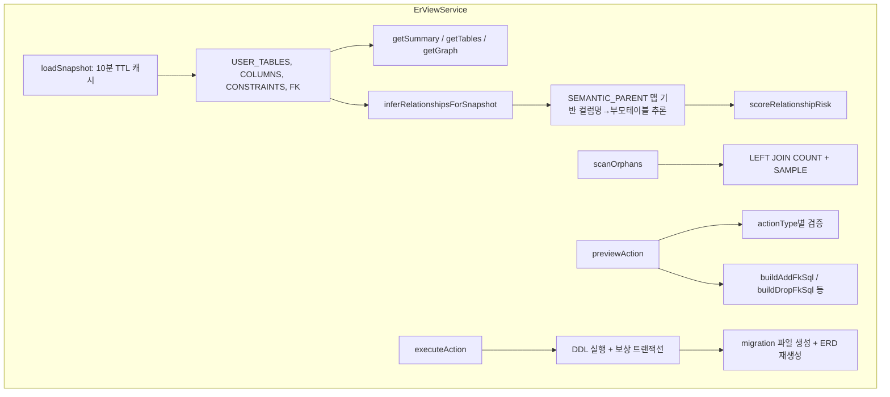

# ER VIEW — 비즈니스 로직 & 데이터 흐름 분석
> **분석 기준 커밋:** `8a7e96ea`
> **분석 일자:** `2026-07-04`

## 1. 화면 개요

실시간 Oracle DB 스키마를 분석하여 테이블 관계(물리 FK/추정 관계), orphan 데이터, 리스크 점수를 시각화하고, DDL 실행(ADD FK/UK/DROP FK/DELETE ORPHAN)을 관리하는 도구.

| 항목 | 내용 |
|------|------|
| **메뉴 코드** | SYS_ER_VIEW |
| **경로** | `/system/er-view` |
| **프론트 파일** | `apps/frontend/src/app/(authenticated)/system/er-view/page.tsx` |
| **백엔드** | `ErViewController` (`/system/er-view`) |
| **서비스** | `ErViewService` |
| **DB 접근** | Oracle `USER_TABLES`, `USER_TAB_COLUMNS`, `USER_CONSTRAINTS`, `USER_CONS_COLUMNS` 등 |

## 2. 화면 구성



## 3. 상태 관리

```typescript
const [summary, setSummary] = useState<Summary | null>(null);
const [tables, setTables] = useState<TableRow[]>([]);
const [selectedTables, setSelectedTables] = useState<string[]>([]);
const [graph, setGraph] = useState<GraphResponse | null>(null);
const [selectedRel, setSelectedRel] = useState<Relationship | null>(null);
const [orphanScan, setOrphanScan] = useState<any>(null);
const [preview, setPreview] = useState<ActionPreview | null>(null);
// + ReactFlow nodes/edges 상태 (useNodesState)
```

## 4. API 호출 흐름



## 5. 백엔드 처리



## 6. 처리 규칙 및 검증

- `SEMANTIC_PARENT`: 컬럼명 기반 부모 테이블 매핑 (ITEM_CODE→ITEM_MASTERS, PROCESS_CODE→PROCESS_MASTERS 등)
- 리스크 점수: orphan(50) + 부모키 없음(40) + 테넌트 미포함(25) + 로그 테이블(20) 등
- 실행 전 dry-run 필수
- DDL 실행 후 자동 migration SQL 파일 생성 (`apps/backend/src/migrations/`)
- DEV 모드에서만 ERD 자동 재생성 (`python tools/generate_db_schema_doc.py`)
- PROD 모드에서는 dry-run/execute만 가능

## 7. Action 타입

| Action | 설명 | 리스크 |
|--------|------|--------|
| ADD_FK | 물리 FK 생성 | LOW (조건 충족 시) |
| ADD_UK | Unique Key 생성 | LOW |
| DROP_FK | FK 제거 | HIGH |
| DELETE_ORPHANS | Orphan 데이터 삭제 | MEDIUM/HIGH |
| UPDATE_ORPHAN_KEY | Orphan 키 업데이트 | MEDIUM |

## 8. 엣지/관계 타입

| 타입 | 설명 | 시각화 |
|------|------|--------|
| PHYSICAL_FK | 실제 FK 제약 | 파란 실선 |
| INFERRED | 컬럼명 기반 추정 관계 | 주황 점선 (애니메이션) |

## 9. DB 영향

- 읽기 전용: USER_TABLES, USER_TAB_COLUMNS, USER_CONSTRAINTS, USER_CONS_COLUMNS, USER_TAB_COMMENTS, USER_COL_COMMENTS
- DDL 실행: ALTER TABLE ... ADD/DROP CONSTRAINT
- DML 실행: DELETE (orphan 정리)
- 로그: `logs/schema-governance/actions-YYYY-MM.jsonl`

## 10. 에러 코드

| 상황 | 처리 |
|------|------|
| 중복 constraint | ORA-02275/02264/02261 → BadRequestException |
| DDL 실패 | 보상 트랜잭션 (생성한 제약 DROP) |
| orphan 존재 시 ADD_FK | dry-run 단계에서 차단 |

## 11. 비고

- 서비스 파일이 942라인으로 가장 큰 파일 중 하나
- 스키마 스냅샷 10분 TTL 캐시
- DEV 모드에서는 ERD 문서(`docs/reports/db-schema-erd.md`) 자동 재생성
- ReactFlow로 그래프 시각화 (노드 드래그, 미니맵, 줌)
