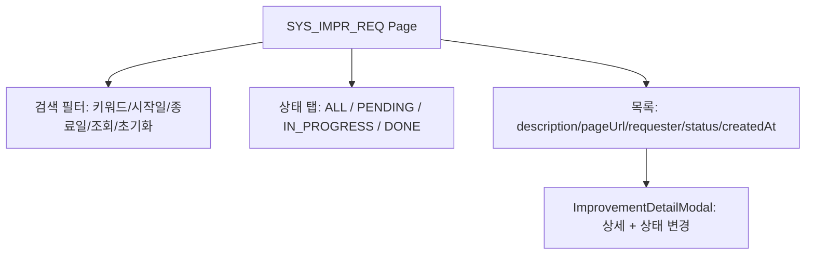
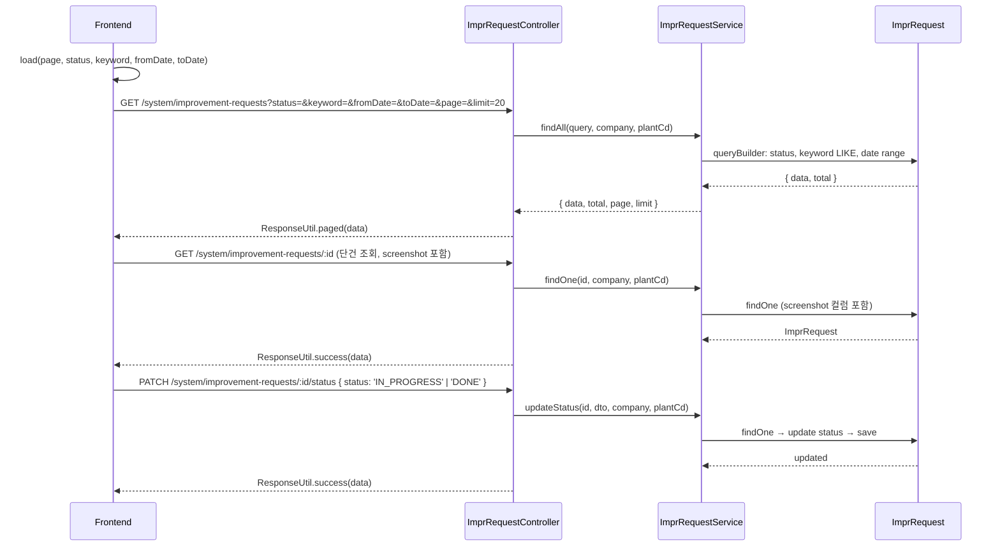

# 개선요청 관리 — 비즈니스 로직 & 데이터 흐름 분석
> **분석 기준 커밋:** `8a7e96ea`
> **분석 일자:** `2026-07-04`

## 1. 화면 개요

사용자가 시스템 개선사항을 등록하고 관리자가 상태를 변경하는 페이지. 키워드/날짜/상태 필터, 페이지네이션, 상태 변경 모달.

| 항목 | 내용 |
|------|------|
| **메뉴 코드** | SYS_IMPR_REQ |
| **경로** | `/system/improvement-requests` |
| **프론트 파일** | `apps/frontend/src/app/(authenticated)/system/improvement-requests/page.tsx` |
| **컴포넌트** | `ImprovementDetailModal.tsx` |
| **서비스** | `improvementRequestService` (`@/services/improvementRequestService`) |
| **백엔드** | `ImprRequestController` (`/system/improvement-requests`) |
| **서비스** | `ImprRequestService` |
| **DB 엔티티** | `ImprRequest` |

## 2. 화면 구성



## 3. 상태 관리

```typescript
const [statusFilter, setStatusFilter] = useState<StatusTab>("ALL");
const [keyword, setKeyword] = useState("");
const [fromDate, setFromDate] = useState("");
const [toDate, setToDate] = useState("");
const [items, setItems] = useState<ImprRequestItem[]>([]);
const [total, setTotal] = useState(0);
const [page, setPage] = useState(1);
const [isLoading, setIsLoading] = useState(false);
const [selectedId, setSelectedId] = useState<string | null>(null);
```

## 4. API 호출 흐름



## 5. 백엔드 처리

- `ImprRequestService.create`: UUID 생성 → PENDING 상태로 저장
- `ImprRequestService.findAll`: 목록 조회 시 screenshot 컬럼 제외 (대용량 방지)
- `ImprRequestService.findOne`: 단건 조회 시 screenshot 포함
- `ImprRequestService.updateStatus`: 상태 변경 (검증 없이 직접 문자열 변경)
- 요청자 식별: Authorization 토큰 + 헤더(`x-company`, `x-plant`, `x-user-name`)에서 추출

## 6. 처리 규칙 및 검증

- 상태 전이: PENDING → IN_PROGRESS → DONE (역방향도 허용)
- 페이지 사이즈: 20
- 키워드 검색: description + pageUrl LIKE 검색
- 등록일 범위: fromDate ~ toDate
- 스크린샷: 목록에서 제외, 단건 조회 시에만 포함
- 상태 탭: ALL/PENDING/IN_PROGRESS/DONE

## 7. 상태 전이

```
PENDING → IN_PROGRESS → DONE
(역방향 이동도 코드상 허용)
```

| 상태 | Badge 색상 |
|------|-----------|
| PENDING | 노랑(yellow) |
| IN_PROGRESS | 파랑(blue) |
| DONE | 초록(emerald) |

## 8. 상태 코드 및 공통코드

- 상태는 하드코딩: PENDING, IN_PROGRESS, DONE

## 9. DB 테이블 영향 및 엔티티

**ImprRequest** (`impr-request.entity.ts`)
| 컬럼 | 설명 |
|------|------|
| imprId | UUID (PK, 애플리케이션 생성) |
| pageUrl | 요청 페이지 URL |
| elementText | 요소 텍스트 |
| elementTag | 요소 태그 |
| description | 요청 내용 |
| screenshot | 스크린샷 (BLOB/CLOB) |
| status | 상태 |
| requesterId | 요청자 ID |
| requesterNm | 요청자명 |
| company | 테넌트 |
| plantCd | 테넌트 |
| createdAt | 생성일 |
| updatedAt | 수정일 |

## 10. 에러 코드

| HTTP | 상황 |
|------|------|
| 404 | imprId 미존재 |
| 400 | 회사/사업장 정보 없음 |

## 11. 비고

- `improvementRequestService`에서 API 호출 추상화
- 스크린샷은 목록 조회 시 제외 (성능 최적화)
- 페이지네이션 UI는 직접 구현 (별도의 DataGrid 미사용)
- 요청자 정보는 `Authorization` 헤더 + `x-user-name` 헤더에서 추출
- 상태 변경 시 서버 검증 없음 (프론트 상태 탭으로만 제한)
