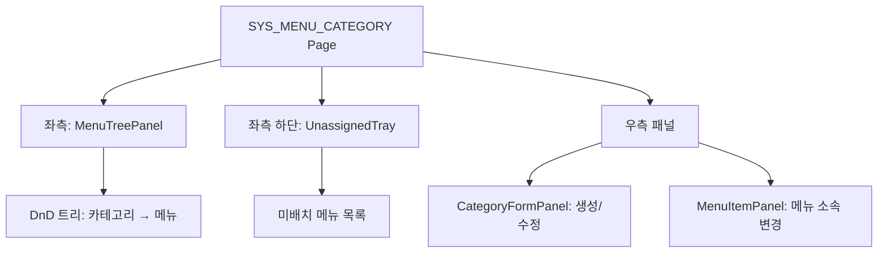
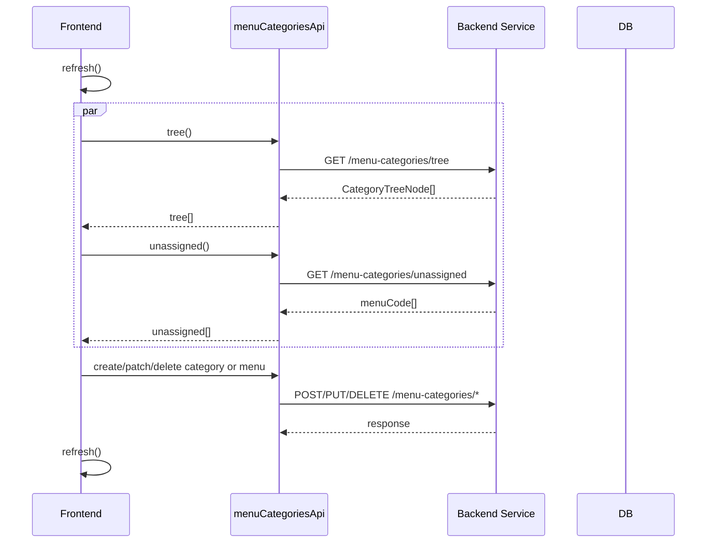

# 메뉴 카테고리 관리 — 비즈니스 로직 & 데이터 흐름 분석
> **분석 기준 커밋:** `8a7e96ea`
> **분석 일자:** `2026-07-04`

## 1. 화면 개요

메뉴 카테고리(트리 구조)를 드래그앤드롭으로 관리하는 페이지. 카테고리 CRUD, 메뉴 소속 변경, 미배치 메뉴 관리.

| 항목 | 내용 |
|------|------|
| **메뉴 코드** | SYS_MENU_CATEGORY |
| **경로** | `/system/menu-categories` |
| **프론트 파일** | `apps/frontend/src/app/(authenticated)/system/menu-categories/page.tsx` |
| **컴포넌트** | `MenuTreePanel`, `CategoryFormPanel`, `MenuItemPanel`, `UnassignedTray` |
| **서비스** | `menuCategoriesApi` (`@/services/menuCategoriesApi`) |
| **스토어** | `menuTreeStore` |

## 2. 화면 구성



## 3. 상태 관리

```typescript
const [tree, setTree] = useState<CategoryTreeNode[]>([]);
const [unassigned, setUnassigned] = useState<string[]>([]);
const [selection, setSelection] = useState<Selection>(
  { kind: 'none' } | { kind: 'new-category' } | { kind: 'category'; code: string } | { kind: 'menu'; menuCode: string }
);
const invalidate = useMenuTreeStore((s) => s.invalidate);
```

## 4. API 호출 흐름



## 5. 백엔드 처리

- `menuCategoriesApi`에서 API 호출 추상화
- 트리 구조는 서버에서 계산하여 반환
- 미배치 메뉴는 카테고리에 속하지 않은 메뉴 목록
- DnD는 프론트에서 처리 후 변경사항만 API로 전송

## 6. 처리 규칙 및 검증

- 카테고리: 라벨/아이콘/순서 편집 가능
- 메뉴: 소속 카테고리 변경 가능
- 미배치 메뉴 트레이에서 기존 카테고리로 드래그하여 이동
- `menuTreeStore` 전역 스토어에서 트리 캐시 관리

## 7. 상태 전이

- 카테고리/메뉴 소속 변경은 API 호출 후 refresh

## 8. 상태 코드 및 공통코드

- 없음

## 9. DB 테이블 영향 및 엔티티

**MENU_CATEGORY_ITEMS** (DB 테이블)
| 컬럼 | 설명 |
|------|------|
| menuCode | 메뉴 코드 |
| categoryCode | 카테고리 코드 |
| sortOrder | 정렬 순서 |

**MENU_CATEGORIES** (DB 테이블)
| 컬럼 | 설명 |
|------|------|
| code | 카테고리 코드 |
| label | 라벨 |
| icon | 아이콘 |
| sortOrder | 정렬 순서 |

## 10. 에러 코드

- API 인터셉터에서 전역 처리

## 11. 비고

- 드래그앤드롭은 HTML5 DnD API 또는 라이브러리 사용 (프론트 처리)
- `menuCategoriesApi` 서비스에서 API 엔드포인트 관리
- `menuTreeStore` (zustand)에서 캐시 관리
