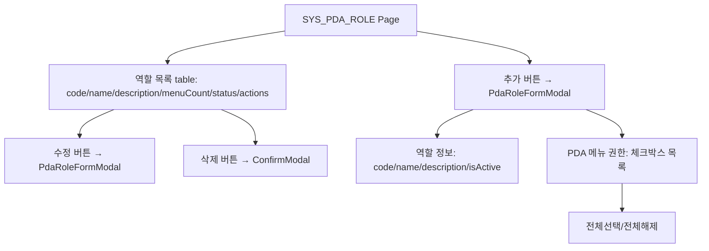
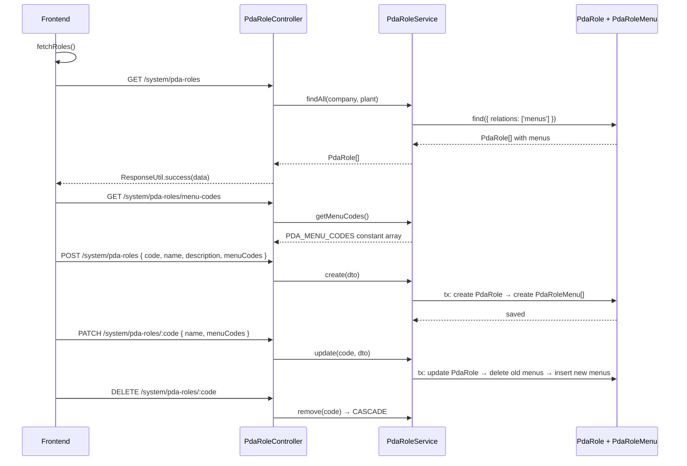

---
sources:
  - apps/frontend/src/app/(authenticated)/system/pda-roles/page.tsx
verifiedCommit: 8a7e96ea
---

# PDA 역할 관리 — 비즈니스 로직 & 데이터 흐름 분석
> **분석 기준 커밋:** `8a7e96ea`
> **분석 일자:** `2026-07-04`

## 1. 화면 개요

PDA 장치용 역할(Role) CRUD 페이지. 역할 생성/수정 시 PDA 메뉴별 권한을 체크박스로 선택. 사용자 관리(SYS_USER)에서 PDA 역할 선택 시 참조됨.

| 항목 | 내용 |
|------|------|
| **메뉴 코드** | SYS_PDA_ROLE |
| **경로** | `/system/pda-roles` |
| **프론트 파일** | `apps/frontend/src/app/(authenticated)/system/pda-roles/page.tsx` |
| **컴포넌트** | `PdaRoleFormModal.tsx` |
| **백엔드** | `PdaRoleController` (`/system/pda-roles`) |
| **서비스** | `PdaRoleService` |
| **DB 엔티티** | `PdaRole`, `PdaRoleMenu` |

## 2. 화면 구성



| 컬럼 | 설명 |
|------|------|
| code | 역할 코드 (PK) |
| name | 역할명 |
| description | 설명 |
| menuCount | 연결된 PDA 메뉴 수 (Badge) |
| isActive | 활성여부 (Badge success/error) |

## 3. 상태 관리

```typescript
const [roles, setRoles] = useState<PdaRole[]>([]);
const [loading, setLoading] = useState(false);
const [formOpen, setFormOpen] = useState(false);
const [editingRole, setEditingRole] = useState<PdaRole | null>(null);
const [deleteTarget, setDeleteTarget] = useState<PdaRole | null>(null);
```

## 4. API 호출 흐름



## 5. 백엔드 처리

```mermaid
flowchart TB
    subgraph "PdaRoleService.update"
        A[findOne: code + tenant] --> B{found?}
        B -- YES --> C[tx: update PdaRole fields]
        C --> D[delete all PdaRoleMenu where pdaRoleCode=code]
        D --> E[menuCodes.length > 0?]
        E -- YES --> F[insert new PdaRoleMenu[]]
        E -- NO --> G[skip]
        F --> H[return role with relations:menus]
        G --> H
        B -- NO --> I[throw NotFoundException]
    end
```

## 6. 처리 규칙 및 검증

- code는 생성 시 입력, 수정 시 disabled (PK)
- `PDA_MENU_CODES` 상수: 9개 PDA 메뉴 코드 (서버에서 관리)
  - `PDA_MAT_RECEIVING`, `PDA_MAT_ISSUING`, `PDA_MAT_ADJUSTMENT`, `PDA_MAT_INV_COUNT`
  - `PDA_SHIPPING`, `PDA_PALLET_BUILD`, `PDA_PALLET_SHIP`
  - `PDA_EQUIP_INSPECT`, `PDA_PRODUCT_INV_COUNT`
- 메뉴 매핑은 전체 교체 방식 (delete all → insert all)
- 생성 시 isActive=true 기본값
- CASCADE: role 삭제 시 menu 매핑도 함께 삭제

## 7. 상태 전이

- isActive: true ↔ false (토글)

## 8. 상태 코드 및 공통코드

- 없음 (프론트에서 하드코딩된 색상/Badge)

## 9. DB 테이블 영향 및 엔티티

**PdaRole** (`pda-role.entity.ts`)
| 컬럼 | 설명 |
|------|------|
| code | PK |
| name | 역할명 |
| description | 설명 |
| isActive | 활성여부 |
| company | 테넌트 |
| plant | 테넌트 |

**PdaRoleMenu** (`pda-role-menu.entity.ts`)
| 컬럼 | 설명 |
|------|------|
| id | PK |
| pdaRoleCode | FK → PdaRole.code |
| menuCode | PDA 메뉴 코드 |
| isActive | 활성여부 |
| company | 테넌트 |
| plant | 테넌트 |

## 10. 에러 코드

| HTTP | 상황 |
|------|------|
| 404 | 역할 미존재 |
| 409 | 중복 역할 코드 |

## 11. 비고

- `PdaRole`과 `PdaRoleMenu`는 1:N 관계
- active 목록 조회는 `SYS_USER` 폼에서 Select 옵션용으로 사용됨
- PDA 메뉴 코드는 `pdaMenuConfig.ts`의 menuCode와 일치해야 함 (주석 명시)
