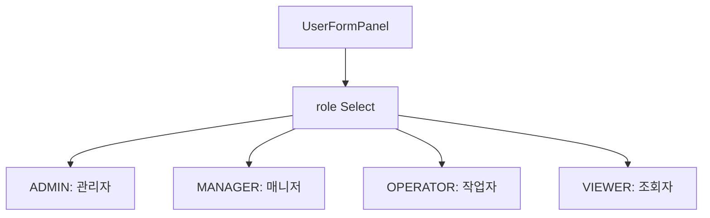

# 역할(ROLE) 관리 — 비즈니스 로직 & 데이터 흐름 분석
> **분석 기준 커밋:** `8a7e96ea`
> **분석 일자:** `2026-07-04`

## 1. 화면 개요

**주의: SYS_ROLE 메뉴에 해당하는 전용 프론트 페이지가 현재 repo에서 발견되지 않았습니다.**  
사용자 관리(`SYS_USER`) 내에서 role 필드(ADMIN/MANAGER/OPERATOR/VIEWER)를 Select로 선택하는 방식으로 관리됩니다.

역할(Role)은 시스템 사용자의 권한 수준을 정의하며, 별도 CRUD 페이지 없이 사용자 생성/수정 폼에서 직접 설정합니다.

| 항목 | 내용 |
|------|------|
| **메뉴 코드** | SYS_ROLE |
| **경로** | `/system/roles` (프론트 페이지 미확인) |
| **관련 프론트** | `SYS_USER`의 `UserFormPanel.tsx`에서 role Select |
| **백엔드** | `User` 엔티티의 `role` 컬럼 |

## 2. 화면 구성

전용 페이지 없음. `SYS_USER`의 사용자 폼에서 role을 선택:

## 3-11. 분석

역할(Role)은 사용자 엔티티의 `role` 컬럼에 문자열로 저장되며, 다음과 같은 코드값을 가집니다:

| 값 | 라벨 | 설명 |
|-----|------|------|
| ADMIN | 관리자 | 최고 권한 |
| MANAGER | 매니저 | 중간 관리자 |
| OPERATOR | 작업자 | 현장 작업자 |
| VIEWER | 조회자 | 읽기 전용 |

역할 기반 권한 제어는 `RolesGuard`에서 `@Roles('ADMIN')` 데코레이터로 적용됩니다.  
스케줄러 작업 생성/수정/삭제/즉시실행/토글 등 주요 관리 기능은 ADMIN 역할만 접근 가능합니다.

## 비고

- 향후 역할별 메뉴 권한 매트릭스 페이지가 추가될 수 있음
- 현재는 role 값이 `User` 테이블의 문자열 컬럼으로만 관리됨
- 별도 `Roles` 엔티티나 메뉴 권한 테이블(`ROLE_MENU_PERMISSIONS`)은 DB에서 직접 관리
