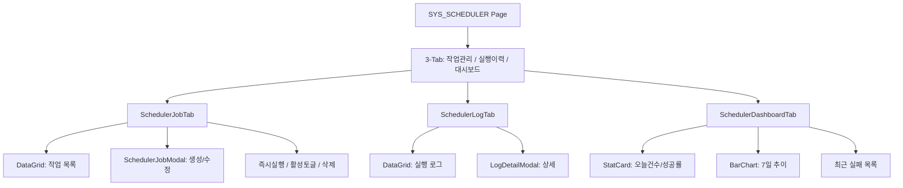
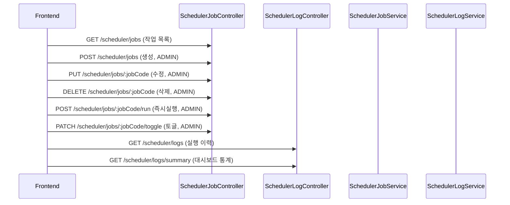

---
sources:
  - apps/frontend/src/app/(authenticated)/system/scheduler/page.tsx
verifiedCommit: 8a7e96ea
---

# 스케줄러 관리 — 비즈니스 로직 & 데이터 흐름 분석
> **분석 기준 커밋:** `8a7e96ea`
> **분석 일자:** `2026-07-04`

## 1. 화면 개요

백그라운드 스케줄러 작업을 관리하는 3-탭 페이지. 작업 CRUD + 즉시 실행/토글, 실행 이력 조회, 대시보드 통계 제공.

| 항목 | 내용 |
|------|------|
| **메뉴 코드** | SYS_SCHEDULER |
| **경로** | `/system/scheduler` |
| **프론트 파일** | `apps/frontend/src/app/(authenticated)/system/scheduler/page.tsx` |
| **컴포넌트** | `SchedulerJobTab`, `SchedulerLogTab`, `SchedulerDashboardTab`, `SchedulerJobModal`, `LogDetailModal` |
| **백엔드** | `SchedulerJobController` (`/scheduler/jobs`), `SchedulerLogController` (`/scheduler/logs`) |
| **서비스** | `SchedulerJobService`, `SchedulerLogService`, `SchedulerRunnerService` |
| **DB 엔티티** | `SchedulerJob`, `SchedulerLog` |

## 2. 화면 구성



## 3. 상태 관리

```typescript
const [activeTab, setActiveTab] = useState<TabValue>("jobs");
// 각 탭 컴포넌트 내부에서 자체 상태 관리
```

## 4. API 호출 흐름



## 5. 백엔드 처리

**SchedulerJobService:**
- `onModuleInit`: 서버 시작 시 stale RUNNING/RETRYING 로그 복구 + 활성 작업 CronJob 등록
- `create`: 작업 생성 후 CronJob 등록
- `update`: 작업 수정 후 CronJob 재등록
- `remove`: 작업 삭제 후 CronJob 해제
- `toggle`: isActive 토글 → CronJob 등록/해제
- `runNow`: Cron 무시 즉시 실행
- `schedulerRegistry` (NestJS `@nestjs/schedule`)로 CronJob 관리

**SchedulerLogService:**
- `generateLogId`: `SEQ_SCHEDULER_LOGS.NEXTVAL`
- `createLog`: RUNNING 상태로 로그 생성
- `updateLog`: 실행 완료 후 상태/종료시각 갱신
- `findAll`: 페이지네이션 + 필터
- `getSummary`: 오늘, 7일 추이, 작업별 비율, 최근 실패 5건
- `recoverStaleRunning`: 서버 재시작 시 RUNNING/RETRYING → FAIL

## 6. 처리 규칙 및 검증

- ADMIN 역할만 작업 생성/수정/삭제/실행/토글 가능 (`@Roles('ADMIN')`)
- 작업 상태: `ACTIVE` / `INACTIVE`
- 실행 상태: `PENDING` → `RUNNING` → `SUCCESS` or `FAIL` or `TIMEOUT`
- Cron 표현식 사용 (`cron` 라이브러리)
- `computeNextRun`: cron-parser로 다음 실행 시각 계산

## 7. 상태 전이

```
작업: INACTIVE ↔ ACTIVE (toggle)
로그: PENDING → RUNNING → SUCCESS
     PENDING → RUNNING → FAIL
     PENDING → RUNNING → TIMEOUT
     RUNNING → FAIL (stale recovery)
```

## 8. 상태 코드 및 공통코드

- 없음 (작업 상태는 hardcoded)

## 9. DB 테이블 영향 및 엔티티

**SchedulerJob** (`scheduler-job.entity.ts`)
| 컬럼 | 설명 |
|------|------|
| jobCode | PK |
| jobName | 작업명 |
| description | 설명 |
| cronExpr | Cron 표현식 |
| handler | 실행 핸들러 |
| params | 파라미터 (JSON) |
| isActive | 활성여부 |
| company | 테넌트 |
| plantCd | 테넌트 |

**SchedulerLog** (`scheduler-log.entity.ts`)
| 컬럼 | 설명 |
|------|------|
| logId | PK (SEQ_SCHEDULER_LOGS) |
| jobCode | FK → SchedulerJob |
| status | 실행 상태 |
| startTime | 시작 시간 |
| endTime | 종료 시간 |
| duration | 소요 시간 |
| errorMsg | 에러 메시지 |
| retryCount | 재시도 횟수 |
| company | 테넌트 |
| plantCd | 테넌트 |

## 10. 에러 코드

| HTTP | 상황 |
|------|------|
| 403 | ADMIN이 아닌 사용자 |

## 11. 비고

- `SchedulerRunnerService`에서 실제 작업 실행 로직 처리
- CronJob은 `SchedulerRegistry`에 이름 = `{jobCode}_{company}_{plant}` 형식으로 등록
- 모듈 위치: `apps/backend/src/modules/scheduler/` (별도 모듈)
