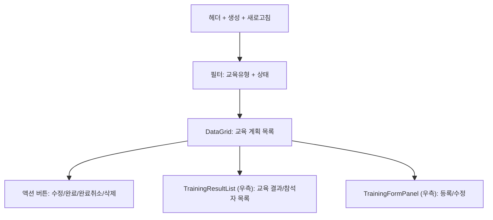
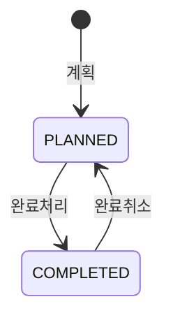

# 교육훈련 관리 — 비즈니스 로직 & 데이터 흐름 분석

> **Menu Code:** `SYS_TRAINING`
> **Path:** `/system/training`
> **Label:** `menu.system.training`
> **분석 기준 커밋:** `8a7e96ea`
> **분석 일자:** `2026-07-04`

## 1. 화면 개요

IATF 16949 7.2 역량/교육 관리. DataGrid(교육 계획) + TrainingFormPanel + TrainingResultList(교육 결과/참석자). 상태: PLANNED → IN_PROGRESS → COMPLETED.

## 2. 화면 구성

## 3. API 호출 흐름

| 시점 | API | 용도 |
| --- | --- | --- |
| 진입 | `GET /system/trainings` | 교육 계획 목록 |
| 등록 | `POST /system/trainings` | 교육 계획 등록 |
| 수정 | `PUT /system/trainings/{planNo}` | 교육 계획 수정 |
| 삭제 | `DELETE /system/trainings/{planNo}` | PLANNED만 삭제 |
| 완료 | `PATCH /system/trainings/{planNo}/complete` | → COMPLETED |
| 완료취소 | `PATCH /system/trainings/{planNo}/cancel-complete` | COMPLETED → PLANNED |
| 결과 목록 | `GET /system/trainings/{planNo}/results` | 교육 결과/참석자 조회 |

## 4. 상태 전이

## 5. DB 테이블 영향

| 테이블 | 작업 | 설명 |
| --- | --- | --- |
| `SYS_TRAININGS` | CRUD + status UPDATE | 교육 계획 마스터 |
| `SYS_TRAINING_RESULTS` | CRUD | 교육 결과/참석자 |

## 6. 공통코드

| 그룹코드 | 용도 |
| --- | --- |
| `TRAINING_TYPE` | 교육 유형 |
| `TRAINING_STATUS` | 교육 상태 |

## 7. 비고

- 결과(TrainingResultList)에서 참석자별 이수/미이수 관리
- 완료취소로 상태 복원 가능
- `alert()/confirm()/prompt()` 사용 없음
