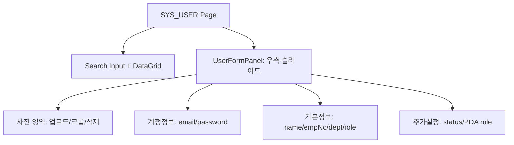
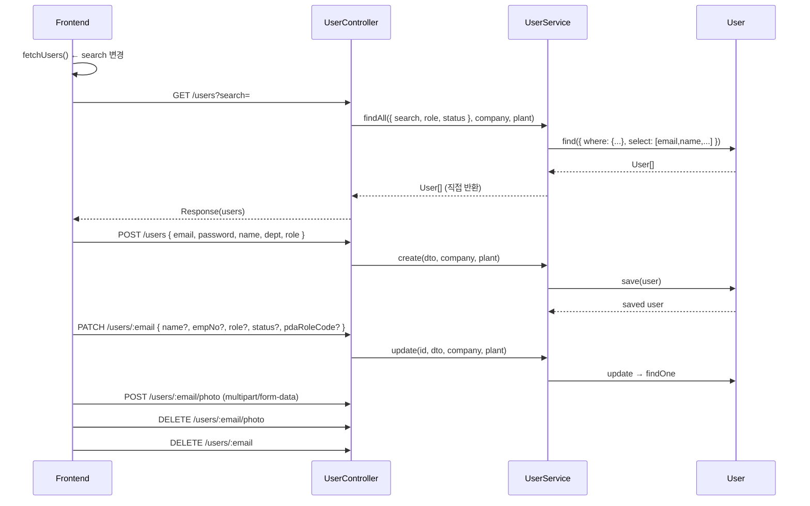

---
sources:
  - apps/frontend/src/app/(authenticated)/system/users/page.tsx
verifiedCommit: 8a7e96ea
---

# 사용자 관리 — 비즈니스 로직 & 데이터 흐름 분석
> **분석 기준 커밋:** `8a7e96ea`
> **분석 일자:** `2026-07-04`

## 1. 화면 개요

시스템 사용자 CRUD 페이지. 사진 업로드/크롭, 역할/상태/PDA 역할 설정, 비밀번호 관리 포함.

| 항목 | 내용 |
|------|------|
| **메뉴 코드** | SYS_USER |
| **경로** | `/system/users` |
| **프론트 파일** | `apps/frontend/src/app/(authenticated)/system/users/page.tsx` |
| **컴포넌트** | `UserFormPanel.tsx`, `usersColumns.tsx`, `ImageCropModal.tsx` |
| **백엔드** | `UserController` (`/users`) |
| **서비스** | `UserService` |
| **DB 엔티티** | `User` |

## 2. 화면 구성



| 컬럼 | 설명 |
|------|------|
| photoUrl | 사용자 사진 (avatar) |
| email | 이메일 (PK) |
| name | 이름 |
| empNo | 사원번호 |
| dept | 부서 |
| role | 역할 (ADMIN/MANAGER/OPERATOR/VIEWER) |
| status | 상태 (ACTIVE/INACTIVE) |
| lastLoginAt | 최근 로그인 |

## 3. 상태 관리

```typescript
const [users, setUsers] = useState<User[]>([]);
const [search, setSearch] = useState("");
const [isPanelOpen, setIsPanelOpen] = useState(false);
const [editingUser, setEditingUser] = useState<User | null>(null);
const [deleteTarget, setDeleteTarget] = useState<User | null>(null);
```

## 4. API 호출 흐름



- PDA 역할 목록 조회: `GET /system/pda-roles/active` (UserFormPanel에서 호출)

## 5. 백엔드 처리

- `UserService.findAll`: email ILIKE 검색, role/status 필터
- `UserService.create`: 중복 체크 → create (기본 비밀번호: `admin123`)
- `UserService.update`: partial update (PATCH), 변경된 필드만 전송
- `UserService.remove`: 진짜 DELETE
- `updatePhoto`: photoUrl 업데이트, 파일은 disk storage에 저장 (`./uploads/users/`)

## 6. 처리 규칙 및 검증

- email이 PK (수정 시 disabled)
- 생성 시 password 필수 (기본값 `admin123`)
- 수정 시 password는 입력한 경우만 변경
- 사진: 5MB 제한, image/ 타입만 허용, jpg/png/gif
- role: ADMIN/MANAGER/OPERATOR/VIEWER (하드코딩)
- status: ACTIVE/INACTIVE (하드코딩)

## 7. 상태 전이

- ACTIVE ↔ INACTIVE (status 필드 직접 변경)

## 8. 상태 코드 및 공통코드

| 코드 | 사용처 |
|------|--------|
| `GENERAL_STATUS` | 사용자 상태 (StatusBadge, StatusHeaderHelp) |

## 9. DB 테이블 영향 및 엔티티

**User** (`user.entity.ts`)
| 컬럼 | 설명 |
|------|------|
| email | PK |
| password | 해시된 비밀번호 |
| name | 이름 |
| empNo | 사원번호 |
| dept | 부서 |
| role | 역할 |
| status | 상태 |
| photoUrl | 사진 URL |
| pdaRoleCode | PDA 역할 코드 |
| lastLoginAt | 최근 로그인 |
| company | 테넌트 |
| plant | 테넌트 |

## 10. 에러 코드

| HTTP | 상황 |
|------|------|
| 404 | 사용자 미존재 |
| 409 | 중복 이메일 |

## 11. 비고

- 응답에서 password는 제외됨 (select에 없음)
- 사진 업로드는 `multer` disk storage, URL은 `/uploads/users/{filename}`
