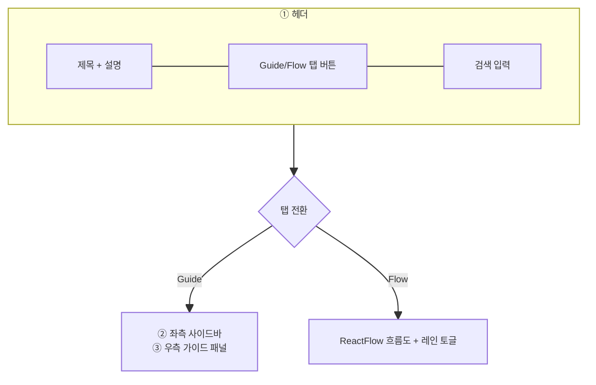

# 업무 가이드 — 비즈니스 로직 & 데이터 흐름 분석

> **분석 기준 커밋:** `8a7e96ea8e9f2710bd79a8c5d12cbbc8ecc1ab26`
> **분석 일자:** `2026-07-04`

---

## 1. 화면 개요

| 항목 | 내용 |
|------|------|
| **메뉴 코드** | `WORKFLOW` |
| **URL** | `/workflow` |
| **메뉴 경로** | 업무가이드 |
| **화면 목적** | 처음 사용자를 위한 단계별 업무 지침과 흐름도 제공 (워크플로우 중심 온보딩 허브) |
| **주요 사용자** | 신규 입사자, 업무 전환자 |
| **Workflow 노드** | 해당 없음 (워크플로우 맵 자체 표현) |

## 2. 화면 구성

### 2.1 레이아웃

| 영역 | 컴포넌트 | 역할 |
| --- | --- | --- |
| ① 헤더 | page.tsx `header` | 제목, 탭 전환 (`LayoutList` / `Workflow`), 검색창 |
| ② 좌측 | `WorkflowSidebar` | 레인별 계층적 업무 단계 목록 (접이식) |
| ③ 우측 (Guide 탭) | `WorkflowGuide` | 선택한 업무 노드의 상세 설명, 입/출력, 화면 바로가기, 도움말, DB 스키마 |
| ④ 우측 (Flow 탭) | `WorkflowFlow` | ReactFlow 기반 시각적 흐름도, 레인 필터, 보조 연결 표시 |

### 2.2 버튼/액션

| 버튼 | 핸들 | 설명 |
| --- | --- | --- |
| Guide/Flow 탭 | `setTab("guide" / "flow")` | Guide / Flow 모드 전환 |
| 검색 입력 | `setQuery` | 검색어 기준 노드 필터링 (`getVisibleNodeIds(query, ...)`) |
| 사이드바 레인 접기 | `toggleLane` | 레인별 접이식 |
| 사이드바 노드 선택 | `onSelect(nodeId)` | 선택 노드 정보를 우측 패널에 표시 |
| 화면 바로가기 | `router.push(path)` | 가이드 내 버튼으로 해당 업무 화면으로 이동 (`useTransition` pending) |
| Flow 노드 클릭 | `onNodeClick` | 흐름도 노드 선택 → Guide 탭으로 전환 |
| Flow 레인 필터 | `toggleLane` | 특정 레인만 표시 (1개 이상 필수) |
| Flow 보조 연결 표시 | `toggleShowAllRelations` | reference/reversal 엣지 표시/숨김 |
| DB 스키마 칩 | `setSchemaTable` | 테이블명 클릭 시 `WorkflowSchemaPanel` 모달 (portal) |

## 3. 상태 관리

Zustand store 미사용. `useState`로 로컬 관리:

| 상태 | 타입 | 초기값 |
| --- | --- | --- |
| `tab` | `"guide" \| "flow"` | `"guide"` |
| `query` | string | `""` |
| `selectedNodeId` | string | `workflowNodes[0]?.id` |
| `schemaTable` | string \| null | null |

## 4. API 호출 흐름

### 4-1. 조회

| 시점 | API | 용도 | 호출 위치 |
| --- | --- | --- | --- |
| 스키마 칩 클릭 | `GET /system/table-schema?table={tableName}` | Oracle 테이블 컬럼 정보 조회 | `WorkflowSchemaPanel.tsx:73` |

`/system/table-schema` API는 Oracle `USER_TAB_COMMENTS`, `USER_COL_COMMENTS`, `USER_TAB_COLUMNS` 또는 유사 메타데이터를 조회해 `{ tableName, tableComment, columns: [{ columnName, dataType, dataLength, nullable, comments, ... }] }`를 반환한다.

## 5. 백엔드 처리

화면 자체 API (Guide/Flow 데이터)는 없음. 모든 데이터는 `config/workflowMap.ts`에 정적 정의되어 있다.

`WorkflowSchemaPanel`에서 호출하는 `GET /system/table-schema`는 시스템 메타데이터 전용 엔드포인트.

### workflowMap 구성 요소

| 항목 | 설명 | 개수 |
| --- | --- | --- |
| `workflowLanes` | 10개 레인 (구매/입하, 자재/IQC, 생산, 품질, 출하, 추적성, 역처리, IATF, 소모품, PDA) | 10 |
| `workflowNodes` | 업무 활동 노드 (id, lane, activity, detail, x, routes, dataObjects, inputs, outputs, why, when, cautions, order) | 50+ |
| `workflowEdges` | 노드 간 연결 엣지 (kind: normal/branch/reversal/reference) | 다수 |

## 6. 처리 규칙 및 검증

| 규칙 | 설명 |
| --- | --- |
| 검색어 필터 | `getVisibleNodeIds(query, laneIds)` — 레인 제목, 활동명, 상세 등에서 대소문자 구분 없이 매칭 |
| 사이드바 접기 | 검색 중에는 모든 레인이 열려 있고, 검색 결과 0개 레인은 숨김 |
| Flow 레인 필터 | 최소 1개 레인은 항상 활성 (`next.size > 1` 체크) |
| 엣지 표시 | `normal`/`branch`는 항상, `reference`/`reversal`는 선택한 노드와 연결된 경우 또는 "보조 연결 보기" 토글 시 표시 |
| 엣지 스타일링 | kind에 따라 점선(`reversal`), 실선(`reference`), 색상 분기(`branch`= amber, `reference`= cyan, `normal`= blue) |
| 화면 이동 | `useTransition()`으로 로딩 pending 표시, 중복 클릭 방지 |
| 스키마 패널 | `createPortal`로 body에 렌더, ESC 키로 닫기, overlay 배경 클릭 시 닫기 |

## 7. 상태 전이

상태 전이 없음. 읽기 전용 업무 가이드.

## 8. 상태 코드 및 공통코드

해당 없음 (i18n key는 `workflowGuide.*`)

## 9. DB 테이블 영향 및 엔티티

직접적인 DB 영향 없음. `workflowMap.ts`의 `dataObjects`에 나열된 테이블명이 있으나 이는 참고용.

| dataObjects 참조 테이블 (예시) | 설명 |
| --- | --- |
| `PURCHASE_ORDERS`, `PURCHASE_ORDER_ITEMS` | 구매오더 |
| `MAT_ARRIVALS`, `MAT_LOTS`, `STOCK_TRANSACTIONS` | 입하/LOT/수불 |
| `IQC_PART_SPECS`, `IQC_LOGS`, `AQL_STANDARDS` | IQC 기준/로그 |
| `JOB_ORDERS`, `ROUTING_GROUPS`, `BOM_MASTERS` | 작업지시 |
| `SG_LABELS`, `FG_LABELS`, `PROD_RESULTS` | 실적/라벨 |
| `BOX_MASTERS`, `PALLET_MASTERS`, `SHIPMENT_LOGS` | 포장/출하 |
| `EQUIP_INSPECT_LOGS`, `EQUIP_MASTERS` | 설비점검 |

## 10. 에러 코드 및 메시지

| 상황 | 처리 |
| --- | --- |
| 스키마 API 실패 | `error` 상태 → "테이블 명세를 불러올 수 없습니다." |
| 스키마 API empty | 컬럼 0개 → "컬럼 정보가 없습니다." |
| 도움말 notFound | `WorkflowHelpInline`에서 항목 자체를 숨김 (`notFound && !loading` 시 `return null`) |

## 11. 비고

- `workflow-business-map.structure.test.mjs` — 구조 유효성 테스트 파일 있음.
- `config/workflowMap.ts`가 업무 가이드 데이터의 유일한 출처. API/DB 의존 없음.
- `deriveHelpRefs()` 함수가 `node.helpRefs` 우선, 없으면 `routes`에서 `findMenuCodeByPath()`로 메뉴코드 자동 도출.
- `WorkflowGuide`와 `WorkflowFlow`는 완전히 독립적 — 탭 전환 시 각각만 렌더.
- 모든 업무 단계는 `WorkflowActivityNode` 타입으로 정의되어 있고, i18n 적용되지 않고 한글 하드코딩.