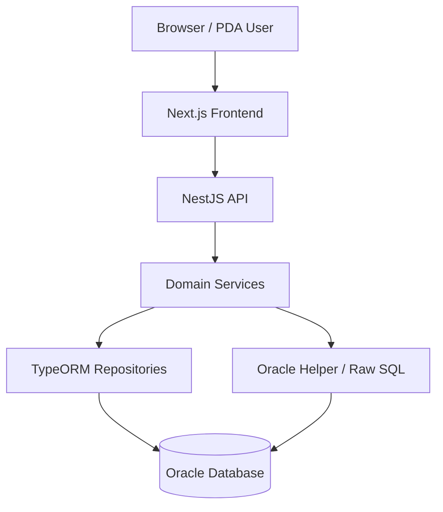

# HANES MES 시스템 아키텍처 인덱스

## 목적

이 문서는 현재 구현된 HANES MES의 시스템 구조를 상위 레벨에서 전수형으로 설명하는 문서다.
프론트엔드, 백엔드, 데이터 계층, 운영 계층이 어떻게 연결되는지 빠르게 파악하기 위한 기준 문서다.

## 시스템 구성 요소

- 프론트엔드: `apps/frontend`
- 백엔드: `apps/backend`
- 기준 문서: `docs/`
- 산출물: `exports/`

## 런타임 구조

## 프론트엔드 아키텍처

### 루트 구조

- 공개 영역: `apps/frontend/src/app/page.tsx`, `login`
- 인증 영역: `apps/frontend/src/app/(authenticated)`
- PDA 영역: `apps/frontend/src/app/pda`
- 공통 컴포넌트: `apps/frontend/src/components`
- 공통 훅: `apps/frontend/src/hooks`

### 화면 그룹

- `dashboard`
- `master`
- `material`
- `inventory`
- `production`
- `quality`
- `inspection`
- `shipping`
- `sales`
- `equipment`
- `customs`
- `outsourcing`
- `consumables`
- `system`
- `workflow`
- `interface`
- `product`

### PDA 그룹

- `pda/login`
- `pda/menu`
- `pda/material/*`
- `pda/product/*`
- `pda/shipping/*`
- `pda/equip-inspect`
- `pda/settings`

## 백엔드 아키텍처

### 루트 조립

- 기준 파일: `apps/backend/src/app.module.ts`
- 기술 축: NestJS + TypeORM + Oracle

### 상위 모듈 전수

- `auth`
- `user`
- `role`
- `num-rule`
- `master`
- `material`
- `inventory`
- `production`
- `quality`
- `shipping`
- `equipment`
- `outsourcing`
- `customs`
- `consumables`
- `interface`
- `scheduler`
- `system`
- `workflow`
- `dashboard`

### 품질 하위 모듈

- `audit`
- `change-management`
- `continuity-inspect`
- `defects`
- `fai`
- `inspection`
- `oqc`
- `ppap`
- `rework`
- `spc`

## 데이터 계층

### 기준 위치

- 엔티티: `apps/backend/src/entities`
- DB 설정: `apps/backend/src/database`
- Oracle 보조 모듈: `apps/backend/src/common/modules/oracle.module.ts`

### 주요 엔티티 군

- 조직/권한
- 기준정보
- 자재/재고
- 생산
- 품질
- 출하
- 설비/치공구
- 외주/통관/소모품
- 시스템/운영

세부 전수 목록은 [02-data-model-erd.md](C:/Project/HANES/docs/core/02-data-model-erd.md)를 본다.

## 요청 처리 흐름

1. 사용자가 웹 또는 PDA 화면에서 기능을 실행한다.
2. 프론트엔드가 API를 호출한다.
3. 컨트롤러가 요청을 수신한다.
4. 서비스가 비즈니스 로직과 상태 전이를 수행한다.
5. TypeORM 또는 Oracle 호출로 DB를 읽고 쓴다.
6. 결과를 응답으로 반환한다.

## 운영 계층

- 스케줄러: `scheduler`
- 대시보드: `dashboard`
- 워크플로우 요약: `workflow`
- 외부 연동: `interface`
- 시스템 설정과 문서/교육: `system`

## 문서 사용 기준

1. 이 문서는 시스템 상위 구조를 설명한다.
2. 저장소의 실제 배치는 [module-map.md](C:/Project/HANES/docs/core/module-map.md)를 본다.
3. 백엔드 모듈 전수는 [backend-module-index.md](C:/Project/HANES/docs/core/backend-module-index.md)를 본다.
4. 프론트엔드 라우트 전수는 [03-frontend-routing.md](C:/Project/HANES/docs/core/03-frontend-routing.md)를 본다.
5. API 인덱스는 [04-backend-api-endpoints.md](C:/Project/HANES/docs/core/04-backend-api-endpoints.md)를 본다.
6. 상태 전이와 업무 흐름은 [domain-workflows.md](C:/Project/HANES/docs/core/domain-workflows.md)와 [05-production-process-flow.md](C:/Project/HANES/docs/core/05-production-process-flow.md)를 함께 본다.
