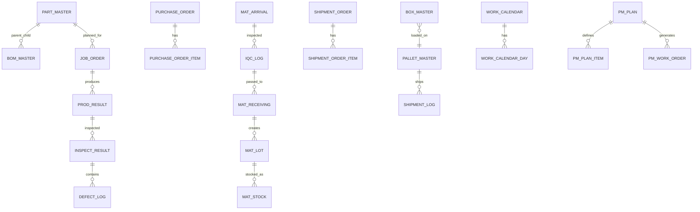

# HANES MES 데이터 모델 인덱스

## 목적

이 문서는 현재 구현된 엔티티를 도메인별로 전수에 가깝게 묶어 데이터 모델의 전체 구조를 파악하기 위한 문서다.
컬럼 정의와 인덱스는 각 엔티티 파일을 기준으로 보고, 여기서는 엔티티 군과 대표 관계를 정리한다.

## 기준 위치

- 엔티티: `apps/backend/src/entities/*.entity.ts`
- DB 설정: `apps/backend/src/database/*`

## 엔티티 군 전수 목록

### 조직 / 권한

- `user.entity.ts`
- `role.entity.ts`
- `role-menu-permission.entity.ts`
- `department-master.entity.ts`
- `company-master.entity.ts`
- `pda-role.entity.ts`
- `pda-role-menu.entity.ts`

### 기준정보

- `part-master.entity.ts`
- `bom-master.entity.ts`
- `process-master.entity.ts`
- `prod-line-master.entity.ts`
- `worker-master.entity.ts`
- `warehouse.entity.ts`
- `partner-master.entity.ts`
- `vendor-master.entity.ts`
- `label-template.entity.ts`
- `work-instruction.entity.ts`
- `work-calendar.entity.ts`
- `work-calendar-day.entity.ts`
- `shift-pattern.entity.ts`
- `com-code.entity.ts` 계열

### 자재 / 재고

- `purchase-order.entity.ts`
- `purchase-order-item.entity.ts`
- `mat-arrival.entity.ts`
- `iqc-log.entity.ts`
- `mat-receiving.entity.ts`
- `mat-lot.entity.ts`
- `mat-stock.entity.ts`
- `mat-issue.entity.ts`
- `mat-issue-request.entity.ts`
- `mat-issue-request-item.entity.ts`
- `stock-transaction.entity.ts`
- `inv-adj-log.entity.ts`
- `physical-inv-session.entity.ts`
- `physical-inv-count-detail.entity.ts`

### 생산

- `prod-plan.entity.ts`
- `job-order.entity.ts`
- `prod-result.entity.ts`
- `simulation-result.entity.ts`
- `process-capa.entity.ts`
- `product-stock.entity.ts`
- `product-transaction.entity.ts`
- `fg-label.entity.ts`

### 품질

- `inspect-result.entity.ts`
- `defect-log.entity.ts`
- `trace-log.entity.ts`
- `oqc-request.entity.ts`
- `oqc-request-box.entity.ts`
- `sample-inspect-result.entity.ts`
- `spc-chart.entity.ts`
- `spc-data.entity.ts`
- `rework-order.entity.ts`
- `rework-process.entity.ts`
- `rework-result.entity.ts`
- `rework-inspect.entity.ts`
- `fai-request.entity.ts`
- `fai-item.entity.ts`
- `control-plan.entity.ts`
- `control-plan-item.entity.ts`
- `audit-plan.entity.ts`
- `audit-finding.entity.ts`
- `capa-request.entity.ts`
- `capa-action.entity.ts`
- `change-order.entity.ts`
- `customer-complaint.entity.ts`
- `ppap-submission.entity.ts`

### 출하

- `customer-order.entity.ts`
- `customer-order-item.entity.ts`
- `shipment-order.entity.ts`
- `shipment-order-item.entity.ts`
- `box-master.entity.ts`
- `pallet-master.entity.ts`
- `shipment-log.entity.ts`
- `shipment-return.entity.ts`
- `shipment-return-item.entity.ts`

### 설비 / 치공구

- `equip-master.entity.ts`
- `equip-inspect-log.entity.ts`
- `equip-inspect-item-master.entity.ts`
- `equip-protocol.entity.ts`
- `equip-bom-rel.entity.ts`
- `equip-bom-item.entity.ts`
- `mold-master.entity.ts`
- `mold-usage-log.entity.ts`
- `calibration-log.entity.ts`
- `gauge-master.entity.ts`
- `pm-plan.entity.ts`
- `pm-plan-item.entity.ts`
- `pm-work-order.entity.ts`
- `pm-wo-result.entity.ts`
- `inter-log.entity.ts`

### 외주 / 통관 / 소모품

- `subcon-order.entity.ts`
- `subcon-delivery.entity.ts`
- `subcon-receive.entity.ts`
- `customs-entry.entity.ts`
- `customs-lot.entity.ts`
- `customs-usage-report.entity.ts`
- `consumable-master.entity.ts`
- `consumable-stock.entity.ts`
- `consumable-log.entity.ts`
- `consumable-mount-log.entity.ts`

### 시스템 / 운영

- `sys-config.entity.ts`
- `comm-config.entity.ts`
- `document-master.entity.ts`
- `activity-log.entity.ts`
- `scheduler-job.entity.ts`
- `scheduler-log.entity.ts`
- `scheduler-notification.entity.ts`
- `training-plan.entity.ts`
- `training-result.entity.ts`
- `num-rule-master.entity.ts`
- `seq-rule.entity.ts`

## 대표 관계 축

## 데이터 모델 읽기 기준

1. 이 문서는 컬럼 사전이 아니다.
2. 엔티티 군과 관계 축을 먼저 이해하는 용도로 사용한다.
3. 컬럼 타입, 인덱스, FK 세부는 엔티티 파일을 직접 확인한다.
4. 실제 업무 흐름은 [domain-workflows.md](C:/Project/HANES/docs/core/domain-workflows.md)와 [05-production-process-flow.md](C:/Project/HANES/docs/core/05-production-process-flow.md)를 함께 본다.
5. 엔티티 설계 규칙 자체는 [entity-design-guide.md](C:/Project/HANES/docs/core/entity-design-guide.md)를 기준으로 본다.
