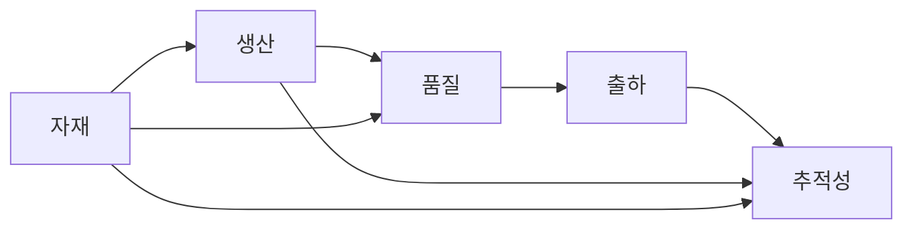

# HANES MES 도메인 워크플로우 인덱스

## 목적

이 문서는 자재, 생산, 품질, 출하가 현재 코드에서 어떻게 이어지는지 상위 흐름이 아니라 도메인 기준 인덱스로 정리한 문서다.
상태 전이의 상세 규칙은 `domain-workflows.md`를 기준으로 보고, 이 문서는 흐름 연결과 단계 구조를 빠르게 파악하는 용도로 사용한다.

## 전체 흐름 개요

## 자재 흐름

### 주요 단계

1. 구매 또는 발주 기준 준비
2. 입하 등록
3. LOT 생성 및 라벨 발행
4. IQC 판정
5. 합격 LOT 입고
6. 자재 재고 반영
7. 생산 또는 기타 요청으로 자재 출고

### 관련 엔티티

- `PurchaseOrder`
- `MatArrival`
- `MatLot`
- `IqcLog`
- `MatReceiving`
- `MatStock`
- `StockTransaction`

### 관련 서비스 축

- `arrival.service.ts`
- `iqc-history.service.ts`
- `receiving.service.ts`
- `mat-stock.service.ts`
- `mat-issue.service.ts`
- `physical-inv.service.ts`

## 생산 흐름

### 주요 단계

1. 생산계획 생성
2. 생산계획 확정
3. 작업지시 발행
4. 작업 시작
5. 자재, 작업자, 설비 투입
6. 생산실적 등록
7. 생산실적 완료
8. WIP 또는 FG 재고 반영

### 관련 엔티티

- `ProdPlan`
- `JobOrder`
- `ProdResult`
- `ProductStock`
- `ProductTransaction`
- `FgLabel`

### 관련 서비스 축

- `prod-plan.service.ts`
- `job-order.service.ts`
- `prod-result.service.ts`
- `auto-issue.service.ts`
- `simulation-data.service.ts`

## 품질 흐름

### 주요 단계

1. 입고 또는 생산 이후 검사 수행
2. 검사 결과 저장
3. 불합격이면 불량 또는 재작업 흐름 연결
4. OQC로 출하 전 품질 차단
5. SPC와 MSA로 통계 관리
6. 추적성 조회로 자재, 설비, 작업자, 생산 이력 연결

### 관련 하위 도메인

- `inspection`
- `defects`
- `oqc`
- `rework`
- `spc`
- `audit`
- `change-management`
- `fai`
- `ppap`
- `continuity-inspect`

### 관련 서비스 축

- `inspect-result.service.ts`
- `trace.service.ts`
- `defect-log.service.ts`
- `oqc.service.ts`
- `rework.service.ts`
- `spc.service.ts`
- `msa.service.ts`

## 출하 흐름

### 주요 단계

1. 고객주문 등록
2. 출하지시 생성 또는 확정
3. 박스 포장
4. 팔레트 적재
5. 출하 생성
6. 적재 완료
7. 실제 출하
8. 배송 완료 또는 반품 처리

### 관련 엔티티

- `CustomerOrder`
- `ShipmentOrder`
- `ShipmentLog`
- `BoxMaster`
- `PalletMaster`
- `FgLabel`

### 관련 서비스 축

- `customer-order.service.ts`
- `ship-order.service.ts`
- `shipment.service.ts`
- `box.service.ts`
- `pallet.service.ts`
- `ship-history.service.ts`
- `ship-return.service.ts`

## 추적성 흐름

### 입력 기준

- FG 바코드
- 생산 UID
- 작업지시 번호
- LOT 또는 시리얼

### 연결 축

- 자재: `PurchaseOrder -> Arrival -> IQC -> Receiving -> MatLot -> MatStock`
- 생산: `ProdPlan -> JobOrder -> ProdResult`
- 품질: `ProdResult -> InspectResult -> DefectLog / TraceLog`
- 출하: `ShipmentOrder -> Box -> Pallet -> Shipment`

## 읽을 때 주의할 점

1. 이 문서는 단계와 연결 구조를 설명한다.
2. 실제 상태값, 예외 처리, 취소/복원 규칙은 `domain-workflows.md`를 우선한다.
3. 흐름 간 단절 지점은 서비스 코드에서 다시 검증해야 한다.

## 함께 읽을 문서

- [domain-workflows.md](C:/Project/HANES/docs/core/domain-workflows.md)
- [backend-module-index.md](C:/Project/HANES/docs/core/backend-module-index.md)
- [04-backend-api-endpoints.md](C:/Project/HANES/docs/core/04-backend-api-endpoints.md)
