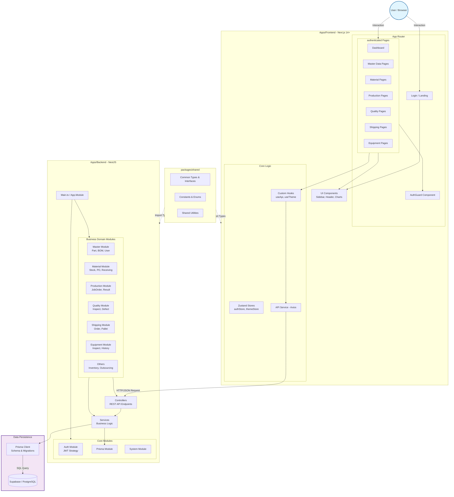

# HANES MES 시스템 아키텍처

## 개요

HANES MES 프로젝트의 전체 시스템 아키텍처입니다. Monorepo 구조 하에 Next.js(프론트엔드)와 NestJS(백엔드)가 Shared Package를 공유하며, Prisma를 통해 데이터베이스와 통신하는 구조입니다.

## 아키텍처 다이어그램

## 주요 구성 요소

### 1. Frontend (Next.js)

- **구조**: Next.js App Router 방식 사용
- **보안**: AuthGuard 컴포넌트를 통한 인증 페이지 보호
- **상태 관리**: Zustand (authStore, themeStore)
- **통신**: Axios 기반 API Service

### 2. Backend (NestJS)

#### Core Modules
- **AuthModule**: JWT 인증 및 인가 처리
- **PrismaModule**: DB 연결 관리 및 서비스 제공
- **SystemModule**: 공통 설정 및 시스템 관련 기능

#### Business Modules
- **MasterModule**: 기준 정보 (품목, 거래처, 사용자 등)
- **MaterialModule**: 자재 관리 (입고, 재고, 수불)
- **ProductionModule**: 생산 관리 (작업지시, 실적)
- **QualityModule**: 품질 관리 (검사, 불량)
- **ShippingModule**: 출하 관리 (주문, 패킹, 출하)
- **EquipmentModule**: 설비 관리 (보전, 점검)

### 3. Database (Prisma + Supabase)

- **Prisma ORM**: schema.prisma 파일을 통한 데이터 모델 정의
- **PostgreSQL**: Supabase 또는 호환 PostgreSQL 사용
- **타입 안전성**: Prisma Client를 통한 타입 안전한 DB 쿼리

### 4. Shared Package (Monorepo)

- **packages/shared**: 프론트엔드와 백엔드 간 공유
- **Types**: API 응답 타입, DTO 인터페이스
- **Constants**: 공통 상수, Enum
- **Utils**: 공통 유틸리티 함수

## 데이터 흐름

1. **사용자** → 브라우저에서 프론트엔드 접근
2. **프론트엔드** → AuthGuard를 통한 인증 확인
3. **API 호출** → Axios를 통해 백엔드 REST API 호출
4. **Controller** → 요청 수신 및 유효성 검증
5. **Service** → 비즈니스 로직 처리
6. **Prisma Client** → SQL 쿼리 생성 및 실행
7. **Database** → 데이터 저장/조회
8. **응답** → 역순으로 데이터 반환

## 기술 스택

| 레이어 | 기술 |
|--------|------|
| Frontend | Next.js 14+, React, TypeScript, Tailwind CSS, Zustand |
| Backend | NestJS, TypeScript, Prisma ORM |
| Database | PostgreSQL (Supabase) |
| Monorepo | Turborepo, pnpm |
| Auth | JWT, Passport.js |
| API | REST, Axios |

---

**생성일**: 2026-02-16
**도구**: NotebookLM + Claude Code
