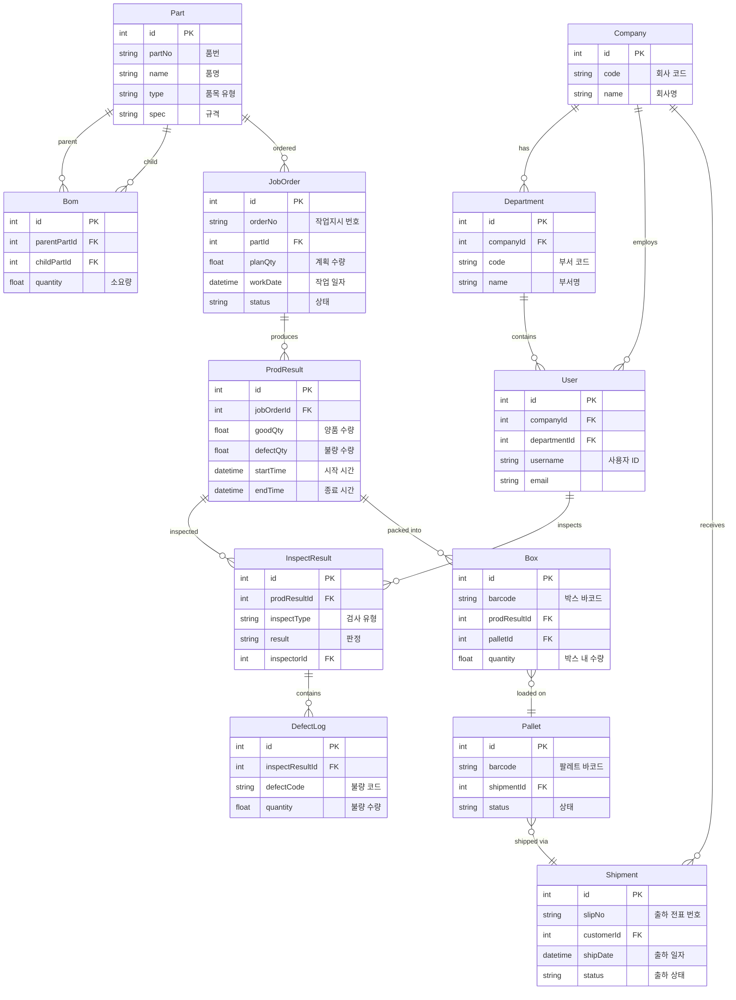

# HANES MES 데이터 모델 (ERD)

## 개요

HANES MES 프로젝트의 Prisma 데이터 모델 관계도입니다. 주요 도메인(기준 정보, 생산, 품질, 출하) 간의 연결성을 보여줍니다.

## ERD (Entity Relationship Diagram)



## 엔티티 설명

### 1. 조직 (Organization)

#### Company (회사/거래처)
- 자사, 고객사, 협력사 모두 포함
- Department와 User의 상위 조직

#### Department (부서)
- 회사 내 부서 구조
- 사용자 소속 관리

#### User (사용자)
- 시스템 사용자
- 회사 및 부서 소속
- 검사 담당자로도 활용

### 2. 품목 및 BOM (Part & Bill of Materials)

#### Part (품목)
- 제품, 반제품, 자재 모두 포함
- type: 품목 유형 구분 (FG, WIP, RAW)

#### Bom (자재명세서)
- **자기 참조 구조** (Self-referencing)
- parentPartId: 상위 품목 (완제품)
- childPartId: 하위 품목 (구성 자재)
- quantity: 소요량 (1개 생산 시 필요한 수량)

**예시**: 하네스(완제품) 1개 생산 시
- Wire 2m 필요 → Bom(parent=하네스, child=Wire, qty=2)
- Connector 4개 필요 → Bom(parent=하네스, child=Connector, qty=4)

### 3. 생산 (Production)

#### JobOrder (작업지시)
- 생산 계획에 따른 작업 지시서
- status: WAIT, RUNNING, PAUSED, DONE

#### ProdResult (생산실적)
- 작업지시에 대한 실제 생산 결과
- 양품/불량 수량 기록
- 작업 시작/종료 시간 추적

### 4. 품질 (Quality)

#### InspectResult (검사결과)
- 생산 실적에 대한 품질 검사
- inspectType: 수입(IQC), 공정(IPQC), 출하(OQC)
- result: PASS, FAIL, CONDITIONAL

#### DefectLog (불량 이력)
- 검사 결과의 상세 불량 내역
- defectCode: 불량 유형 코드
- 불량 원인 분석을 위한 데이터

### 5. 출하 및 포장 (Shipping & Packing)

#### Box (박스)
- 생산 실적을 박스 단위로 포장
- barcode: 추적성(Traceability) 확보
- Pallet에 적재될 수 있음

#### Pallet (팔레트)
- 여러 Box를 하나로 묶은 물류 단위
- 출하의 기본 단위

#### Shipment (출하)
- 고객사 주문에 대한 출하 처리
- 여러 Pallet를 하나의 출하로 묶음
- 출하 확정 시 재고 차감

## 주요 비즈니스 흐름

### 생산 → 검사 → 포장 → 출하

```
JobOrder (작업지시 생성)
    ↓
ProdResult (생산 실적 등록)
    ↓
InspectResult (품질 검사)
    ├─ PASS → Box (포장)
    └─ FAIL → DefectLog (불량 기록)
              ↓
         Box (포장)
              ↓
         Pallet (팔레트 적재)
              ↓
         Shipment (출하 확정)
```

### 추적성 (Traceability)

완제품 → 역추적 가능:
```
Shipment → Pallet → Box → ProdResult → JobOrder → Part (BOM)
```

불량 이력 추적:
```
DefectLog → InspectResult → ProdResult → JobOrder → Part
```

## 재고 관리

### 재고 변동 시점

| 시점 | 재고 변동 |
|------|-----------|
| **생산 시작** | 원자재 재고 ↓, 재공품(WIP) ↑ |
| **생산 완료** | 재공품 ↓, 완제품 ↑ |
| **불량 발생** | 완제품 ↓, 불량품 창고 ↑ |
| **출하 확정** | 완제품 재고 ↓ |

## Prisma 스키마 위치

- **스키마 파일**: `apps/backend/prisma/schema.prisma`
- **마이그레이션**: `apps/backend/prisma/migrations/`
- **시드 데이터**: `apps/backend/prisma/seed-*.ts`

---

**생성일**: 2026-02-16
**도구**: NotebookLM + Claude Code
