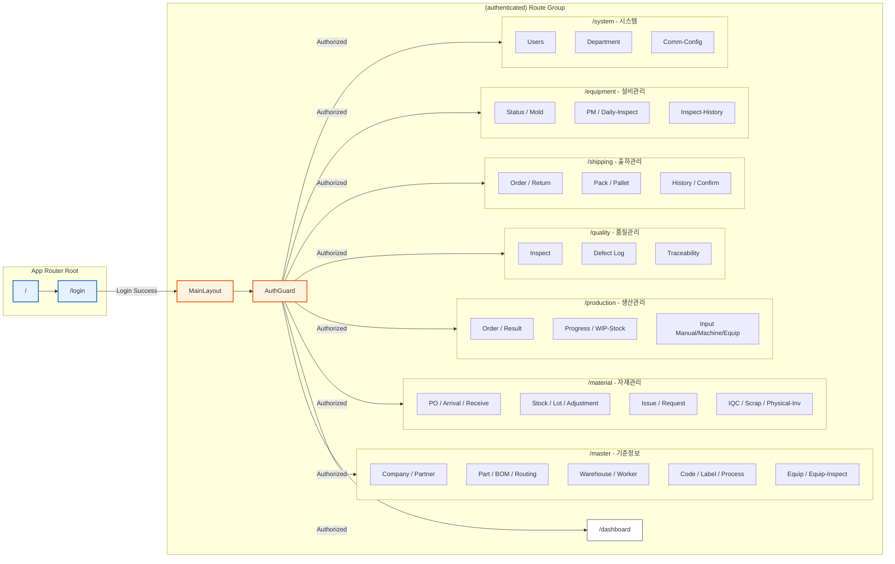

# HANES MES 프론트엔드 라우팅 구조

## 개요

Next.js App Router를 사용한 HANES MES 프론트엔드의 페이지 구조와 라우팅입니다. `(authenticated)` Route Group을 통해 인증된 사용자만 접근 가능한 영역을 분리했습니다.

## 라우팅 다이어그램



## 라우팅 구조 설명

### 공개 페이지 (Public)

| 경로 | 설명 | 파일 위치 |
|------|------|-----------|
| `/` | 루트 페이지 (리다이렉트) | `apps/frontend/src/app/page.tsx` |
| `/login` | 로그인 페이지 | `apps/frontend/src/app/login/page.tsx` |

### 인증 보호 영역 (Authenticated)

**Route Group**: `(authenticated)`
- URL에는 나타나지 않음
- 모든 하위 페이지에 AuthGuard 적용
- 공통 레이아웃 (Sidebar, Header) 적용

#### 레이아웃 파일
- `apps/frontend/src/app/(authenticated)/layout.tsx`
- `apps/frontend/src/components/layout/AuthGuard.tsx`
- `apps/frontend/src/components/layout/Sidebar.tsx`
- `apps/frontend/src/components/layout/Header.tsx`

## 도메인별 페이지 상세

### 1. Master (기준정보) - `/master`

| 페이지 | 경로 | 설명 |
|--------|------|------|
| 회사/거래처 | `/master/company` | 자사, 고객사, 협력사 관리 |
| 협력사 | `/master/partner` | 거래처 관리 |
| 품목 | `/master/part` | 제품, 반제품, 자재 관리 |
| BOM | `/master/bom` | 자재명세서 관리 |
| 라우팅 | `/master/routing` | 공정 순서 관리 |
| 창고 | `/master/warehouse` | 창고/로케이션 관리 |
| 작업자 | `/master/worker` | 작업자 정보 관리 |
| 공정 | `/master/process` | 공정 마스터 |
| 공통코드 | `/master/code` | 코드 관리 |
| 라벨템플릿 | `/master/label` | 바코드 라벨 템플릿 |
| 설비 | `/master/equip` | 설비 대장 |
| 설비점검항목 | `/master/equip-inspect` | 점검 항목 관리 |

### 2. Material (자재관리) - `/material`

| 페이지 | 경로 | 설명 |
|--------|------|------|
| 구매발주 | `/material/po` | Purchase Order |
| 입하 | `/material/arrival` | 자재 입하 등록 |
| 입고 | `/material/receive` | 입고 확정 처리 |
| 재고조회 | `/material/stock` | 자재 재고 현황 |
| LOT관리 | `/material/lot` | LOT 추적 |
| 재고조정 | `/material/adjustment` | 실사 후 조정 |
| 자재출고 | `/material/issue` | 생산 투입 |
| 출고요청 | `/material/request` | 출고 요청서 |
| 수입검사 | `/material/iqc` | IQC 검사 |
| 폐기처리 | `/material/scrap` | 불용 자재 폐기 |
| 실사 | `/material/physical-inv` | 재고 실사 |

### 3. Production (생산관리) - `/production`

| 페이지 | 경로 | 설명 |
|--------|------|------|
| 작업지시 | `/production/order` | Job Order 생성 |
| 생산실적 | `/production/result` | 실적 조회 |
| 진척현황 | `/production/progress` | 작업 진행 현황 |
| 재공재고 | `/production/wip-stock` | WIP 재고 |
| 수동입력 | `/production/input-manual` | 실적 수동 입력 |
| 설비입력 | `/production/input-machine` | 설비 연동 실적 |
| 설비실적 | `/production/input-equip` | 설비별 실적 |

### 4. Quality (품질관리) - `/quality`

| 페이지 | 경로 | 설명 |
|--------|------|------|
| 검사결과 | `/quality/inspect` | 품질 검사 등록 |
| 불량이력 | `/quality/defect` | Defect Log |
| 추적조회 | `/quality/trace` | Traceability |

### 5. Shipping (출하관리) - `/shipping`

| 페이지 | 경로 | 설명 |
|--------|------|------|
| 출하지시 | `/shipping/order` | 출하 오더 |
| 반품 | `/shipping/return` | 반품 처리 |
| 포장 | `/shipping/pack` | 박스 포장 |
| 팔레트 | `/shipping/pallet` | 팔레트 적재 |
| 출하이력 | `/shipping/history` | 출하 내역 |
| 출하확정 | `/shipping/confirm` | 출하 확정 |

### 6. Equipment (설비관리) - `/equipment`

| 페이지 | 경로 | 설명 |
|--------|------|------|
| 가동현황 | `/equipment/status` | 설비 상태 모니터링 |
| 금형관리 | `/equipment/mold` | 금형 이력 |
| 예방보전 | `/equipment/pm` | PM 계획/실적 |
| 일상점검 | `/equipment/daily-inspect` | 일일 점검 |
| 점검이력 | `/equipment/inspect-history` | 점검 내역 조회 |

### 7. System (시스템) - `/system`

| 페이지 | 경로 | 설명 |
|--------|------|------|
| 사용자 | `/system/users` | 사용자 계정 관리 |
| 부서 | `/system/department` | 부서 관리 |
| 통신설정 | `/system/comm-config` | PLC/설비 통신 |

## 추가 도메인 (다이어그램 미포함)

### Consumables (소모품 관리) - `/consumables`
- 입고 (`/consumables/receiving`)
- 불출 (`/consumables/issuing`)
- 재고 (`/consumables/stock`)

### Outsourcing (외주 관리) - `/outsourcing`
- 외주발주 (`/outsourcing/order`)
- 외주입고 (`/outsourcing/receive`)
- 외주업체 (`/outsourcing/vendor`)

### Customs (통관/자재) - `/customs`
- 통관내역 (`/customs/entry`)
- 자재현황 (`/customs/stock`)
- 사용내역 (`/customs/usage`)

### Interface (외부연동) - `/interface`
- 연동로그 (`/interface/log`)
- 수동연동 (`/interface/manual`)
- 대시보드 (`/interface/dashboard`)

## AuthGuard 동작

```typescript
// 의사코드
function AuthGuard({ children }) {
  const { user, isAuthenticated } = useAuthStore();

  if (!isAuthenticated) {
    redirect('/login');
  }

  return <>{children}</>;
}
```

## 상태 관리

### Zustand Stores

- **authStore** (`apps/frontend/src/stores/authStore.ts`)
  - 사용자 정보
  - 로그인/로그아웃
  - 토큰 관리

- **themeStore** (`apps/frontend/src/stores/themeStore.ts`)
  - 다크/라이트 모드
  - 테마 설정

## 공통 컴포넌트

### Layout
- `Sidebar.tsx`: 좌측 메뉴
- `Header.tsx`: 상단 헤더 (사용자 정보, 테마 전환)
- `AuthGuard.tsx`: 인증 체크

### UI
- `Modal.tsx`: 모달 대화상자
- `DataGrid.tsx`: 데이터 테이블
- `Select.tsx`: 드롭다운
- `ComCodeBadge.tsx`: 공통코드 배지

---

**생성일**: 2026-02-16
**도구**: NotebookLM + Claude Code
