# HANES MES Backend API 엔드포인트

## 개요

NestJS 프레임워크를 사용한 HANES MES Backend의 API 구조입니다. Controller-Service 패턴을 따르며, 도메인별로 모듈이 분리되어 있습니다.

## API 아키텍처 다이어그램

```mermaid
graph LR
    %% 스타일 정의
    classDef controller fill:#e3f2fd,stroke:#1565c0,stroke-width:2px;
    classDef service fill:#e8f5e9,stroke:#2e7d32,stroke-width:2px;
    classDef module fill:#fff3e0,stroke:#e65100,stroke-width:2px,stroke-dasharray: 5 5;

    subgraph API_Gateway [API Entry Points]
        direction TB

        %% 1. Master Module
        subgraph Master_Domain [Master Module]
            direction LR
            C_Part[Part Controller<br/>GET /parts<br/>POST /parts<br/>PUT /parts/:id]:::controller
            C_BOM[BOM Controller<br/>GET /boms<br/>POST /boms/structure]:::controller
            C_Comp[Company Controller<br/>GET /companies<br/>POST /companies]:::controller

            S_Part(Part Service):::service
            S_BOM(BOM Service):::service
            S_Comp(Company Service):::service

            C_Part --> S_Part
            C_BOM --> S_BOM
            C_Comp --> S_Comp
        end

        %% 2. Material Module
        subgraph Material_Domain [Material Module]
            direction LR
            C_PO[PurchaseOrder Controller<br/>GET /purchase-orders<br/>POST /purchase-orders]:::controller
            C_Recv[Receiving Controller<br/>POST /receiving<br/>POST /receiving/confirm]:::controller
            C_Stock[MatStock Controller<br/>GET /mat-stocks<br/>GET /mat-stocks/history]:::controller

            S_PO(PurchaseOrder Service):::service
            S_Recv(Receiving Service):::service
            S_Stock(MatStock Service):::service

            C_PO --> S_PO
            C_Recv --> S_Recv
            C_Stock --> S_Stock
        end

        %% 3. Production Module
        subgraph Prod_Domain [Production Module]
            direction LR
            C_Job[JobOrder Controller<br/>GET /job-orders<br/>POST /job-orders<br/>PATCH /job-orders/:id/status]:::controller
            C_Res[ProdResult Controller<br/>POST /prod-results<br/>GET /prod-results/stats]:::controller

            S_Job(JobOrder Service):::service
            S_Res(ProdResult Service):::service

            C_Job --> S_Job
            C_Res --> S_Res
        end

        %% 4. Quality Module
        subgraph Qual_Domain [Quality Module]
            direction LR
            C_Insp[InspectResult Controller<br/>POST /inspect-results<br/>GET /inspect-results/:lotId]:::controller
            C_Defect[DefectLog Controller<br/>GET /defect-logs<br/>POST /defect-logs/report]:::controller

            S_Insp(InspectResult Service):::service
            S_Defect(DefectLog Service):::service

            C_Insp --> S_Insp
            C_Defect --> S_Defect
        end

        %% 5. Shipping Module
        subgraph Ship_Domain [Shipping Module]
            direction LR
            C_Ship[Shipment Controller<br/>POST /shipments<br/>PUT /shipments/confirm]:::controller
            C_Box[Box Controller<br/>POST /boxes<br/>GET /boxes/:barcode]:::controller
            C_Pallet[Pallet Controller<br/>POST /pallets<br/>PUT /pallets/:id/load]:::controller

            S_Ship(Shipment Service):::service
            S_Box(Box Service):::service
            S_Pallet(Pallet Service):::service

            C_Ship --> S_Ship
            C_Box --> S_Box
            C_Pallet --> S_Pallet
        end

        %% 6. Equipment Module
        subgraph Equip_Domain [Equipment Module]
            direction LR
            C_EMast[EquipMaster Controller<br/>GET /equip-masters<br/>PUT /equip-masters/:id]:::controller
            C_Daily[DailyInspect Controller<br/>POST /daily-inspects<br/>GET /daily-inspects/history]:::controller

            S_EMast(EquipMaster Service):::service
            S_Daily(DailyInspect Service):::service

            C_EMast --> S_EMast
            C_Daily --> S_Daily
        end
    end
```



## 도메인별 API 상세

### 1. Master Module (기준정보)

#### Part Controller (`/api/master/part`)

| Method | Endpoint | 설명 | 파일 위치 |
|--------|----------|------|-----------|
| GET | `/parts` | 품목 목록 조회 | `part.controller.ts` |
| GET | `/parts/:id` | 품목 상세 조회 | `part.controller.ts` |
| POST | `/parts` | 품목 생성 | `part.controller.ts` |
| PUT | `/parts/:id` | 품목 수정 | `part.controller.ts` |
| DELETE | `/parts/:id` | 품목 삭제 | `part.controller.ts` |

**Service**: `PartService` - 품목 CRUD 및 비즈니스 로직

#### BOM Controller (`/api/master/bom`)

| Method | Endpoint | 설명 |
|--------|----------|------|
| GET | `/boms` | BOM 목록 조회 |
| GET | `/boms/:id` | BOM 상세 조회 |
| POST | `/boms` | BOM 생성 |
| GET | `/boms/:id/structure` | BOM 구조 전개 (정전개/역전개) |
| PUT | `/boms/:id` | BOM 수정 |
| DELETE | `/boms/:id` | BOM 삭제 |

**Service**: `BomService` - BOM 구조 관리, 전개 로직

#### 기타 Master 컨트롤러

- **CompanyController**: 회사/거래처 관리
- **DepartmentController**: 부서 관리
- **WorkerController**: 작업자 관리
- **RoutingController**: 공정 순서 관리
- **ProcessController**: 공정 마스터
- **WarehouseController**: 창고 관리

**위치**: `apps/backend/src/modules/master/controllers/`

---

### 2. Material Module (자재관리)

#### PurchaseOrder Controller (`/api/material/po`)

| Method | Endpoint | 설명 |
|--------|----------|------|
| GET | `/purchase-orders` | 구매발주 목록 |
| POST | `/purchase-orders` | 구매발주 생성 |
| PUT | `/purchase-orders/:id` | 발주 수정 |
| PATCH | `/purchase-orders/:id/status` | 발주 상태 변경 |

**Service**: `PurchaseOrderService`

#### Receiving Controller (`/api/material/receive`)

| Method | Endpoint | 설명 |
|--------|----------|------|
| POST | `/receiving` | 입고 등록 |
| POST | `/receiving/confirm` | 입고 확정 (재고 증가) |
| GET | `/receiving/:id` | 입고 상세 |

**Service**: `ReceivingService` - 입고 처리, 재고 연동

#### MatStock Controller (`/api/material/stock`)

| Method | Endpoint | 설명 |
|--------|----------|------|
| GET | `/mat-stocks` | 자재 재고 현황 |
| GET | `/mat-stocks/:partId` | 특정 품목 재고 |
| GET | `/mat-stocks/history` | 수불 이력 조회 |

**Service**: `MatStockService`

#### 기타 Material 컨트롤러

- **IssueController**: 자재 출고
- **AdjustmentController**: 재고 조정
- **LotController**: LOT 관리
- **ScrapController**: 폐기 처리

**위치**: `apps/backend/src/modules/material/controllers/`

---

### 3. Production Module (생산관리)

#### JobOrder Controller (`/api/production/job-order`)

| Method | Endpoint | 설명 |
|--------|----------|------|
| GET | `/job-orders` | 작업지시 목록 |
| POST | `/job-orders` | 작업지시 생성 |
| GET | `/job-orders/:id` | 작업지시 상세 |
| PATCH | `/job-orders/:id/status` | 상태 변경 (WAIT→RUNNING→DONE) |
| PUT | `/job-orders/:id` | 작업지시 수정 |

**Service**: `JobOrderService` - 작업지시 관리, BOM 전개

#### ProdResult Controller (`/api/production/result`)

| Method | Endpoint | 설명 |
|--------|----------|------|
| POST | `/prod-results` | 생산실적 등록 |
| GET | `/prod-results` | 실적 목록 조회 |
| GET | `/prod-results/stats` | 생산 통계 (일별/월별) |
| GET | `/prod-results/:jobOrderId` | 작업지시별 실적 |

**Service**: `ProdResultService` - 실적 등록, 재고 연동 (WIP 관리)

**위치**: `apps/backend/src/modules/production/controllers/`

---

### 4. Quality Module (품질관리)

#### InspectResult Controller (`/api/quality/inspect`)

| Method | Endpoint | 설명 |
|--------|----------|------|
| POST | `/inspect-results` | 검사 결과 등록 |
| GET | `/inspect-results` | 검사 목록 조회 |
| GET | `/inspect-results/:lotId` | LOT별 검사 이력 |
| PUT | `/inspect-results/:id` | 검사 결과 수정 |

**Service**: `InspectResultService` - 검사 등록, 판정 처리

#### DefectLog Controller (`/api/quality/defect`)

| Method | Endpoint | 설명 |
|--------|----------|------|
| GET | `/defect-logs` | 불량 이력 조회 |
| POST | `/defect-logs/report` | 불량 보고서 생성 |
| GET | `/defect-logs/stats` | 불량 통계 (파레토 차트용) |

**Service**: `DefectLogService` - 불량 분석

**위치**: `apps/backend/src/modules/quality/controllers/`

---

### 5. Shipping Module (출하관리)

#### Box Controller (`/api/shipping/box`)

| Method | Endpoint | 설명 |
|--------|----------|------|
| POST | `/boxes` | 박스 생성 (바코드 발행) |
| GET | `/boxes/:barcode` | 바코드로 박스 조회 |
| PUT | `/boxes/:id/pallet` | 팔레트 적재 |

**Service**: `BoxService` - 박스 포장, 바코드 생성

#### Pallet Controller (`/api/shipping/pallet`)

| Method | Endpoint | 설명 |
|--------|----------|------|
| POST | `/pallets` | 팔레트 생성 |
| PUT | `/pallets/:id/load` | 박스 적재 |
| GET | `/pallets/:barcode` | 팔레트 조회 |

**Service**: `PalletService` - 팔레트 관리

#### Shipment Controller (`/api/shipping/shipment`)

| Method | Endpoint | 설명 |
|--------|----------|------|
| POST | `/shipments` | 출하지시 생성 |
| PUT | `/shipments/:id/confirm` | 출하 확정 (재고 차감) |
| GET | `/shipments` | 출하 목록 |
| GET | `/shipments/:id/trace` | 추적 정보 (Box→Pallet→Shipment) |

**Service**: `ShipmentService` - 출하 처리, 재고 차감

**위치**: `apps/backend/src/modules/shipping/controllers/`

---

### 6. Equipment Module (설비관리)

#### EquipMaster Controller (`/api/equipment/master`)

| Method | Endpoint | 설명 |
|--------|----------|------|
| GET | `/equip-masters` | 설비 목록 |
| PUT | `/equip-masters/:id` | 설비 정보 수정 |
| PATCH | `/equip-masters/:id/status` | 설비 상태 변경 (가동/정지/보전) |

**Service**: `EquipMasterService`

#### DailyInspect Controller (`/api/equipment/daily-inspect`)

| Method | Endpoint | 설명 |
|--------|----------|------|
| POST | `/daily-inspects` | 일상점검 등록 |
| GET | `/daily-inspects/history` | 점검 이력 조회 |
| GET | `/daily-inspects/:equipId` | 설비별 점검 내역 |

**Service**: `DailyInspectService` - 점검 관리

**위치**: `apps/backend/src/modules/equipment/controllers/`

---

## 공통 패턴

### Controller 구조

```typescript
@Controller('api/master/part')
@UseGuards(JwtAuthGuard)
export class PartController {
  constructor(private readonly partService: PartService) {}

  @Get()
  async findAll(@Query() query: PartQueryDto) {
    return this.partService.findAll(query);
  }

  @Post()
  async create(@Body() dto: CreatePartDto) {
    return this.partService.create(dto);
  }
}
```

### Service 구조

```typescript
@Injectable()
export class PartService {
  constructor(private readonly prisma: PrismaService) {}

  async findAll(query: PartQueryDto) {
    return this.prisma.part.findMany({
      where: { ... },
      include: { ... },
    });
  }

  async create(dto: CreatePartDto) {
    return this.prisma.part.create({
      data: dto,
    });
  }
}
```

## 인증 및 권한

### JWT 인증

모든 API는 `JwtAuthGuard`를 통해 보호됩니다.

```
Authorization: Bearer <JWT_TOKEN>
```

### 권한 체크

특정 API는 역할(Role) 기반 권한 체크:

```typescript
@UseGuards(JwtAuthGuard, RolesGuard)
@Roles('ADMIN', 'MANAGER')
```

## API Base URL

```
개발: http://localhost:3001/api
운영: https://api.hanes-mes.com/api
```

## 응답 형식

### 성공 응답

```json
{
  "data": { ... },
  "message": "성공",
  "statusCode": 200
}
```

### 에러 응답

```json
{
  "statusCode": 400,
  "message": "잘못된 요청",
  "error": "Bad Request"
}
```

---

**생성일**: 2026-02-16
**도구**: NotebookLM + Claude Code
