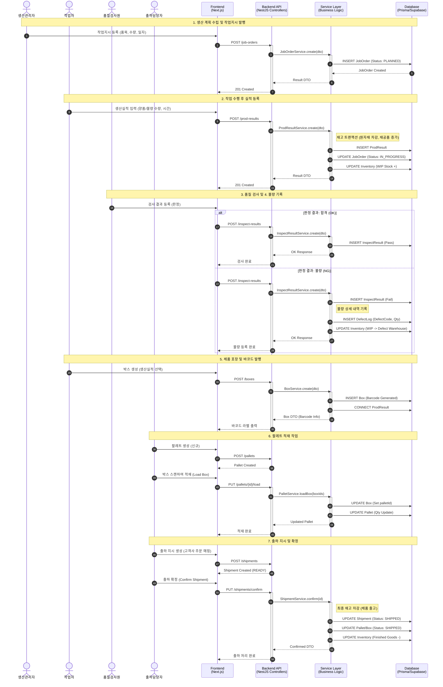

# HANES MES 생산 프로세스 흐름

## 개요

HANES MES의 핵심 비즈니스 프로세스인 "생산 → 품질검사 → 포장 → 출하"의 전체 데이터 흐름을 시퀀스 다이어그램으로 표현합니다.

## 프로세스 흐름 다이어그램



## 단계별 상세 설명

### 1단계: 작업지시 생성 (Job Order)

**담당자**: 생산관리자
**API**: `POST /api/production/job-order`
**Controller**: `JobOrderController`
**Service**: `JobOrderService.create()`

#### 입력 데이터 (DTO)
```typescript
{
  partId: number;        // 생산할 품목
  planQty: number;       // 계획 수량
  workDate: Date;        // 작업 일자
  lineId: number;        // 생산 라인
  status: "PLANNED";     // 초기 상태
}
```

#### 처리 내용
1. BOM 전개 (필요 자재 계산)
2. 자재 가용 재고 체크
3. JobOrder 생성 (Status: PLANNED)
4. 필요시 자재 예약

---

### 2단계: 생산실적 입력 (Production Result)

**담당자**: 작업자
**API**: `POST /api/production/result`
**Controller**: `ProdResultController`
**Service**: `ProdResultService.create()`

#### 입력 데이터
```typescript
{
  jobOrderId: number;    // 작업지시 ID
  goodQty: number;       // 양품 수량
  defectQty: number;     // 불량 수량
  startTime: Date;       // 작업 시작 시간
  endTime: Date;         // 작업 종료 시간
  workerId: number;      // 작업자 ID
}
```

#### 처리 내용 (트랜잭션)
1. **ProdResult 생성**
2. **JobOrder 상태 변경**: PLANNED → IN_PROGRESS
3. **재고 처리**:
   - 원자재 재고 차감 (BOM 기준)
   - WIP(재공품) 재고 증가

#### 재고 계산 예시
```
생산: 하네스 100개
BOM: Wire 2m/개, Connector 4개/개

재고 변동:
- Wire: -200m (원자재)
- Connector: -400개 (원자재)
- 하네스(WIP): +100개 (재공품)
```

---

### 3단계: 품질검사 (Inspection)

**담당자**: 품질검사원
**API**: `POST /api/quality/inspect`
**Controller**: `InspectResultController`
**Service**: `InspectResultService.create()`

#### 입력 데이터
```typescript
{
  prodResultId: number;  // 생산실적 ID
  inspectType: "IPQC";   // 검사 유형 (IQC, IPQC, OQC)
  result: "PASS" | "FAIL"; // 판정
  inspectorId: number;   // 검사자
}
```

#### 처리 내용
- **PASS**: InspectResult 생성만
- **FAIL**: InspectResult + DefectLog 생성

---

### 4단계: 불량 기록 (Defect Logging)

**API**: `POST /api/quality/defect` (검사 FAIL 시 자동 호출)
**Service**: `DefectLogService.create()`

#### 입력 데이터
```typescript
{
  inspectResultId: number;
  defectCode: string;    // 불량 유형 코드
  quantity: number;      // 불량 수량
  cause: string;         // 불량 원인
}
```

#### 처리 내용
1. DefectLog 생성
2. **재고 이동**: WIP → 불량품 창고
3. 불량 통계 업데이트 (파레토 차트용)

---

### 5단계: 박스 포장 (Box Packing)

**담당자**: 작업자
**API**: `POST /api/shipping/box`
**Controller**: `BoxController`
**Service**: `BoxService.create()`

#### 입력 데이터
```typescript
{
  prodResultId: number;  // 생산실적 ID
  quantity: number;      // 박스 내 수량
  partId: number;        // 품목
}
```

#### 처리 내용
1. **바코드 생성** (UUID 또는 규칙 기반)
2. Box 레코드 생성
3. ProdResult와 연결
4. 바코드 라벨 출력 데이터 반환

#### 바코드 형식 예시
```
BOX-20260216-000123
```

---

### 6단계: 팔레트 적재 (Palletizing)

**담당자**: 출하담당자
**API**: `PUT /api/shipping/pallet/:id/load`
**Controller**: `PalletController`
**Service**: `PalletService.loadBox()`

#### 입력 데이터
```typescript
{
  palletId: number;
  boxIds: number[];      // 적재할 박스 ID 목록
}
```

#### 처리 내용
1. Box의 `palletId` 필드 업데이트
2. Pallet의 총 수량 업데이트
3. 팔레트 바코드 발행 (필요 시)

---

### 7단계: 출하 확정 (Shipment Confirmation)

**담당자**: 출하담당자
**API**: `PUT /api/shipping/shipment/:id/confirm`
**Controller**: `ShipmentController`
**Service**: `ShipmentService.confirm()`

#### 처리 내용 (트랜잭션)
1. **Shipment 상태 변경**: READY → SHIPPED
2. **Pallet/Box 상태 변경**: → SHIPPED
3. **재고 차감**: WIP/완제품 재고 → 출고
4. 출하 전표 생성

#### 재고 변동
```
출하 확정 시:
- 완제품 재고: -100개
- 출하 수량: +100개
```

---

## 재고 추적 흐름

### 전체 재고 흐름

```
[원자재 재고]
    ↓ (생산 시작)
[WIP 재고] ← 생산실적 등록
    ↓ (검사 합격)
[완제품 재고]
    ↓ (출하 확정)
[출하 수량]

※ 불량 발생 시: WIP → [불량품 창고]
```

### 추적성 (Traceability)

**순방향**: 자재 → 제품
```
Part (원자재)
  → JobOrder (작업지시)
  → ProdResult (생산실적)
  → Box (포장)
  → Pallet (적재)
  → Shipment (출하)
```

**역방향**: 제품 → 자재
```
Shipment (출하 제품)
  → Pallet (어느 팔레트?)
  → Box (어느 박스?)
  → ProdResult (언제 생산?)
  → JobOrder (어떤 지시?)
  → Bom (어떤 자재 사용?)
```

---

## 상태 전이 (State Transition)

### JobOrder 상태

```
PLANNED → IN_PROGRESS → PAUSED → IN_PROGRESS → DONE → CLOSED
```

| 상태 | 설명 | 전환 조건 |
|------|------|-----------|
| `PLANNED` | 계획 수립 | 작업지시 생성 |
| `IN_PROGRESS` | 작업 중 | 첫 실적 등록 |
| `PAUSED` | 일시 중지 | 수동 중지 |
| `DONE` | 완료 | 계획 수량 달성 |
| `CLOSED` | 마감 | 최종 마감 처리 |

### Shipment 상태

```
DRAFT → READY → SHIPPED → DELIVERED
```

---

## 에러 처리

### 재고 부족 시

```typescript
// ProdResultService.create()
if (availableStock < requiredQty) {
  throw new BadRequestException('자재 재고 부족');
}
```

### 중복 바코드 방지

```typescript
// BoxService.create()
const existingBox = await prisma.box.findUnique({
  where: { barcode }
});
if (existingBox) {
  throw new ConflictException('중복 바코드');
}
```

---

## 성능 최적화

### 트랜잭션 사용

모든 재고 관련 작업은 트랜잭션으로 처리:

```typescript
await prisma.$transaction(async (tx) => {
  await tx.prodResult.create({ ... });
  await tx.inventory.update({ ... });
  await tx.jobOrder.update({ ... });
});
```

### 배치 처리

대량 박스 생성 시 배치 처리:

```typescript
await prisma.box.createMany({
  data: boxDataArray
});
```

---

**생성일**: 2026-02-16
**도구**: NotebookLM + Claude Code
